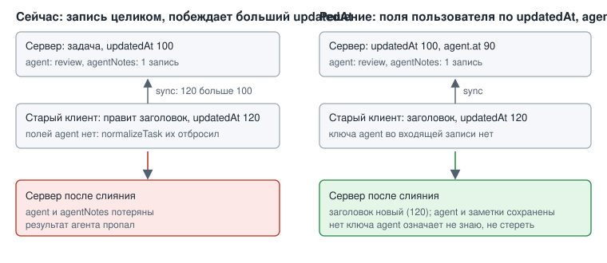

# ADR-001: Защита полей `agent` и `agentNotes` при sync-слиянии

- Status: Accepted
- Drives: FR-003, FR-008, FR-011, NFR-004, NFR-005, NFR-006, AC-025, AC-026
- Source: SRC-33, SRC-34

## Context

`sync.mjs` (`#merge`) заменяет запись задачи целиком, если `updatedAt` во входящей записи больше серверного. Клиент (`js/sync.js`) шлёт всё состояние и применяет ответ через `normalizeTask`, который собирает объект по белому списку полей.

Отсюда два пути потери данных:

1. Старый закешированный PWA не знает поля `agent` и отбрасывает его при первом получении состояния. Любая его правка задачи новее серверной записи и затирает `agent` на сервере.
2. Новый клиент с устаревшей копией правит задачу после записи агента. Его запись новее по `updatedAt`, поэтому статус агента и `agentNotes` теряются.

Сама задача через sync пропасть не может: удаление идёт только через надгробие `deleted`. Под угрозой поля агента и результаты работы.

*Рис. 1. Слева запись целиком стирает результат агента. Справа сервер оставляет `agent` и заметки, если во входящей записи их нет.*

## Decision Drivers

- Ни одна задача и ни одно поле агента не теряются (SRC-34), `SCHEMA` остаётся `1`.
- Старый PWA работает без ошибок (SRC-33), защита живёт на сервере.
- `serve.mjs` без `npm install`, протокол «шлём всё состояние» не меняется.

## Considered Options

| Вариант | Плюсы | Минусы |
|---|---|---|
| A. Пофилдовое слияние на сервере | Защищает от старого клиента и устаревшей копии; изменение в одном методе | Второй порядок разрешения конфликтов; зависимость от часов |
| B. Защита только на клиенте | Сервер не меняется | Не защищает закешированный старый PWA |
| C. Состояние агента в отдельном хранилище | Правки не пересекаются | Второй источник истины и файл бэкапа; флаг делегирования всё равно в записи задачи |
| D. Оставить слияние, перечитывать запись перед записью | Минимум кода | Гонка остаётся, старый клиент затирает поле |

## Decision

Вариант A. Правила слияния для задачи с одним `id`:

1. Пользовательские поля берутся от записи с большим `updatedAt`, как сейчас.
2. Блок `agent` (`{status, claimedAt, finishedAt, claimToken, at}`) сравнивается отдельно по `agent.at`: побеждает больший.
3. Отсутствие ключа `agent` во входящей записи означает «не знаю», сервер сохраняет своё значение. Снятие делегирования клиент шлёт явно: `agent: {status: null, at: T}`.
4. `agentNotes` объединяются по паре `(at, text)`, записи только добавляются. Удаление отдельной заметки агента не поддерживается (подтверждено пользователем: не нужно).
5. Задачи без `agent` ведут себя как раньше. Те же правила применяет MCP-слой при записи.

**Принятое допущение (пользователь отдельно не отвечал, применено предложение архитектора).** Метку `agent.at` ставят так: клиент при смене делегирования проставляет своё время, сервер при записи через MCP (`agent_claim`, `agent_finish`) проставляет своё. Расхождение часов телефона и VPS может изменить победителя в редком конфликте «снял делегирование против завершения»; последствие ограничено (результат остаётся в `agentNotes`). Если допущение окажется неверным, правится только источник метки.

## Consequences

Положительные:
- Задача и результат агента не теряются при любом порядке синхронизаций, включая старый клиент.
- Правка локальна: `sync.mjs` и MCP-запись. Клиентскую нормализацию можно дорабатывать отдельно, корректность от неё не зависит.

Отрицательные и меры:
- Появился второй порядок разрешения конфликтов. Мера: тест конкурентной правки (AC-025) и тест со старым клиентом (AC-026).
- Заметки агента нельзя удалить: принято пользователем. Мера: ограничение длины записи задаёт design.
- Перекос часов. Мера: серверная метка для всех записей агента.
- Одинаковые `(at, text)` у двух разных записей схлопнутся: на практике невозможно, так как `at` берётся из миллисекунд.
