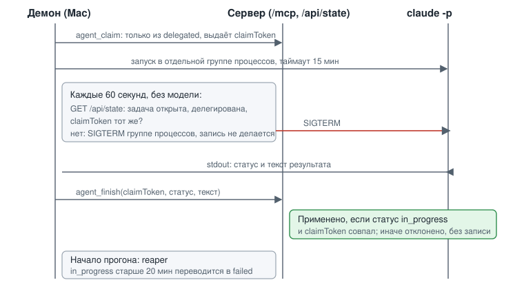

# ADR-002: Прерывание агента и TTL зависшего `in_progress`

- Status: Accepted
- Drives: FR-009, FR-011, NFR-002, NFR-003, AC-014, AC-016, AC-021, AC-022
- Source: SRC-15, SRC-28, SRC-29

## Context

Пока агент работает, пользователь может закрыть задачу или снять делегирование. Агент должен молча бросить работу и ничего не записать (SRC-29). Между проверкой статуса и записью результата остаётся окно гонки. Кроме того, `in_progress` может зависнуть: падение `claude`, обрыв сети, перезагрузка Mac.

*Рис. 1. Демон захватывает задачу, раз в минуту опрашивает статус без модели, при закрытии убивает процесс, а результат записывает условной командой.*

## Decision Drivers

- Результат не пишется в закрытую задачу даже при гонке.
- Проверки не должны тратить токены.
- Агент не обходит MCP-контракт и не пишет в файл.
- Зависший `in_progress` не висит бесконечно.

## Considered Options

| Вариант | Плюсы | Минусы |
|---|---|---|
| A. Только перепроверка перед записью | Просто | Агент работает до конца после закрытия; окно гонки без условной записи |
| B. Watchdog демона и условная запись на сервере | Прерывание за минуту; запись исключена на уровне сервера; права агента уже | Больше кода в демоне, нужен контракт stdout |
| C. Агент сам опрашивает статус | Быстрая остановка | Зависит от модели, тратит ходы |

## Decision

Вариант B.

- `agent_claim(task)`: только из `delegated`, выдаёт `claimToken` и `claimedAt`.
- Демон запускает `claude -p` в отдельной группе процессов, таймаут 15 минут. Раз в 60 секунд читает `GET /api/state` (без модели). Если задача закрыта, удалена, делегирование снято или `claimToken` не совпал, демон отправляет SIGTERM группе процессов и ничего не пишет.
- Агент отдаёт результат в stdout (JSON: статус `review | needs_info | failed` и текст). Агент не имеет права писать в TaskFlow.
- Демон вызывает `agent_finish(task, claimToken, status, note)`. Сервер применяет запись атомарно, только если статус `in_progress` и `claimToken` совпал, иначе отклоняет без записи.
- TTL зависшего `in_progress`: 20 минут (таймаут 15 минут и 5 минут запаса). Reaper в начале каждого прогона переводит такие задачи в `failed` с причиной «TTL истёк». Для reaper `claimToken` не нужен, вызов помечен признаком «по TTL». Если Mac выключен, статус остаётся до следующего прогона (SRC-32).
- Параллельные запуски исключает `mkdir`-lock с pid. Лимиты: не больше 3 задач за прогон, последовательно.
- Допущения для design: период опроса 60 секунд, формат stdout, предел длины заметки.

## Consequences

Положительные:
- Гонка «закрыли во время работы» исключена на сервере (AC-022).
- Права агента сужены до чтения: из allowlist уходят `task_comment` и `task_edit` (усиливает NFR-001).
- `claimToken` защищает и от двух демонов.

Отрицательные и меры:
- Сложнее демон (процессы, разбор вывода). Мера: тесты на закрытие, снятие, таймаут и отклонение записи.
- Статус `needs_info` идёт через stdout, а не прямой вызов агента. Принято как цена.
- Прерывание не мгновенное, до 60 секунд. Принято: SRC-29 требует «ближайшей проверки».
