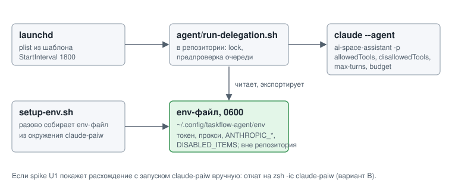

# ADR-003: Wrapper окружения `claude-paiw` под launchd и хранение секретов

- Status: Accepted
- Drives: FR-005, FR-006, NFR-001, NFR-002, AC-008, AC-009, AC-020, AC-021
- Source: SRC-3, SRC-4, SRC-11, SRC-13, SRC-31

## Context

`claude-paiw` определена в `~/.zshrc` как zsh-функция. Она выставляет `AI_LAUNCHER_PAIW_WORKSPACE`, `AI_LAUNCHER_PAIW_DISABLED_ITEMS`, `ANTHROPIC_BASE_URL`, `ANTHROPIC_CUSTOM_HEADERS` (токен прокси), `HTTP_PROXY`, `NO_PROXY` и затем вызывает `command claude "$@"`. launchd профиль не грузит. Существующий `run-with-env.sh` берёт только строки `export` и функцию не увидит. Токены в `.zshrc` лежат открытым текстом.

*Рис. 1. launchd запускает wrapper из репозитория, wrapper читает env-файл 0600 вне репозитория и вызывает `claude` с явными флагами.*

## Decision Drivers

- Запуск именно через окружение `claude-paiw`, без выбора другого агента (SRC-31).
- Секреты вне репозитория, права 0600 (подтверждено на Gate 2).
- Сопровождаемость: правка `.zshrc` не должна молча ломать демон.

## Considered Options

| Вариант | Плюсы | Минусы |
|---|---|---|
| A. Wrapper и env-файл 0600 | Детерминированно, не зависит от интерактивного zsh | Копия значений, нужна регенерация при смене токена |
| B. `zsh -ic 'claude-paiw ...'` | Буквальное соблюдение, одно место правды | Хрупко под launchd (плагины, tty, медленный старт), секреты остаются в `.zshrc` |
| C. Токен в Keychain | Надёжнее файла | Сложная отладка под launchd, отход от решения Gate 2 |

## Decision

Вариант A.

- `agent/run-delegation.sh` в репозитории: lock, предпроверка очереди, чтение env-файла, вызов `claude --agent ai-space-assistant -p ...` с флагами `--allowedTools`, `--disallowedTools`, `--max-turns`, `--max-budget-usd`. `bypassPermissions` не используется.
- Env-файл `~/.config/taskflow-agent/env` (0600, каталог 0700) вне репозитория: токен, прокси, `ANTHROPIC_*`, `DISABLED_ITEMS`. В репозитории только `env.example` с именами переменных.
- `agent/setup-env.sh` разово собирает env-файл из окружения пользователя и ничего не логирует.
- Шаблон plist в репозитории, `StartInterval 1800`, логи в `~/Library/Logs`.
- Пользователь явно принял, что запуск `claude` с тем же окружением, что задаёт `claude-paiw`, считается выполнением SRC-31.

**Условие (spike U1).** До реализации spike U1 должен показать, что запуск под launchd (`launchctl kickstart`) ведёт себя так же, как `claude-paiw` вручную: MCP `taskflow` и прокси доступны, `--agent ai-space-assistant` стартует. Если поведение расходится, берётся вариант B (`zsh -ic claude-paiw`), а change останавливается до решения пользователя, если не работает и он (подмена на `claude --agent` без окружения запрещена). Spike U5 проверяет, какие навыки доступны под `DISABLED_ITEMS` для сценариев «поздравление» и «ревью MR».

## Consequences

Положительные:
- Запуск воспроизводим и не зависит от содержимого `.zshrc` во время прогона.
- Права и лимиты агента видны в одном скрипте и проверяются тестом (AC-020, AC-021).

Отрицательные и меры:
- Значения дублируются: при смене токена или `DISABLED_ITEMS` env-файл надо пересоздать. Мера: `setup-env.sh` и проверка в wrapper на пустые обязательные переменные с записью в лог.
- Токен лежит в файле (0600), не в Keychain. Принято для личного инструмента.
