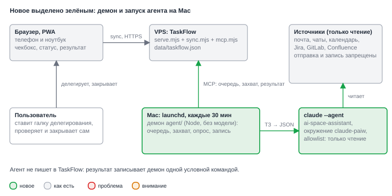
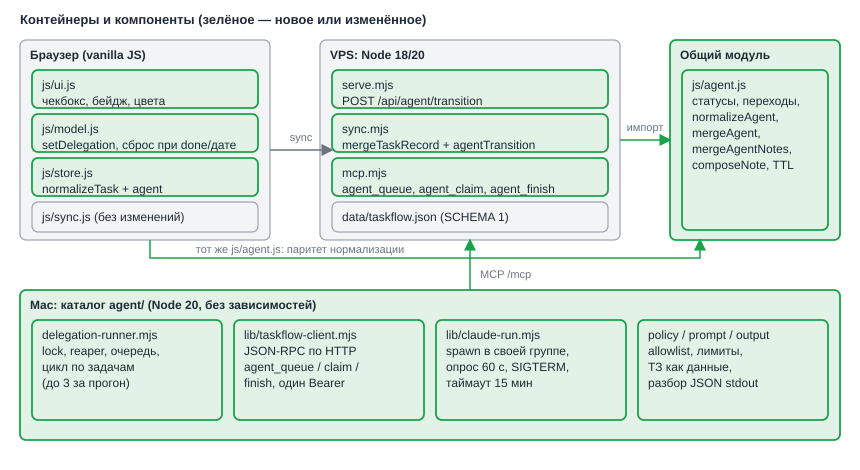
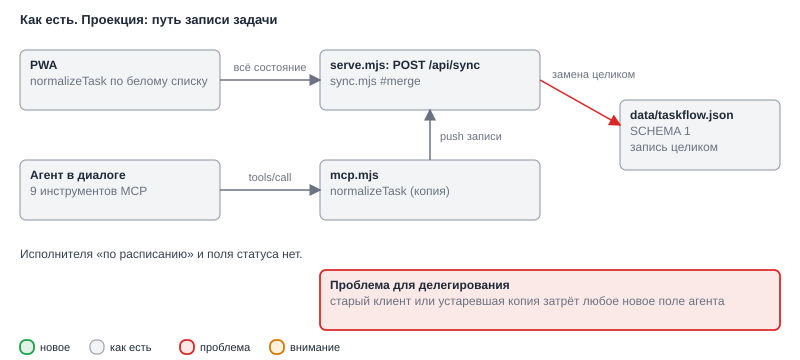
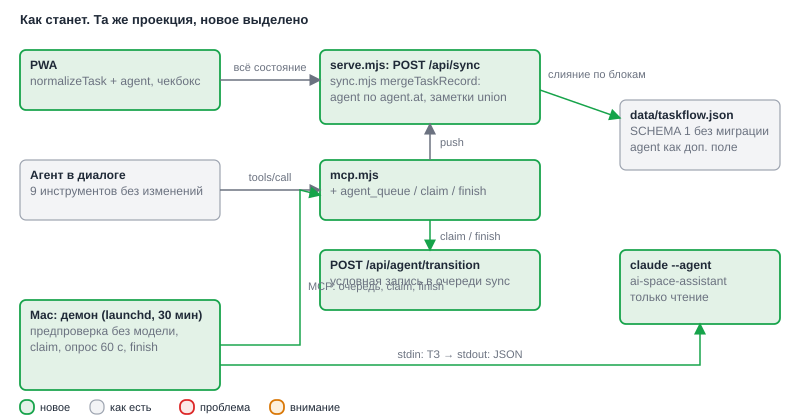
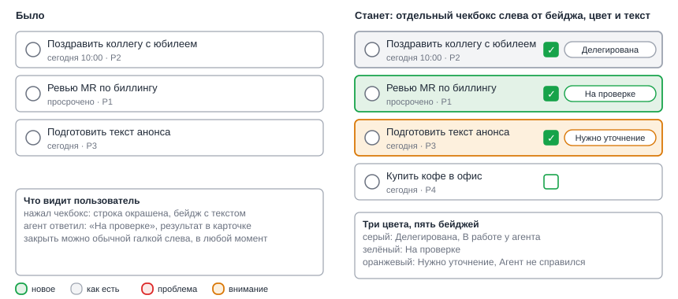
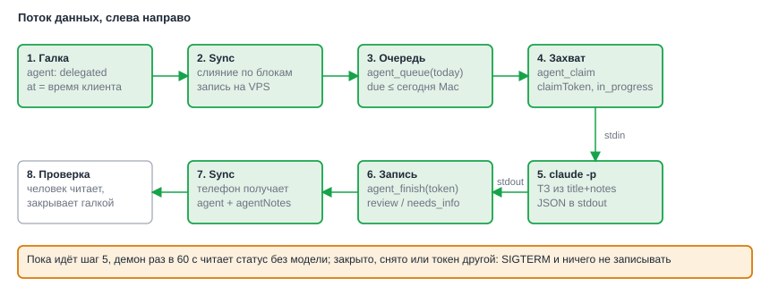

# HLD: add-agent-delegation

**Date**: 2026-10-04
**Designer**: system-designer
**Status**: Draft (Gate A снят пользователем: «выполняй без подтверждения»)
**Proposal**: `openspec/changes/add-agent-delegation/proposal.md`

## Overview

В строке задачи из «Сегодня» появляется отдельный чекбокс «Делегировать агенту». Отмеченная задача попадает в очередь. Раз в 30 минут launchd запускает на Mac небольшой Node-демон. Он без модели проверяет очередь через MCP, захватывает задачу, запускает `claude --agent ai-space-assistant` с окружением `claude-paiw` и получает результат в stdout. Запись результата делает сам демон одной условной командой. Агент в TaskFlow ничего не пишет. Результат ложится в `agentNotes`, статус становится «на проверке», закрывает задачу человек.

Данные расширяются одним блоком `agent` в записи задачи. `SCHEMA` остаётся `1`, миграции нет. Главный риск здесь не интерфейс, а потеря данных при слиянии: `sync.mjs` сегодня заменяет запись целиком по `updatedAt`, и старый клиент затёр бы поле агента. Поэтому слияние становится блочным: поля пользователя по `updatedAt`, блок `agent` по своей метке `agent.at`, заметки объединяются (ADR-001). Всё, что связано со статусом агента, живёт в одном чистом модуле `js/agent.js`, который импортируют браузер, `sync.mjs`, `mcp.mjs` и демон. Так нормализация и правила слияния не расходятся между копиями.

Ограничения безопасности держит не промпт, а запуск: allowlist только на чтение, явный denylist на отправку и запись, лимиты по времени, ходам и бюджету, текст задачи как данные (ADR-003, ADR-002).

## Architecture

### System Context (C4 Level 1)

*Новая часть системы одна: демон и запуск агента на Mac. Источники агент только читает.*

### Component Diagram (C4 Level 2)

*Модуль `js/agent.js` общий для трёх сред исполнения, а `agentTransition` в `sync.mjs` единственное место, где агент меняет запись.*

## Change Visualization (As-Is → To-Be)

Легенда для всех фигур: зелёный — новое, серый — как есть, красный — проблема, оранжевый — на что обратить внимание.

### Как есть (As-Is)

*Рис. 1. Запись уходит целиком и заменяется целиком. Любое новое поле агента переживёт только тот клиент, который его знает.*

### Как станет (To-Be)

*Рис. 2. Путь записи тот же, но слияние идёт по блокам, а у агента есть свой вход: три инструмента MCP и условная запись.*

### До/после для ключевого сценария

*Рис. 3. Строка «Сегодня» получает отдельный чекбокс и цветной бейдж с текстом. Список, галка выполнения и жесты строки остаются прежними.*

### Что меняется пошагово

Порядок такой, в каком данные проходят через систему.

1. **Строка списка (`js/ui.js`)**: было — одна галка выполнения. Станет — вторая кнопка `delegate` с `role="checkbox"`, класс подсветки и текстовый бейдж статуса. Нажатие не открывает карточку и не начинает drag.
2. **Операции над задачей (`js/model.js`)**: было — `toggleDone`, `updateTask`. Станет — `setDelegation(id, on)`. Закрытие, возврат и перенос на будущую дату сбрасывают делегирование, у повторяющейся задачи статус возвращается в `delegated`.
3. **Нормализация (`js/store.js`, `mcp.mjs`)**: было — две копии белого списка полей. Станет — обе вызывают `normalizeAgent` из `js/agent.js`. Задачи без блока `agent` остаются без него.
4. **Слияние (`sync.mjs`)**: было — `updatedAt` решает за всю запись. Станет — `mergeTaskRecord`: пользовательские поля по `updatedAt`, `agent` по `agent.at`, `agentNotes` объединяются по паре `(at, text)`.
5. **Условная запись (`sync.mjs`, `serve.mjs`)**: было — только слияние. Станет — `agentTransition` (`claim`, `finish`, `reap`) в той же очереди записи и маршрут `POST /api/agent/transition`.
6. **MCP (`mcp.mjs`)**: было — девять инструментов. Станет — те же девять без изменений и три новых: `agent_queue`, `agent_claim`, `agent_finish`.
7. **Демон на Mac (`agent/`)**: было — ничего. Станет — launchd каждые 1800 с запускает shell, который читает env-файл и вызывает Node-раннер: блокировка, предпроверка, захват, запуск `claude`, опрос статуса раз в 60 с, запись результата.
8. **Выкладка (`scripts/deploy-check.mjs`, `sw.js`)**: было — ручная. Станет — бэкап `data/taskflow.json` с пятью последними копиями и сверкой числа задач до и после, версия кэша `sw.js` повышается.

### Key Architectural Decisions

| Decision | Choice | Drives | ADR |
|---|---|---|---|
| Слияние при sync | Блок `agent` по `agent.at`, заметки union, отсутствие ключа значит «не знаю» | NFR-004, NFR-005, NFR-006, FR-003, FR-008, FR-011 | [ADR-001](adrs/001-sync-merge-agent-fields.md) |
| Прерывание и зависшие задачи | Опрос статуса раз в 60 с, SIGTERM, условная запись по токену, TTL 20 минут | FR-009, FR-011, NFR-002, NFR-003 | [ADR-002](adrs/002-interrupt-and-ttl.md) |
| Запуск под launchd | Wrapper и env-файл 0600, `claude` с окружением `claude-paiw`, spike U1 как условие | FR-005, FR-006, NFR-001, NFR-002 | [ADR-003](adrs/003-launchd-wrapper-env.md) |
| Где живёт логика статуса | Один чистый модуль `js/agent.js`, общий для браузера, сервера, MCP и демона | NFR-004, NFR-005, NFR-007 | — (развилки нет, дополнение к ADR-001) |
| Как выполняется условная запись | `agentTransition` внутри очереди записи `SyncStore`, маршрут `/api/agent/transition` по токену синхронизации | FR-003, FR-011, NFR-003 | — (реализует «атомарно на сервере» из ADR-002) |
| Демон: язык и граница | Shell только грузит окружение, вся логика в Node без зависимостей | FR-005, NFR-002, NFR-003 | — (уточнение ADR-003, нужна проверяемость тестами) |
| Канал демона к TaskFlow | JSON-RPC по HTTP на `/mcp` с одним MCP-токеном, без модели | FR-004, FR-013 | — (C3, C8) |
| Формат результата агента | Одна JSON-строка в stdout: `{status, text}`, разбор в демоне | FR-008, FR-009 | — (C8) |

## Decision Forks

### Fork 1: как не потерять поля агента при слиянии

Слияние записи целиком теряет блок `agent`, если пришёл старый клиент или устаревшая копия. Сравнение вариантов и допущение про часы — в [ADR-001](adrs/001-sync-merge-agent-fields.md). Дополнение дизайна: клиент ставит `agent.at = max(Date.now(), прежний at + 1)`, чтобы собственные метки не шли назад даже при отставших часах телефона.

### Fork 2: что делать, когда задачу закрыли во время работы

Опрос раз в минуту плюс условная запись на сервере. Агент сам статус не проверяет и в файл не пишет. См. [ADR-002](adrs/002-interrupt-and-ttl.md).

### Fork 3: как повторить окружение `claude-paiw` без интерактивного zsh

Env-файл с правами 0600 и wrapper в репозитории. Запасной путь `zsh -ic claude-paiw` включается только при провале spike U1. См. [ADR-003](adrs/003-launchd-wrapper-env.md).

## Data Flow

*Задача проходит восемь шагов: галка, sync, очередь, захват, запуск, запись, sync на телефон, проверка человеком. Пока идёт шаг 5, демон раз в минуту сверяет статус.*

Подробные последовательности (прогон, гонка закрытия) и диаграмма статусов — в `design.md`.

## Cross-cutting Concerns

- **Observability**: демон пишет в `~/Library/Logs/taskflow-agent/run.log` одну строку JSON на событие: прогон, захват, завершение, отклонение записи, убийство процесса. Текст задачи и секреты в лог не попадают, только `id`, статус, длительность и стоимость из ответа `claude`. На сервере новых логов нет, добавляется только строка при отклонении `agentTransition`.
- **Security**: allowlist только на чтение плюс явный denylist (ADR-003). Из окружения процесса `claude` вырезается MCP-токен TaskFlow, у агента нет ни одного инструмента TaskFlow. Текст задачи подаётся через stdin внутри JSON-блока, символ `<` экранируется, так что закрыть блок изнутри нельзя. Env-файл 0600, каталог 0700, `setup-env.sh` ничего не печатает.
- **Error handling**: любой отказ демона (таймаут, ненулевой код, неверный формат, исчерпанный лимит) превращается в `failed` с причиной одной строкой. Автоповторов нет: повторить можно, сняв и поставив галку. Отказ условной записи молча отбрасывается, повторной попытки нет. Недоступность сети при `finish` оставляет `in_progress`, через 20 минут reaper следующего прогона ставит `failed` по TTL.
- **Performance**: пустая очередь стоит одного HTTP-запроса. За прогон не больше трёх задач, последовательно. Размер заметки ограничен 4000 символами, `--max-turns 30`, `--max-budget-usd 2.00`, таймаут 15 минут. Данные по-прежнему целиком в одном JSON, это десятки килобайт.
- **Совместимость**: клиентская корректность не зависит от обновления кэша. Старый PWA без `js/agent.js` продолжает работать, серверная защита ADR-001 сохраняет его поля. Версия кэша `sw.js` повышается до `taskflow-v16`, `js/agent.js` добавляется в оболочку.

## Constraints for Developer

- C1: блок `agent` = `{status, claimedAt, finishedAt, claimToken, at}`. Единственная реализация нормализации — `js/agent.js`. `SCHEMA` остаётся `1`. Тест паритета `js/store.js` и `mcp.mjs` обязателен.
- C2: существующие девять инструментов MCP не меняются. Для задач без `agent` их вывод посимвольно совпадает с нынешним (golden-файлы снимаются до правок).
- C3: предпроверка очереди и опрос статуса идут обычным HTTP без модели.
- C4: «Сегодня» для демона — локальная дата Mac, передаётся в `agent_queue` и `agent_claim` параметром `today`. Время в `due` игнорируется.
- C5: перед выкладкой `scripts/deploy-check.mjs backup`, после — `compare`. Хранится пять копий. Расхождение останавливает выкладку.
- C6: версия кэша `sw.js` повышается, добавляется `./js/agent.js`.
- C7: текст задачи только данными, `bypassPermissions` и `--dangerously-skip-permissions` не используются. Тест проверяет итоговый argv.
- C8: stdout агента — одна JSON-строка `{"status":"review|needs_info|failed","text":"..."}`. Опрос 60 с, заметка до 4000 символов, `--max-turns 30`, `--max-budget-usd 2.00`, таймаут 15 минут, TTL 20 минут, до 3 задач за прогон.
- C9: первой идёт блокирующая задача: spike U1 (запуск под `launchctl kickstart`, при расхождении откат на `zsh -ic claude-paiw`) и spike U5 (какие навыки и инструменты доступны под `DISABLED_ITEMS`). Остальная работа над демоном стартует после зелёного U1. Офлайн-сценарий старого клиента закрывается тестом AC-026.
- C10: `serve.mjs` и `sync.mjs` не получают новых зависимостей и работают на Node 18. Тест запускает их в каталоге без `node_modules`.
- C11: `mcp.mjs` экспортирует `normalizeTask` и `TOOLS` и запускает сервер только как точку входа. Иначе паритет и контракт не проверить без сети.

## Superseded Documents

Нет.

## References

- Proposal: `openspec/changes/add-agent-delegation/proposal.md`
- Requirements source: `openspec/changes/add-agent-delegation/requirements-source.md`
- Research: `openspec/changes/add-agent-delegation/research.md`
- ADR-001: `adrs/001-sync-merge-agent-fields.md`
- ADR-002: `adrs/002-interrupt-and-ttl.md`
- ADR-003: `adrs/003-launchd-wrapper-env.md`
- Спеки проекта: `openspec/specs/agent-task-api`, `agent-inbox`, `mcp-transport-auth`

---

*Created by System Designer agent (04). Gate A снят пользователем, затем design.md.*
