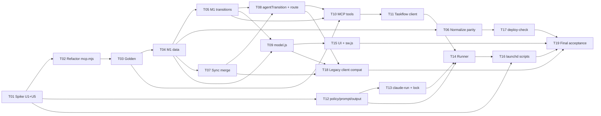

# Tasks: add-agent-delegation

**Date**: 2026-10-04
**Planner**: task-planner
**Status**: Accepted (Gate A и Gate B сняты пользователем, вопросы по гранулярности разрешены планировщиком, см. «Принятые решения»)
**Design**: `openspec/changes/add-agent-delegation/design.md`
**HLD**: `openspec/changes/add-agent-delegation/hld.md`

## Overview

Декомпозиция дизайна в 19 задач: блокирующий spike, два prefactoring-шага (рефакторинг `mcp.mjs`, golden-файлы), затем вертикальные срезы от чистого ядра `js/agent.js` через sync, MCP, клиент и UI до демона и выкладки. Порядок следует C2: spike U1+U5, golden на неизменённом поведении, M1 с тестами.

**Total tasks**: 19
**Total effort**: 39 story points (S=1, M=2, L=3)

> Каждая задача несёт поле `Verification`: команду, чей exit code отвечает на вопрос «задача сделана». До реализации команда падает (нет файла теста или модуля), после проходит.

### Общие правила для всех задач (ограничения оркестратора)

- Тесты и spike никогда не читают и не пишут реальный `data/taskflow.json` основного чекаута и не обращаются к VPS. Только временные каталоги (`fs.mkdtemp`) и синтетические фикстуры. Реальные снимки проверяются на выкладке вручную командой `check-snapshot` (T17), не в тестах.
- Spike не устанавливает plist постоянно. Только временный `launchctl submit` (или `bootstrap` во временный label) с обязательным удалением в `trap`/`finally`. `claude` запускается на синтетической задаче во временном экземпляре `serve.mjs` с временным каталогом данных.
- Установка plist у пользователя: ручной шаг из `agent/README.md`, ни одна задача не выполняет её на машине пользователя.
- Работа только в этом worktree. Без атрибуции Claude/AI в коммитах и файлах.
- Для коротких и однострочных тестов: `"test": "node --test test/"` (T02).

## Принятые решения (вместо вопросов Gate A)

| Вопрос | Решение (консервативно) |
|---|---|
| Гранулярность M1 | Два среза: T04 (данные, вид, слияние) и T05 (переходы, очередь), потому что UI и sync зависят от первого, демон от второго |
| Golden-файлы до или после рефакторинга `mcp.mjs` | Рефакторинг T02 механический (перенос запуска в `main()` и экспорт), затем T03 снимает эталон. Чтобы доказать эквивалентность, T03 дополнительно сверяет вывод с прогоном исходного `mcp.mjs` из `git show <base>:mcp.mjs` во временном каталоге по stdio, если SDK установлен; иначе помечает проверку как skip и фиксирует это в заметке |
| `claude-paiw` против `claude` | Берётся ADR-003 (`claude` + env-файл). Провал U1/U5: откат на `zsh -ic claude-paiw` и **остановка**, T04 и дальше не стартуют до решения пользователя |
| Live-проверка M8 против `mcp.mjs` | В T11 с `t.skip`, если SDK не установлен |
| Ручные проверки UI | Чек-лист в T15 и T19, автоматизируется только чистая `agentView` |
| Метка кэша `sw.js` | `taskflow-v16`, строго по C9 входа; в T15 |

## Task Graph



## Progress checklist (для apply)

- [~] 1.1 T01 Spike U1+U5 — spike подготовлен (agent/spike/run-spike.sh), прогон — ручной шаг пользователя; блокирующая зависимость снята решением пользователя. U5 частично: `tools/call` без `initialize` на stateless /mcp работает. T12/T16 строят allowlist и argv по design.md с полными именами mcp__<server>__<tool>, сверка с выводом spike до QA
- [x] 1.2 T02 Рефакторинг mcp.mjs и тестовая инфраструктура
- [x] 1.3 T03 Golden-файлы девяти инструментов
- [x] 2.1 T04 M1: данные, вид, слияние
- [x] 2.2 T05 M1: переходы, очередь
- [x] 2.3 T06 Нормализация и паритет
- [x] 3.1 T07 Слияние в sync.mjs
- [x] 3.2 T08 agentTransition и маршрут
- [x] 3.3 T09 model.js
- [x] 4.1 T10 MCP-инструменты
- [x] 4.2 T11 Клиент TaskFlow
- [x] 5.1 T12 policy, prompt, output
- [x] 5.2 T13 claude-run и lock
- [x] 5.3 T14 runOnce
- [ ] 6.1 T15 UI и sw.js (ждёт ручной проверки: жесты и обе темы; снято по ревью I08)
- [x] 6.2 T16 launchd, env, README
- [x] 7.1 T17 deploy-check
- [x] 7.2 T18 Совместимость старого клиента
- [ ] 7.3 T19 Итоговая приёмка (ждёт ручных пунктов чек-листа; снято по ревью I08)

## Tasks

### T01: Spike U1+U5: headless claude под launchd и состав инструментов

**Role**: Infra
**Effort**: L
**Blocked by**: []
**Covers**: FR-006, FR-005, NFR-001, AC-009, SRC-35 (проверка осуществимости; первая блокирующая задача по C2)

**What to build**:
Скрипт `agent/spike/run-spike.sh` и заметка `openspec/changes/add-agent-delegation/spike-u1-u5.md`. Скрипт во временном каталоге поднимает экземпляр `serve.mjs` на свободном порту с временным каталогом данных и одной синтетической задачей. Затем во временном launchd-окружении (`launchctl submit -l taskflow.spike.<rand>` или `bootstrap` временного plist из `mktemp`, удаление в `trap EXIT`) запускает `claude` с окружением из временного env-файла (0600), собранного из текущей оболочки, на синтетической задаче. Проверяется U1: запуск с коротким `PATH`, окружением прокси и заголовков, флагов `--agent ai-space-assistant -p --output-format json --max-turns --max-budget-usd --allowedTools --disallowedTools --append-system-prompt`, промпта через stdin, формата конверта `result`. Проверяется U5: реальный состав доступных MCP-инструментов и навыков под `AI_LAUNCHER_PAIW_DISABLED_ITEMS`, сверка имён `ALLOWED_TOOLS`/`DISALLOWED_TOOLS` из дизайна, нужен ли `Read`, нужен ли `initialize` перед `tools/call` (вход для T11). Отдельно проверяется SRC-35: запуск именно `claude --agent ai-space-assistant` с окружением `claude-paiw` из env-файла 0600 (это и есть выполнение SRC-31), argv совпадает с AC-009; при провале U1 проверяется fallback `zsh -ic claude-paiw` (его argv тоже фиксируется). Результат: файл заметки с строками `U1: PASS|FAIL`, `U5: PASS|FAIL`, `SRC-35: env-launch PASS|FAIL, fallback PASS|FAIL|n/a`, фактический argv, список расхождений с дизайном.
Реальный `data/taskflow.json`, VPS и постоянный plist не используются.

**Acceptance criteria**:
- [ ] Скрипт работает только во временных каталогах, на выходе (в том числе при сбое) временная задача launchd снята, временный `serve.mjs` остановлен
- [ ] Заметка содержит вердикты U1 и U5, подтверждённый argv, список инструментов чтения, нужных для сценариев, и расхождения с `policy.mjs` из дизайна
- [ ] При `FAIL`: заметка фиксирует откат на `zsh -ic claude-paiw` и явную остановку до решения пользователя; следующие задачи не стартуют
- [x] Выяснено, нужен ли `initialize` перед `tools/call` на stateless `/mcp`
- [ ] Заметка подтверждает argv `claude --agent ai-space-assistant ...` с окружением из env-файла (SRC-35, AC-009) и, при `U1: FAIL`, работоспособность fallback `zsh -ic claude-paiw`

**Verification**:
```bash
node --test test/spike-report.test.mjs
```
Тест читает заметку: есть строки `U1: PASS` и `U5: PASS`, нет упоминания реального `data/taskflow.json`; плюс `launchctl list | grep -c taskflow.spike` равно 0. Падает, пока заметки нет; при `FAIL` в заметке тест падает намеренно, это стоп-сигнал.

**Files** (estimated):
- `agent/spike/run-spike.sh` — временный harness
- `openspec/changes/add-agent-delegation/spike-u1-u5.md` — результаты
- `test/spike-report.test.mjs` — проверка заметки и отсутствия остатков launchd

---

### T02: Рефакторинг mcp.mjs без смены поведения и тестовая инфраструктура

**Role**: GO
**Effort**: M
**Blocked by**: [T01]
**Covers**: — (prefactoring по C3: без него паритет и контракт не проверить; импорт `mcp.mjs` сейчас создаёт токен-файл и открывает порт)

**What to build**:
Запуск сервера (`loadMcpToken`, динамический импорт SDK, `listen`) переносится в `main()`, срабатывающую только при запуске как программы (`import.meta.url === pathToFileURL(process.argv[1]).href`). Экспортируются `normalizeTask`, `TOOLS`, `findTask`. В `package.json` добавляется `"test": "node --test test/"`. Поведение сервера не меняется. Добавляется минимальный тест, что импорт не создаёт токен-файл и не открывает порт.

**Acceptance criteria**:
- [x] `import('./mcp.mjs')` не создаёт файлов, не слушает порт
- [x] `node mcp.mjs` запускается, как раньше (токен, порт, `/mcp` отвечают)
- [x] Экспортированы `normalizeTask`, `TOOLS`, `findTask`; порядок и содержимое `TOOLS` прежние
- [x] Новых зависимостей нет

**Verification**:
```bash
npm test -- --test-name-pattern 'mcp import'
```
Тест `test/mcp-import.test.mjs` с `HOME` во временный каталог падает до рефакторинга (импорт создаёт токен-файл или зависает), проходит после.

**Files** (estimated):
- `mcp.mjs` — `main()`, экспорты
- `package.json` — скрипт `test`
- `test/mcp-import.test.mjs`

---

### T03: Golden-файлы девяти инструментов на неизменённом поведении

**Role**: QA
**Effort**: M
**Blocked by**: [T02]
**Covers**: NFR-007, AC-027 (эталон фиксируется ДО добавления чего-либо в поведение)

**What to build**:
Фикстура задач без блока `agent` (все исторические формы записи) во временном каталоге данных. Генератор вызывает `TOOLS[i].run` для всех девяти инструментов (`tasks_list`, `task_get`, `task_add`, `task_edit`, `task_done`, `task_snooze`, `task_comment`, `subtask_add`/`subtask_toggle`, `inbox_add`, `inbox_list`: ровно те, что есть в `TOOLS`) на изолированном `SyncStore` и пишет `test/golden/<tool>.txt`. Эталон коммитится отдельным коммитом и больше не пересоздаётся. Тест `mcp-contract.test.mjs` сверяет вывод с эталоном побайтно. Если SDK установлен, один дополнительный тест сверяет вывод с прогоном исходной версии `mcp.mjs` (`git show <base>:mcp.mjs`) во временном каталоге; иначе `t.skip` и пометка в заметке коммита.
Реальные данные не используются.

**Acceptance criteria**:
- [x] По одному golden-файлу на каждый из девяти инструментов, включая ответы с ошибками (`ToolError`)
- [x] Фикстура детерминирована (фиксированные id и метки времени, `Date.now` подменён)
- [x] Тест падает при любом изменении формы вывода существующих инструментов
- [x] Каталог `test/golden/` помечен в `test/golden/README.md`: «не пересоздавать»

**Verification**:
```bash
node --test test/mcp-contract.test.mjs
```
Падает до появления golden-файлов, проходит после.

**Files** (estimated):
- `test/mcp-contract.test.mjs`, `test/golden/*.txt`, `test/golden/README.md`, `test/fixtures/legacy-tasks.json`

---

### T04: M1 js/agent.js: данные, вид строки, слияние

**Role**: GO
**Effort**: L
**Blocked by**: [T03]
**Covers**: FR-001, FR-002, FR-003, FR-012, NFR-004, NFR-005, AC-002, AC-003, AC-004, AC-025 (чистая часть)

**What to build**:
Первая половина чистого модуля `js/agent.js` (импортирует только `js/core.js`; без DOM, `node:*`): `AGENT_STATUSES`, `AGENT_LABELS`, `AGENT_TONE`, `LIMITS` (TTL 20 мин, NOTE_MAX 4000, REASON_MAX 300), `normalizeAgent`, `nextAt`, `delegateBlock`, `clearBlock`, `resetBlock`, `isDelegable`, `agentView`, `mergeAgent`, `mergeAgentNotes`, `mergeTaskRecord`, `composeNote`. Все инварианты из M1 (коммутативность, идемпотентность `mergeAgentNotes`, `mergeTaskRecord(undefined, inc) === inc`, отсутствующий ключ во входящем = «не знаю»). Ключ `agent` после появления не удаляется (C5).

**Acceptance criteria**:
- [x] `normalizeAgent(undefined|null)` даёт `undefined`; мусор даёт блок со `status: null`, `at: 0`
- [x] `agentView` даёт видимость чекбокса только для сегодняшних и просроченных; три тона; тексты `short`/`full` из дизайна
- [x] `mergeAgent` выбирает по большему `at`, при равенстве остаётся серверный; `mergeAgentNotes` только добавляет, идемпотентна, порядок по `(at, text)`
- [x] `composeNote` обрезает `review`/`needs_info` до 4000, сводит `failed` к одной строке до 300
- [x] В модуле нет `node:*`, DOM и `Date.now()` по умолчанию в функциях решений (кроме `nextAt`)

**Verification**:
```bash
node --test test/agent.test.mjs --test-name-pattern 'data|view|merge|note'
```
Падает до реализации (нет модуля). Случайные перестановки слияния используют фиксированный seed.

**Files** (estimated):
- `js/agent.js`, `test/agent.test.mjs`

---

### T05: M1 js/agent.js: таблица переходов и очередь

**Role**: GO
**Effort**: M
**Blocked by**: [T04]
**Covers**: FR-003, FR-004, FR-008, FR-009, FR-010, FR-011, FR-012, NFR-003, AC-005, AC-006, AC-007, AC-011, AC-014, AC-016, AC-017

**What to build**:
`reconcileAgent(task, ev, ctx)` с событиями `close | reopen | repeat | due_change` (единая точка сброса блока, M1; вызывается из M3 `model.js` и M7 MCP): `close` очищает статус, `reopen` очищает, `repeat` даёт `delegated` с сохранением `agentNotes`, `due_change` в будущее или без срока очищает, иначе блок не меняется; метки через `nextAt`, у задач без блока возвращается та же задача без ключа `agent`. `applyAgentTransition(task, req, now)` для `claim`, `finish`, `reap` с причинами `Reason` и порядком проверок из дизайна; `buildQueue(tasks, {today, now})` с порядком (дата `due`, затем `agent.at`, затем приоритет), игнорированием времени в `due`, списком `stale` по TTL. Функции чистые, `updatedAt` задачи не меняется.

**Acceptance criteria**:
- [x] Допустимы только `delegated→in_progress`, `in_progress→review|needs_info|failed`, снятие из любого статуса; остальное отклоняется нужной причиной
- [x] `claim` не берёт закрытые, без срока, будущие, входящие, не `delegated`
- [x] `finish` проверяет токен и статус; `reap` до TTL отклоняется `not_expired`
- [x] `buildQueue`: задача на сегодня берётся независимо от времени суток; не взятая вчера берётся сегодня; сверх лимита очередь не режется (лимит 3 применяет демон)
- [x] `review` не меняет `done`
- [x] `reconcileAgent`: `close`→очистка, `reopen`→очистка, `repeat`→`delegated` с прежними `agentNotes`, `due_change` в будущее или без срока→очистка, на сегодня или в прошлое→блок не тронут; задача без блока остаётся без ключа `agent`; результат чистый и идемпотентный

**Verification**:
```bash
node --test test/agent.test.mjs --test-name-pattern 'transition|queue|reconcile'
```

**Files** (estimated):
- `js/agent.js`, `test/agent.test.mjs`

---

### T06: Нормализация в store.js и mcp.mjs и тест паритета

**Role**: GO
**Effort**: S
**Blocked by**: [T04]
**Covers**: NFR-004, AC-023, AC-024

**What to build**:
В `js/store.js` и `mcp.mjs` `normalizeTask` собирает поле через `normalizeAgent` и добавляет `agent` только если блок есть (`...(agent ? { agent } : {})`). `SCHEMA` остаётся `1`. Тест паритета на фикстуре всех исторических форм (без `kind`, `source`, `agentNotes`, с блоком, с мусором в `agent`); для задач без блока JSON идентичен прежнему.

**Acceptance criteria**:
- [x] Обе функции дают одинаковый JSON на одних данных
- [x] У задач без блока ключа `agent` нет, результат побайтно равен эталону T03
- [x] `SCHEMA === 1` в `js/store.js`, `sync.mjs`, `serve.mjs`
- [x] `test/mcp-contract.test.mjs` проходит без изменений

**Verification**:
```bash
node --test test/store-parity.test.mjs test/mcp-contract.test.mjs
```

**Files** (estimated):
- `js/store.js`, `mcp.mjs`, `test/store-parity.test.mjs`

---

### T07: Слияние по блокам в sync.mjs

**Role**: GO
**Effort**: M
**Blocked by**: [T04]
**Covers**: NFR-005, NFR-009, AC-025, AC-029 (часть: `sync.mjs` без зависимостей)

**What to build**:
`SyncStore.#merge` использует `mergeTaskRecord` из M1 и пишет запись, только если результат отличается (`applied` считается по факту). Ни одна задача и ни одно поле агента не удаляются слиянием; надгробия работают как раньше. Импортируются только `js/agent.js` и `node:*` (Node 18).

**Acceptance criteria**:
- [x] Запись без `agent`/`agentNotes` не стирает их на сервере
- [x] Конкурентная правка человека (заголовок) и агента (блок + заметка) сохраняет обе, ни одна задача не пропадает
- [x] Для записей без блока результат совпадает с прежним поведением (задача целиком при большем `updatedAt`)
- [x] Надгробие против правки решается как раньше
- [x] Работает во временном каталоге, реальные данные не трогаются

**Verification**:
```bash
node --test test/sync-merge.test.mjs
```

**Files** (estimated):
- `sync.mjs`, `test/sync-merge.test.mjs`

---

### T08: agentTransition и маршрут /api/agent/transition

**Role**: GO
**Effort**: M
**Blocked by**: [T05, T07]
**Covers**: FR-003, FR-011, FR-013 (серверная часть), NFR-003, NFR-009, AC-016, AC-018, AC-022, AC-029

**What to build**:
`SyncStore.agentTransition(req)` в той же очереди `this.queue` (C7): `now = Date.now()`, `randomUUID()` для claim, `applyAgentTransition`, при успехе `#write` с `rev + 1`, при отказе файл не пишется. Маршрут `POST /api/agent/transition` в `serve.mjs` после проверки токена: 200 / 409 `{ok:false, reason}` / 400 / 401. Остальные маршруты не меняются. Тест поднимает копию `serve.mjs` + `sync.mjs` + `js/` в каталоге без `node_modules`.

**Acceptance criteria**:
- [x] Второй `claim` отклонён; `finish` с чужим токеном, после закрытия, после снятия делегирования отклонён
- [x] `reap` до TTL отклонён, после TTL ставит `failed`
- [x] Запись не меняет `updatedAt` и пользовательские поля
- [x] `serve.mjs` стартует без `npm install`; `/api/ping`, `/api/state`, `/api/sync` без изменений

**Verification**:
```bash
node --test test/sync-merge.test.mjs test/serve-http.test.mjs
```

**Files** (estimated):
- `sync.mjs`, `serve.mjs`, `test/serve-http.test.mjs`, `test/sync-merge.test.mjs`

---

### T09: model.js: setDelegation и точки сброса

**Role**: GO
**Effort**: M
**Blocked by**: [T04, T05]
**Covers**: FR-001, FR-003, FR-010, FR-011, FR-012, AC-001 (логика), AC-002, AC-005, AC-015, AC-016, AC-017

**What to build**:
`setDelegation(id, on)` и сброс блока в `toggleDone` (закрытие, возврат, повтор) и `updateTask` (перенос `due` в будущее или удаление срока снимает делегирование). Сброс выполняется только через `reconcileAgent` из M1 (T05) с событиями `close`/`reopen`/`repeat`/`due_change`, собственной логики сброса в `model.js` нет. Все метки через `nextAt` (C6), всё через `commit`. `VIEWS` не получает фильтра «На проверке».

**Acceptance criteria**:
- [x] `setDelegation(on=true)` работает только в «Сегодня» и без существующего статуса; `on=false` снимает любой статус, в том числе `in_progress`
- [x] Закрытие и возврат очищают статус; повторяющаяся задача получает `delegated`, прошлые `agentNotes` остаются, `due` переносится
- [x] Перенос на будущую дату снимает делегирование, `agentNotes` остаются
- [x] Закрытие при `in_progress` разрешено
- [x] Нет фильтра, уведомления и поля инструкции
- [x] Все сбросы идут через `reconcileAgent` (результат совпадает с прямым вызовом функции из M1 на тех же входах)

**Verification**:
```bash
node --test test/model-agent.test.mjs
```
Тест с заглушкой `localStorage`.

**Files** (estimated):
- `js/model.js`, `test/model-agent.test.mjs`

---

### T10: Инструменты MCP agent_queue, agent_claim, agent_finish

**Role**: GO
**Effort**: M
**Blocked by**: [T03, T05, T08]
**Covers**: FR-013, FR-004, FR-010, FR-011, FR-012, NFR-007, AC-016, AC-017, AC-018, AC-027

**What to build**:
Три инструмента в конец `TOOLS` (существующие девять и порядок не меняются). `api()` получает режим, не бросающий на 409. Ответы одной строкой JSON, отказ `isError: true` и `AGENT_REJECTED:<reason>`. `agent_queue` читает `/api/state`, зовёт `buildQueue`, поддерживает `task_id` с `exists:false`. В `taskLine`/`taskDetails` для задач с блоком добавляются элементы статуса (только добавление). Описание: «Служебный инструмент демона делегирования, из диалога не вызывать». Сброс блока `agent` в существующих инструментах через `reconcileAgent` из M1 (M7): `task_done` (close→очистка; повтор→`delegated`; undo→очистка), `task_edit` и `task_snooze` (перенос `due` в будущее или без срока→очистка). У задач без блока вывод байт-в-байт прежний, golden-файлы T03 не меняются. Сквозной тест `test/mcp-agent-tools.test.mjs` покрывает AC-016, AC-017, AC-018 (M14).

**Acceptance criteria**:
- [x] Новые инструменты работают через реальный `serve.mjs` и тот же Bearer
- [x] Golden-файлы T03 проходят без изменений; для задач с блоком в выводе только добавлены элементы
- [x] `task_done` на задаче с блоком закрывает её и очищает статус (равно закрытию галкой); повторяющаяся задача получает `delegated`; undo очищает (AC-016, AC-017)
- [x] `task_edit` и `task_snooze` с переносом `due` в будущее или без срока очищают блок; перенос на сегодня или в прошлое блок не трогает
- [x] У задач без блока вывод всех существующих инструментов байт-в-байт прежний (golden T03)
- [x] Прямой записи в файл из `mcp.mjs` нет

**Verification**:
```bash
node --test test/mcp-agent-tools.test.mjs test/mcp-contract.test.mjs
```

**Files** (estimated):
- `mcp.mjs`, `test/mcp-agent-tools.test.mjs`

---

### T11: agent/lib/taskflow-client.mjs

**Role**: GO
**Effort**: M
**Blocked by**: [T10]
**Covers**: FR-013, AC-018

**What to build**:
Клиент JSON-RPC по HTTP (`queue`, `claim`, `finish`, `reap`), классы `TaskflowRejected`/`TaskflowUnavailable`, разбор `content[0].text`, таймаут, повтор с `initialize` только если T01 показал необходимость. Тест с подменой `fetchImpl` и (при установленном SDK, иначе `t.skip`) против живого `mcp.mjs` во временном окружении.

**Acceptance criteria**:
- [x] Отказ сервера даёт `TaskflowRejected(reason)`; сеть, 5xx, таймаут, мусор дают `TaskflowUnavailable`
- [x] Заголовки и тело запроса по дизайну M8
- [x] Токен не попадает в сообщения ошибок

**Verification**:
```bash
node --test test/taskflow-client.test.mjs
```

**Files** (estimated):
- `agent/lib/taskflow-client.mjs`, `test/taskflow-client.test.mjs`

---

### T12: policy.mjs, prompt.mjs, output.mjs

**Role**: GO
**Effort**: M
**Blocked by**: [T01]
**Covers**: FR-006, FR-007, FR-008, FR-009, NFR-001, NFR-002, SRC-35, AC-009, AC-010, AC-012, AC-013, AC-020, AC-021

**What to build**:
`agent/lib/policy.mjs` (`LIMITS_RUN`, `ALLOWED_TOOLS`, `DISALLOWED_TOOLS`, `buildClaudeArgs()`) по списку, подтверждённому T01; `prompt.mjs` (`buildPrompt` только из `title`+`notes`, `JSON.stringify` и замена `<`, `SYSTEM_PROMPT`); `output.mjs` (`parseClaudeOutput` по шести правилам дизайна). `buildClaudeArgs()` собирает argv для `claude --agent ai-space-assistant` с окружением из env-файла (SRC-35, выполнение SRC-31); `policy.mjs` экспортирует и fallback-команду `zsh -ic claude-paiw`, используемую только при `U1: FAIL` из заметки T01.

**Acceptance criteria**:
- [x] Пересечение allow и deny пусто; allow только на чтение, ни одного инструмента TaskFlow, `Bash`, `Write`, `Edit`
- [x] argv начинается с `claude` и содержит `--agent ai-space-assistant` (AC-009, SRC-35), `--max-turns 30`, `--max-budget-usd 2.00`; не содержит `bypassPermissions`, `--dangerously-skip-permissions`, `--permission-mode`
- [x] `</task_data>` в заголовке не закрывает блок; в промпте нет полей кроме заголовка и описания
- [x] `parseClaudeOutput`: ограждение ```json, мусор вокруг, неверный статус, пустой текст, `error_max_turns`, `error_max_budget_usd`, `is_error`, ненулевой код без конверта
- [x] Fallback `zsh -ic claude-paiw` описан в `policy.mjs` отдельной константой, по умолчанию не используется; тест проверяет оба варианта argv
- [x] Любое изменение allowlist требует правки теста (C9)

**Verification**:
```bash
node --test test/policy.test.mjs test/prompt.test.mjs test/output.test.mjs
```

**Files** (estimated):
- `agent/lib/policy.mjs`, `prompt.mjs`, `output.mjs`, `test/policy.test.mjs`, `test/prompt.test.mjs`, `test/output.test.mjs`

---

### T13: claude-run.mjs и lock.mjs

**Role**: GO
**Effort**: M
**Blocked by**: [T12]
**Covers**: NFR-001, NFR-003, NFR-002, AC-016, AC-022

**What to build**:
`runClaude` (процесс-группа `detached`, промпт через stdin, SIGTERM затем SIGKILL, `shouldAbort` по таймеру с логированием исключений, лимит stdout, хвост stderr 4 КБ только в лог, вырезание `TASKFLOW_MCP_*` и `TASKFLOW_AGENT_*` из env ребёнка) и `lock.mjs` (`mkdir`+`pid`, отбор замка у мёртвого процесса, `release` в `finally`). Тесты на `fake-claude.mjs` (режимы `ok`, `hang`, `exit1`) во временном каталоге.

**Acceptance criteria**:
- [x] `hang` убивается по таймауту и по `shouldAbort`, дочерняя группа мертва
- [x] Ребёнок не получает `TASKFLOW_MCP_TOKEN`
- [x] Второй `acquire` при живом первом отказывает; замок мёртвого процесса отбирается
- [x] `spawn_error` возвращается без исключения

**Verification**:
```bash
node --test test/claude-run.test.mjs test/lock.test.mjs
```

**Files** (estimated):
- `agent/lib/claude-run.mjs`, `agent/lib/lock.mjs`, `test/helpers/fake-claude.mjs`, `test/claude-run.test.mjs`, `test/lock.test.mjs`

---

### T14: delegation-runner.mjs (runOnce)

**Role**: GO
**Effort**: L
**Blocked by**: [T08, T11, T12, T13]
**Covers**: FR-004, FR-005, FR-008, FR-009, FR-011, FR-014, NFR-002, NFR-003, AC-007, AC-008, AC-011, AC-012, AC-013, AC-014, AC-016, AC-019, AC-021, AC-022

**What to build**:
`runOnce` по порядку из M10: замок, `today` по локальной дате Mac, `queue`, `reap` для `stale`, пустая очередь без запуска процесса, до 3 задач последовательно с захватом прямо перед запуском, опрос `shouldAbort`, ветки `aborted`/`timeout`/`spawn_error`/`exit`, `finish` без повторов. Коды выхода 0/78/1. Логи JSON без текста задач и секретов (C15). Точка входа `delegation-runner.mjs`. Тесты на `fake-claude.mjs` (режимы `ok`, `needs_info`, `bad_json`, `exit1`, `max_turns`, `hang`) и адаптере поверх `SyncStore` во временном каталоге (`test/helpers/fake-taskflow.mjs`), интервалы сокращены параметрами.

**Acceptance criteria**:
- [x] Пустая очередь не запускает процесс
- [x] Не больше 3 задач за прогон; остальные остаются `delegated`; нет автоповторов
- [x] Таймаут, ошибка запуска, неверный формат, лимиты дают `failed` с причиной; `needs_info` пишет вопрос; `review` дописывает результат без затирания `notes`
- [x] Закрытие или снятие делегирования во время работы убивает процесс и ничего не пишет; закрытие между завершением процесса и `finish` отклоняется сервером
- [x] Параллельный запуск блокируется замком; зависший `in_progress` по TTL становится `failed`
- [x] При недоступном сервере задачи остаются как были, пометок нет (Mac выключен = ничего не происходит)
- [x] В логах нет текста задач и значений переменных

**Verification**:
```bash
node --test test/runner.test.mjs
```

**Files** (estimated):
- `agent/delegation-runner.mjs`, `test/runner.test.mjs`, `test/helpers/fake-taskflow.mjs`

---

### T15: UI строки списка, стили и sw.js

**Role**: GO
**Effort**: M
**Blocked by**: [T09]
**Covers**: FR-001, FR-002, FR-010, NFR-006, AC-001, AC-003, AC-004, AC-015

**What to build**:
`js/ui.js`: `delegateToggle` (кнопка `role="checkbox"`, `stopPropagation`, исключение `.delegate` в `onRowDown`, видимость по `view.canToggle`), `agentBadge`, `data-agent="wait|ok|ask"`, строка «Агент: <full>» в редакторе, `toast('Делегирование снято')` при снятии переносом. `styles.css`: токены `--ag-wait/ok/ask` в светлой, тёмной и `[data-theme]` темах, контраст бейджа не ниже 4.5:1. `sw.js`: `CACHE = 'taskflow-v16'`, `./js/agent.js` в `SHELL`. Без фильтров, уведомлений, поля инструкции.

**Acceptance criteria**:
- [x] Чекбокс отличен от галки выполнения; клик не открывает карточку и не запускает drag (ручной чек-лист ниже)
- [x] Для будущих и без срока кнопки нет; при уже стоящем статусе кнопка есть и снимает его
- [x] Три цвета и текстовый бейдж, `aria-label` читается скринридером; обе темы
- [x] `sw.js`: `taskflow-v16`, `agent.js` в оболочке
- [ ] Ручной чек-лист выполнен: клик по кнопке, тап на телефоне, drag строки, обе темы, строка остаётся в списке при `review`, закрытие обычной галкой

**Verification**:
```bash
node --test test/ui-static.test.mjs
```
Статический тест без DOM: `sw.js` содержит `taskflow-v16` и `./js/agent.js`, `js/ui.js` импортирует `agentView`, в `styles.css` заданы все три токена `--ag-*` в трёх контекстах тем, в `js/ui.js` нет слов фильтра «На проверке» и поля инструкции. Падает до реализации. Разметка и жесты проверяются вручную по чек-листу из критериев.

**Files** (estimated):
- `js/ui.js`, `styles.css`, `sw.js`, `test/ui-static.test.mjs`

---

### T16: launchd-скрипты, env, plist, README

**Role**: Infra
**Effort**: M
**Blocked by**: [T01, T14]
**Covers**: FR-005, FR-006, FR-014, NFR-001, SRC-35, AC-008, AC-009, AC-019

**What to build**:
`agent/run-delegation.sh` (POSIX sh, `set -eu`, отказ при режиме env-файла не `600`, проверка обязательных переменных с выводом только имён, `exit 78`, `exec node`; окружение `claude-paiw` из env-файла 0600, запуск `claude --agent ai-space-assistant`, при `U1: FAIL` по заметке T01 fallback `zsh -ic claude-paiw`), `agent/setup-env.sh` (каталог 0700, файл 0600, вывод только имён), `agent/env.example`, `agent/com.taskflow.delegation.plist.template` (`StartInterval 1800`, `RunAtLoad false`, `ProcessType Background`, логи в `~/Library/Logs/taskflow-agent/`), `agent/README.md`: установка, `launchctl bootstrap`/`kickstart`, откат, ручное создание env, смена токена. Установка plist: ручной шаг пользователя и только после `U5: PASS` в `spike-u1-u5.md` (I07); скрипты и тесты ничего не устанавливают.

**Acceptance criteria**:
- [x] Скрипт отказывается работать при env-файле с правами шире 600 и при пустых обязательных переменных (код 78), не печатая значений
- [x] В plist `StartInterval` равен 1800; плейсхолдеры `__REPO__`, `__HOME__`
- [x] `setup-env.sh` экранирует одинарные кавычки, создаёт 0700/0600 и печатает только имена
- [x] README содержит порядок установки, проверки и отката; указано, что установка выполняется вручную
- [ ] Результаты T01 (флаги, `PATH`, вердикт SRC-35 и fallback `zsh -ic claude-paiw`) отражены в скриптах; README описывает оба способа запуска

**Verification**:
```bash
node --test test/launchd-files.test.mjs
```
Тест гоняет `run-delegation.sh` с временным `HOME` и фиктивным `CLAUDE_BIN`, проверяет коды выхода 78 и отказ по правам, парсит plist-шаблон. Падает до появления файлов.

**Files** (estimated):
- `agent/run-delegation.sh`, `agent/setup-env.sh`, `agent/env.example`, `agent/com.taskflow.delegation.plist.template`, `agent/README.md`, `test/launchd-files.test.mjs`

---

### T17: scripts/deploy-check.mjs

**Role**: Infra
**Effort**: M
**Blocked by**: [T06]
**Covers**: NFR-008, NFR-004, AC-023, AC-028

**What to build**:
Команды `backup <dataDir> [--keep 5]` (копия `backups/taskflow-<UTC>.json` с правами 0600, печатает `{file,total,open,done,deleted}`, хранит пять последних), `counts <file>`, `compare <before> <after>` (код 1, если `id` из before нет ни в `tasks`, ни в `deleted`), `check-snapshot <file>` (число и `id` сохранены, нормализация идемпотентна, у задач без `agent` ключа нет). Функции экспортируются. Порядок выкладки и откат описываются в `README.md` (раздел «Выкладка»). Тесты на синтетических снимках во временном каталоге; реальный `data/taskflow.json` и VPS в тестах не участвуют, на выкладке команды запускает пользователь.

**Acceptance criteria**:
- [x] `backup` создаёт копию 0600 и оставляет пять последних
- [x] `compare` падает при пропаже `id` без надгробия, проходит при росте числа задач
- [x] `check-snapshot` проходит на синтетическом снимке всех исторических форм
- [x] README описывает бэкап локально и на VPS, остановку при расхождении, откат со свежей копией

**Verification**:
```bash
node --test test/deploy-check.test.mjs
```

**Files** (estimated):
- `scripts/deploy-check.mjs`, `test/deploy-check.test.mjs`, `README.md`

---

### T18: Совместимость старого клиента и нового клиента со старыми данными

**Role**: QA
**Effort**: M
**Blocked by**: [T07, T08, T09]
**Covers**: NFR-005, NFR-006, AC-025, AC-026

**What to build**:
Замороженная копия `normalizeTask` и цикла sync из базового коммита (`test/fixtures/legacy-client.mjs`, отбрасывает `agent`). Сценарий: сервер держит `review` и заметку, старый клиент офлайн правит заголовок и синхронизируется; проверяются сохранность задач, `agent`, `agentNotes`. Обратное: новый клиент (`model.js` с заглушкой `localStorage`) открывает старые данные и правит их без ошибок.

**Acceptance criteria**:
- [x] После синхронизации старого клиента на сервере остаются `agent` и `agentNotes`, число задач не уменьшилось
- [x] Новый клиент со старыми данными: чтение, правка, закрытие без ошибок, JSON задач без блока не меняется
- [x] Временные каталоги, без реальных данных и VPS

**Verification**:
```bash
node --test test/client-compat.test.mjs
```

**Files** (estimated):
- `test/client-compat.test.mjs`, `test/fixtures/legacy-client.mjs`

---

### T19: Итоговая приёмка и сквозная трассировка

**Role**: QA
**Effort**: S
**Blocked by**: [T15, T16, T17, T18]
**Covers**: все FR/NFR (сквозная проверка), AC-001..AC-029

**What to build**:
Полный прогон `npm test`; сквозной сценарий на временном экземпляре: `delegated` → `runOnce` с `fake-claude` → `review` → закрытие галкой. Скрипт `scripts/ac-trace-check.mjs` сверяет, что каждый AC-001..AC-029 упомянут в имени теста или в ручном чек-листе `test/MANUAL-CHECKLIST.md` (UI-жесты, обе темы, установка plist вручную по README). Проверка на Node 18 для `sync.mjs`/`serve.mjs`, если доступна.

**Acceptance criteria**:
- [x] `npm test` зелёный
- [x] Все 29 AC сопоставлены тесту или закрытому `[x]` пункту чек-листа; незакрытые ручные `[ ]` перечислены скриптом как «ждёт ручной проверки» (изменено по ревью I08)
- [x] Ручной чек-лист создан; пункты, требующие участия пользователя (установка plist, выкладка и `check-snapshot` на реальных данных), помечены как ручные
- [x] В репозитории нет упоминаний реальных путей данных в тестах

**Verification**:
```bash
npm test && node scripts/ac-trace-check.mjs
```

**Files** (estimated):
- `scripts/ac-trace-check.mjs`, `test/MANUAL-CHECKLIST.md`, `test/e2e-delegation.test.mjs`

---

## Requirements Coverage

| FR/NFR | Source | Задачи | Проверяется |
|---|---|---|---|
| FR-001 | SRC-1, SRC-21, SRC-22, SRC-25 | T04, T09, T15 | AC-001, AC-002 |
| FR-002 | SRC-2, SRC-22, SRC-30 | T04, T15 | AC-003, AC-004 |
| FR-003 | SRC-6, SRC-14, SRC-15 | T04, T05, T08, T09 | AC-005, AC-006 |
| FR-004 | SRC-21, SRC-25, SRC-26, SRC-27 | T05, T10, T14 | AC-007 |
| FR-005 | SRC-4, SRC-9, SRC-10 | T01, T14, T16 | AC-008 |
| FR-006 | SRC-3, SRC-11, SRC-31, SRC-35 | T01, T12, T16 | AC-009 |
| FR-007 | SRC-20 | T12 | AC-010 |
| FR-008 | SRC-5, SRC-7, SRC-8, SRC-12, SRC-19, SRC-24 | T05, T12, T14 | AC-011, AC-012 |
| FR-009 | SRC-14, SRC-15 | T05, T12, T14 | AC-013, AC-014 |
| FR-010 | SRC-6, SRC-16, SRC-23 | T05, T09, T10, T15 | AC-015 |
| FR-011 | SRC-28, SRC-29 | T05, T08, T09, T10, T14 | AC-016 |
| FR-012 | SRC-18 | T04, T05, T09, T10 | AC-017 |
| FR-013 | SRC-3, SRC-4, SRC-15 | T08, T10, T11 | AC-018 |
| FR-014 | SRC-32 | T14, T16 | AC-019 |
| NFR-001 | SRC-12, SRC-13, SRC-24 | T01, T12, T13, T16 | AC-020 |
| NFR-002 | SRC-4, SRC-10 | T12, T13, T14 | AC-021 |
| NFR-003 | SRC-15, SRC-29 | T05, T08, T13, T14 | AC-022 |
| NFR-004 | SRC-33, SRC-34 | T04, T06, T17 | AC-023, AC-024 |
| NFR-005 | SRC-34 | T04, T07, T18 | AC-025 |
| NFR-006 | SRC-33, SRC-34 | T15, T18 | AC-026 |
| NFR-007 | SRC-33 | T03, T10 | AC-027 |
| NFR-008 | SRC-34 | T17 | AC-028 |
| NFR-009 | SRC-33 | T07, T08 | AC-029 |

**Coverage**: 23 из 23 FR/NFR покрыты задачами (14 FR, 9 NFR), 100%.

**AC → задачи**: AC-001 T09/T15; AC-002 T04/T09; AC-003 T04/T15; AC-004 T04/T15; AC-005 T05/T09; AC-006 T05/T08; AC-007 T05/T14; AC-008 T14/T16; AC-009 T01/T12/T16 (SRC-35); AC-010 T12; AC-011 T05/T14; AC-012 T12/T14; AC-013 T12/T14; AC-014 T05/T14; AC-015 T09/T15; AC-016 T05/T08/T09/T10/T14; AC-017 T05/T09/T10; AC-018 T08/T10/T11; AC-019 T14/T16; AC-020 T12; AC-021 T12/T14; AC-022 T08/T13/T14; AC-023 T06/T17; AC-024 T06; AC-025 T07/T18; AC-026 T18; AC-027 T03/T10; AC-028 T17; AC-029 T07/T08.

**Задачи без привязки к FR** (обоснование обязательно):
- T02 — prefactoring: вынос запуска `mcp.mjs` в `main()` и экспорты (C3), без него нельзя проверить паритет и контракт; плюс тестовая инфраструктура.
- T03 — infra/QA: эталон выводов девяти инструментов до любых изменений, основа NFR-007 (покрытие закреплено за T10, T03 несёт `Covers` NFR-007 как фиксация эталона).
- Остальные задачи привязаны к требованиям; T01 несёт покрытие как проверка осуществимости, блокирующая по C2.
- `reconcileAgent` (M1) строится в T05, используется в T09 (клиент) и T10 (MCP); тест MCP-сброса M14 лежит в T10.

## Execution Order

Tracer-bullet order (dependencies resolved):

1. **T01** — Spike U1+U5 (блокирующий; при провале стоп до решения пользователя)
2. **T02** — Рефакторинг `mcp.mjs` (prefactoring)
3. **T03** — Golden-файлы (prefactoring/QA)
4. **T04** — M1: данные, вид, слияние
5. **T05** — M1: переходы, очередь
6. **T06** — Нормализация и паритет (параллельно с T07 допустимо)
7. **T07** — Слияние в `sync.mjs`
8. **T08** — `agentTransition` и маршрут
9. **T09** — `model.js`
10. **T10** — MCP-инструменты
11. **T11** — Клиент TaskFlow
12. **T12** — policy, prompt, output (после T01, может идти параллельно с T04..T11)
13. **T13** — claude-run и lock
14. **T14** — `runOnce`
15. **T15** — UI и `sw.js`
16. **T16** — launchd, env, README
17. **T17** — deploy-check
18. **T18** — Совместимость старого клиента
19. **T19** — Итоговая приёмка

## Effort Summary

| Task | Role | Effort | SP |
|---|---|---|---|
| T01 | Infra | L | 3 |
| T02 | GO | M | 2 |
| T03 | QA | M | 2 |
| T04 | GO | L | 3 |
| T05 | GO | M | 2 |
| T06 | GO | S | 1 |
| T07 | GO | M | 2 |
| T08 | GO | M | 2 |
| T09 | GO | M | 2 |
| T10 | GO | M | 2 |
| T11 | GO | M | 2 |
| T12 | GO | M | 2 |
| T13 | GO | M | 2 |
| T14 | GO | L | 3 |
| T15 | GO | M | 2 |
| T16 | Infra | M | 2 |
| T17 | Infra | M | 2 |
| T18 | QA | M | 2 |
| T19 | QA | S | 1 |
| **Total** | | | **39** |

## References

- Requirements Source: `openspec/changes/add-agent-delegation/requirements-source.md`
- Design: `openspec/changes/add-agent-delegation/design.md`
- HLD: `openspec/changes/add-agent-delegation/hld.md`
- Proposal: `openspec/changes/add-agent-delegation/proposal.md`
- ADRs: `openspec/changes/add-agent-delegation/adrs/*.md`

---

*Created by Task Planner agent. Gate A и Gate B сняты пользователем.*
