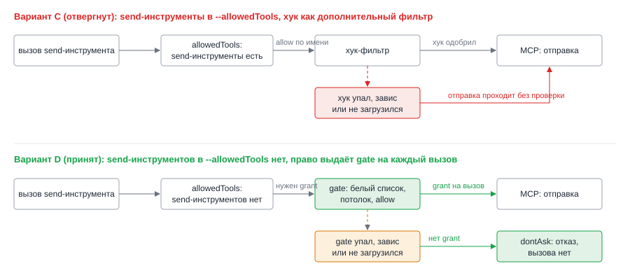

# ADR-004: Механизм ограничения отправки: gate выдаёт право на каждый вызов

- Status: Accepted (принято архитектором по умолчанию: пользователь отменил промежуточные подтверждения; условие включения см. в разделе «Решение»)
- Drives: FR-001, FR-002, FR-003, FR-004, FR-005, FR-006, FR-007, FR-008, NFR-001, NFR-002, AC-009, AC-021, AC-022, AC-023, AC-029
- Source: SRC-8, SRC-9, SRC-13, SRC-14, SRC-17, SRC-18, SRC-19
- Decision: D1 из `proposal.md`

## Context

Агент теперь пишет наружу: сообщения VK Teams, комментарии в MR и Jira, страницы Confluence. Он читает чужие письма, чаты и комментарии, поэтому текст оттуда может содержать инъекцию. Модель такой текст не отфильтрует: защита должна стоять в коде запуска.

Правила разрешений Claude Code смотрят на имя инструмента. Условие «только в этот чат» или «не больше трёх сообщений» allow-правилом не выразить. Остаётся хук `PreToolUse`. У него есть оговорка: хук, который упал, завис или не загрузился, ничего не блокирует, действие проходит (документация Hooks: «broken hooks fail open»; блокирует только `exit 2` или deny в JSON). А требования NFR-002 и AC-022 прямо говорят: при сбое проверки отправка не выполняется.

Ещё два факта из документации Permissions. Deny-правило сильнее решения хука: если send-инструмент остался в `--disallowedTools`, хук его не откроет. Ответ хука `allow` пропускает запрос подтверждения, но deny и ask-правила не обходит.

*Рис. 1. Если send-инструменты лежат в `--allowedTools`, упавший хук оставляет их открытыми. Если их там нет и право выдаёт сам хук, упавший хук оставляет их закрытыми.*

## Decision Drivers

- Сбой проверки закрывает отправку, а не открывает (NFR-002, AC-022).
- Ограничения по адресату и числу действий, которые модель не обойдёт текстом (SRC-13, SRC-14).
- Те же ограничения внутри субагентов (AC-023).
- Режим `dontAsk` и явный список, без `auto` и `bypassPermissions` (NFR-001).
- Без внешних зависимостей: демон на Node 18+ и shell.

## Considered Options

| Вариант | Плюсы | Минусы |
|---|---|---|
| A. Send-инструменты в `--allowedTools` + промпт | Минимум кода | Нет ограничений по адресату и числу; одна инъекция шлёт что угодно |
| B. Журнал по `stream-json` постфактум | Журнал не зависит от модели | Не блокирует: проверка идёт после отправки |
| C. Send-инструменты в `--allowedTools` + хук `PreToolUse` как фильтр | Блокирует до вызова, прост в сборке | Упавший, зависший или не загруженный хук оставляет отправку открытой: нарушает NFR-002 |
| D. Send-инструментов в `--allowedTools` нет; хук (gate) отдаёт `allow` на каждый вызов, прошедший проверки | Нет gate — нет права; любой сбой закрывает отправку по построению; блок до вызова | Зависит от поведения Claude Code: нужно подтвердить, что `allow` от хука работает под `dontAsk` (спайк S1) |
| E. Свой MCP-шлюз: агент видит только шлюз, шлюз проверяет и вызывает настоящие серверы | Самая строгая изоляция, проверка в нашем процессе | Нужно проксировать четыре сервера с их авторизацией, свои имена инструментов, много кода. Запасной путь, если D не заработает |
| F. Режим `auto` с классификатором | Меньше ручных списков | Противоречит SRC-17, недетерминирован, не воспроизводится тестами |

## Decision

Вариант D.

**Что входит в набор.** Шесть send-инструментов: `mcp__mcp-workspace-assistant__messenger-send-message`, `mcp__generic_gitlab__add_merge_request_note`, `mcp__generic_gitlab__create_discussion`, `mcp__generic_gitlab__reply_to_discussion`, `mcp__mcp-jira__jira_add_comment`, `mcp__mcp-confluence__confluence_page_create`. Константа `SEND_TOOLS` в `agent/lib/policy.mjs`, состав закреплён тестом.

**Что в `--allowedTools`.** Инструменты чтения, `Skill`, `Agent` (уточнения по субагентам в ADR-006) и конвертер `confluence_content_from_markdown`: он ничего не пишет, gate для него не нужен (FR-005, AC-008). Send-инструментов в этом списке нет.

**Что в `--disallowedTools`.** Всё, что было, кроме шести send-инструментов: они из deny убираются, иначе gate их не откроет. Остальные пишущие инструменты (письма, календарь, создание чатов, участники, resolve, merge, удаления, правка и перенос страниц) остаются в deny с приоритетом. Тест политики проверяет три пустых пересечения: `SEND_TOOLS ∩ ALLOWED`, `SEND_TOOLS ∩ DISALLOWED`, `ALLOWED ∩ DISALLOWED`.

**Как подключается gate.** `buildClaudeArgs` добавляет `--settings <json>` с хуком `PreToolUse`. Matcher берётся из `SEND_TOOLS` (точные имена, регулярное выражение с якорями). Команда хука: абсолютный путь `node` демона, `agent/hooks/send-gate.mjs`, абсолютные пути каталога прогона и файла политики аргументами (ADR-005, ADR-006). Переменные `TASKFLOW_*` в окружение claude не попадают, поэтому всё нужное хуку передаётся в командной строке. Timeout хука 10 секунд.

**Порядок проверок gate на один вызов.** Любой шаг, не пройденный или упавший, даёт `deny` с короткой причиной и запись «заблокировано» в журнал (ADR-007). Список адресатов в причину не попадает: модель не должна подбирать значения.

1. Файл политики читается и проходит проверку формата и прав (ADR-005).
2. Для инструмента определён извлекатель адресата; адресат найден во входе вызова. Неизвестная форма входа считается отсутствием адресата и блокируется.
3. Адресат есть в белом списке своего типа.
4. Слот потолка свободен (ADR-006).
5. Запись о попытке дописана в журнал; выдаётся `allow`.

Любое исключение внутри gate превращается в `exit 2`: скрипт обёрнут в верхнеуровневый `try/catch`, а в команде хука стоит страховка `node … || exit 2`, которая переводит любой ненулевой код, кроме явного успеха, в блокирующий.

**Условие включения.** Решение работает, только если выполнены три факта, которые документация не гарантирует. Их проверяет пользователь спайком S1 на заглушке MCP с настоящими именами инструментов (U4), без реальных отправок:

1. хук из `--settings` срабатывает в `claude -p` под launchd и внутри субагентов;
2. `allow` от хука открывает инструмент, которого нет в `--allowedTools`, под `dontAsk`;
3. без хука (контрольный прогон) тот же вызов отклоняется.

Если пункт 2 не подтвердится, автоматического отката на вариант C нет: он нарушает NFR-002. Тогда вопрос возвращается пользователю с двумя вариантами: E (шлюз, дорого) или отказ от отправки в этом change. Пока S1 не пройден, на боевых данных включать нельзя.

## Consequences

Положительные:
- Gate не загрузился, завис, упал, файл политики сломан: send-инструмент не разрешён, `dontAsk` отклоняет вызов (AC-022).
- Ограничения по параметрам и потолки применяются до вызова и не зависят от текста модели (AC-012, AC-029).
- Один и тот же хук виден и в субагентах (хуки из настроек срабатывают внутри субагентов с `agent_id`).

Отрицательные и меры:
- Опора на поведение Claude Code, которого нет в явном виде в документации. Мера: спайк S1 и контрольный прогон без хука; тест политики на пустые пересечения.
- Обновление Claude Code может изменить поведение. Мера: S1 запускается повторно после обновления бинаря; контрольный прогон показывает деградацию как «отправка не работает», а не «отправка без проверки».
- Gate видит только вход вызова, не смысл текста: сообщение в разрешённый чат с вредным текстом он пропустит. Остаточный риск принят пользователем (SRC-10); сужается потолками и журналом.
- Прежнее положение ADR-002 архивного change «права агента сужены до чтения» теряет силу: теперь права сужены до чтения и шести send-инструментов под gate.
