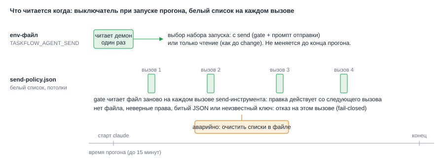

# ADR-005: Белый список и потолки в файле политики; выключатель отправки

- Status: Accepted (принято архитектором по умолчанию)
- Drives: FR-007, FR-008, NFR-002, NFR-004, NFR-005, AC-012, AC-013, AC-022, AC-027
- Source: SRC-13, SRC-14, SRC-18, SRC-19
- Decisions: D2 и D5 из `proposal.md`

## Context

Белый список нужен четырём типам адресатов: чаты VK Teams, проекты Jira, проекты GitLab, пространства Confluence. Пока он пуст, отправка заблокирована (SRC-18). Список содержит идентификаторы приватных чатов, поэтому в репозиторий ему нельзя. Править его нужно без правки кода и без перезапуска демона. Потолки на задачу (VK Teams 3, MR 20, Jira 3, Confluence 2) задал пользователь, и менять их вверх по ошибке не стоит.

Отдельно нужен выключатель: одним действием вернуть демон к политике «только чтение» (NFR-004).



*Рис. 1. Выключатель читает демон один раз при запуске прогона. Файл политики gate читает на каждом вызове, поэтому очистка списков действует со следующего вызова.*

## Decision Drivers

- Правка списка действует без перезапуска (AC-013).
- Любая неясность в файле закрывает отправку (SRC-18).
- Идентификаторы чатов не попадают в git и в логи.
- Выключатель простой и одинаково понятный при ручной проверке.

## Considered Options

| Вариант | Плюсы | Минусы |
|---|---|---|
| A. Переменные в env-файле (списки через запятую) | Один файл настроек | Читаются только при запуске демона; длинные списки неудобны; хук не видит `TASKFLOW_*` (они не передаются в claude) |
| B. Отдельный JSON-файл вне репозитория, gate читает на каждом вызове | Правка действует сразу; структура и проверка формата; нет секретов в env | Ещё один файл в конфиге |
| C. JSON в репозитории | Версионируется | Приватные идентификаторы в git |
| D. Редактор списка в интерфейсе TaskFlow | Удобно | Выходит за рамки (SRC-14), расширяет данные и MCP |

## Decision

Вариант B для политики, плюс переменная в env-файле как выключатель.

**Файл.** `~/.config/taskflow-agent/send-policy.json`, права `0600`, владелец текущий пользователь. Путь по умолчанию лежит рядом с env-файлом; демон передаёт его в gate аргументом команды. В репозитории лежит только шаблон `agent/send-policy.example.json` без значений.

```json
{
  "version": 1,
  "allow": {
    "vk_chats": [],
    "jira_projects": [],
    "gitlab_projects": [],
    "confluence_spaces": []
  },
  "limits": { "vk": 3, "gitlab_comment": 20, "jira": 3, "confluence": 2 }
}
```

**Правила чтения (fail-closed).** Файла нет, права шире `0600`, чужой владелец, не JSON, неверная `version`, неизвестный ключ, значение не массив непустых строк, больше 200 записей в списке: gate блокирует вызов с причиной «политика отправки не прочитана». Пустой список блокирует всё своего типа. Сопоставление точное, без масок и регулярных выражений, с учётом регистра. Для Jira сравнивается префикс ключа задачи до дефиса (`VKTAI-12` даёт `VKTAI`). Для GitLab сравнивается значение `project_id`, как его передал вызов: если пользователь записал в список путь, а агент передал числовой id, вызов блокируется (безопасная ошибка, видна в журнале).

**Потолки.** Значения по умолчанию заданы константами в коде (3, 20, 3, 2). Ключ `limits` необязателен и может только уменьшать потолок: берётся меньшее из файла и кода. Поднять потолок можно только правкой кода. Один потолок `gitlab_comment` общий для заметок, обсуждений и ответов (SRC-13: «комментарии в MR 20»).

**Выключатель (изменено по security SEC03, см. ниже).** Переменная `TASKFLOW_AGENT_SEND` в env-файле. Только `on`: режим с отправкой. Отсутствует или любое другое значение (`off`, `0`, опечатка): режим «только чтение»: в argv нет `--settings` с gate, промпт прежний «только чтение, результат черновиком», send-инструменты не упоминаются. Неизвестное значение и отсутствие переменной трактуются как выключено. Демон читает переменную при запуске прогона (launchd запускает его раз в минуту и каждый раз читает env-файл), набор запуска фиксируется на весь прогон.

**Изменение во время прогона.** Выключатель идёт со следующего прогона. Прогон, который уже идёт (до 15 минут), остаётся в своём режиме. Чтобы остановить отправку в нём немедленно, очищают списки в `send-policy.json`: gate читает файл на каждом вызове и заблокирует следующий. Это описывается в `agent/README.md` как аварийная процедура.

**Состояние при запуске.** Демон проверяет файл политики при старте прогона и пишет в лог только состояние: `ok`, `empty`, `invalid`, `missing`, без значений. Запуск от состояния не зависит: при `empty`, `invalid` и `missing` агент работает с gate, все попытки блокируются и попадают в журнал (AC-013). Отдельной ветки «выключить отправку, если список пуст» нет: один путь проще проверять.

## Consequences

Положительные:
- Правка списка действует сразу и без перезапуска (AC-013); аварийная очистка действует со следующего вызова.
- Приватные идентификаторы лежат вне репозитория в файле с правами `0600`.
- Выключатель возвращает прежнее поведение без правки кода (AC-027).

Отрицательные и меры:
- Ещё один конфигурационный файл. Мера: шаблон и раздел в `agent/README.md`, статус файла в логе демона.
- Пользователь может ошибиться формой идентификатора (путь вместо id). Мера: заблокированная попытка видна в журнале, причина «адресат вне списка».
- Нельзя поднять потолок конфигом. Принято: значения заданы пользователем, а подъём требует осознанного изменения кода и теста.
- Для переходного периода: пока в файле нет списков, задачи вроде «напиши боту» заканчиваются не отправкой, а блокировкой. Смягчение в ADR-008: агент в этом случае прикладывает готовый текст, как раньше.

## Изменено по security SEC03

Исходное решение: отсутствие переменной включало отправку (чтобы не требовать правки env-файла). Security-ревью (SEC03, MEDIUM) отклонило это: установка, обновлённая без правки env-файла, получала бы отправку без явного согласия пользователя.

Решение оркестратора: **opt-in**. Отправка включена ТОЛЬКО при `TASKFLOW_AGENT_SEND=on`; отсутствие переменной, пустая строка, `off`, `ON `, `true` и опечатки оставляют режим «только чтение». Безопасный дефолт, `isSendEnabled` проверяет строгое равенство `'on'`.

Следствия:
- `agent/env.example` по-прежнему содержит `TASKFLOW_AGENT_SEND=off` как явное значение до прохождения спайков; включение — осознанная правка на `on`.
- `agent/setup-env.sh` включает `TASKFLOW_AGENT_SEND` в сохраняемые переменные и, если в оболочке её нет, переносит прежнюю строку из env-файла: пересборка никогда не снимает существующее значение.
- Демон пишет в лог предупреждение `send_spikes_not_passed`, если отправка включена, а в `spike-s1-s3.md` нет строк `S1: PASS` и `S3: PASS`. Предупреждение не запрещает запуск: вердикты вносит пользователь.
- Переходное правило «нужно добавить `off` до обновления демона» больше не нужно (AC-033 переформулирован).
