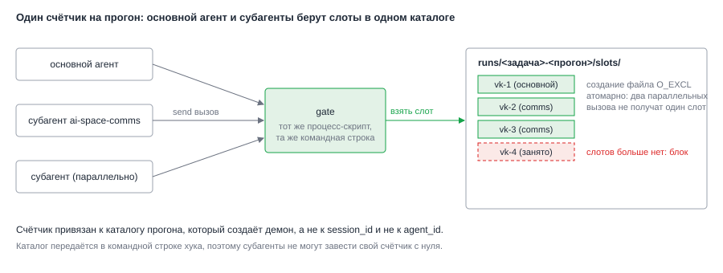

# ADR-006: Субагенты и общий счётчик потолков

- Status: Accepted (принято архитектором по умолчанию)
- Drives: FR-007, NFR-002, AC-010, AC-011, AC-023
- Source: SRC-13, SRC-14, SRC-19
- Decision: D3 из `proposal.md`

## Context

Агент `ai-space-assistant` работает через доменные субагенты: `ai-space-comms`, `ai-space-knowledge`, `ai-space-delivery`. Субагент, которого запустил основной агент, унаследует права запуска. В `--allowedTools` сейчас стоит голый `Agent`, то есть доступен любой субагент (замечание SEC12 из прошлого change). Теперь через субагента можно и отправлять.

Потолок «не больше трёх сообщений за задачу» должен считаться на весь запуск. Если каждый субагент считает отдельно, три субагента отправят девять сообщений.

*Рис. 1. Основной агент и субагенты ходят в один и тот же gate, а gate берёт слот в каталоге прогона. Номер сессии и номер субагента для счёта не нужны.*

## Decision Drivers

- Потолок общий для основного агента и всех субагентов (AC-023).
- Параллельные вызовы не получают один слот дважды.
- Не зависеть от того, одинаковый ли `session_id` у субагента (в документации не подтверждено).
- Сузить набор субагентов, если Claude Code это поддерживает.

## Considered Options

| Вариант | Плюсы | Минусы |
|---|---|---|
| A. Счёт по `session_id` | Идентификатор приходит в входе хука | Неизвестно, одинаков ли он у субагентов; счёт может разойтись |
| B. Счётчик в каталоге прогона, создаваемом демоном | Не зависит от идентификаторов Claude Code; общий для всех процессов хука | Нужно создать и убрать каталог |
| C. Счёт моделью («посчитай свои отправки») | Нет кода | Обходится текстом, нарушает NFR-002 |

Для самого `Agent` два варианта: оставить голый `Agent` (всё решает gate) или заменить на `Agent(<имя>)` для четырёх субагентов. В документации форма `Agent(Name)` описана для deny; allow-форма явно не описана (U5).

## Decision

Вариант B для счёта; для `Agent` вариант «сузить, если проверка подтвердит, иначе оставить голый».

**Счётчик.** Демон перед запуском создаёт каталог прогона `~/.local/state/taskflow-agent/runs/<id задачи>-<метка времени>/` с правами `0700` и подкаталогом `slots/`. Путь передаётся в команде хука. Gate берёт слот так: для типа `kind` пробует создать файл `slots/<kind>-<n>` для `n` от 1 до потолка флагом `O_EXCL`; первый успешный `n` и есть слот. Если создать нельзя ни один, потолок исчерпан, вызов блокируется. Создание файла атомарно, поэтому параллельные вызовы из основного агента и субагентов не получат один слот. Блокировок и общей памяти нет.

**Что считается.** Слот занимается до вызова и не возвращается, если вызов упал или не дал итога: частичную доставку отличить нельзя, повтор после сбоя не должен увеличивать число отправок. Блокировки по белому списку слот не занимают. Типы: `vk`, `gitlab_comment` (заметка, обсуждение и ответ вместе), `jira`, `confluence`.

**Субагенты.** В `--allowedTools` вместо `Agent` ставятся `Agent(ai-space-comms)`, `Agent(ai-space-knowledge)`, `Agent(ai-space-delivery)`, `Agent(ai-space-context-collector)`, если спайк S2 подтвердит, что allow-форма работает и закрывает остальные имена. Если форма не работает (имена не совпадают или доставка ломается), остаётся голый `Agent`: ограничения отправки держит gate, а не правило `Agent`. Право отправки у субагента не шире, чем у основного агента, потому что оно определяется не набором субагента, а grant от gate, и deny наследуется.

**Что gate пишет о субагенте.** В запись журнала идут `agent_type` и признак «субагент» из входа хука (поле `agent_id` есть только внутри субагента). Для счёта они не нужны.

**Очистка.** Демон хранит каталоги прогонов 14 дней и удаляет старые при старте прогона. Внутри журнал отправок с короткими фрагментами текста, права `0600`.

## Consequences

Положительные:
- Общий потолок на весь запуск без зависимости от внутренностей Claude Code (AC-023).
- Атомарное занятие слота без блокировок.
- Субагентов можно сузить, не меняя механизм проверки.

Отрицательные и меры:
- Если allow-форма `Agent(<имя>)` не работает, SEC12 остаётся открытым в части выбора субагента. Мера: gate закрывает отправку независимо от субагента; остаток записан как принятый.
- Каталоги прогонов накапливаются. Мера: удаление старше 14 дней при старте прогона.
- Слот за упавший вызов не возвращается, поэтому задача с ошибками может упереться в потолок раньше. Принято: безопаснее, чем дубль.
