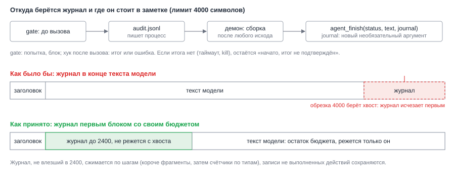

# ADR-007: Журнал действий пишет процесс; доставка в `agentNotes`

- Status: Accepted (принято архитектором по умолчанию)
- Drives: FR-009, FR-010, FR-011, FR-012, NFR-003, NFR-005, NFR-006, AC-015, AC-016, AC-019, AC-020, AC-024, AC-025, AC-026
- Source: SRC-3, SRC-11, SRC-15, SRC-16, SRC-19
- Decision: D4 из `proposal.md`

## Context

Пользователь проверяет не черновик, а сделанное, поэтому журнал: что отправлено, куда, ссылка, итог. Журнал должен быть верным, даже если модель его не упомянула или её уговорили промолчать (AC-025). Он должен дойти и при `failed`, и при таймауте (AC-024), иначе при повторе агент пошлёт дубль.

Три ограничения текущего кода:

- `composeNote` в `js/agent.js` режет текст `review` до 4000 символов с хвоста. Журнал в конце пропадёт именно в больших результатах.
- Для `failed` `composeNote` сжимает текст до одной строки в 300 символов (`REASON_MAX`). Журнал туда не помещается.
- В промпт попадают только заголовок и описание задачи; прежние `agentNotes` не передаются.

*Рис. 1. Журнал пишет gate в файл прогона, демон собирает блок после любого исхода. Блок идёт первым и имеет свой бюджет, поэтому обрезка касается только текста модели.*

## Decision Drivers

- Источник фактов не модель (NFR-003).
- Журнал есть при всех исходах (AC-024).
- Журнал не теряется при обрезке (AC-026).
- Схема данных, набор статусов и девять инструментов MCP не меняются (NFR-005).
- Журнал прежней попытки попадает в промпт как недоверенные данные (NFR-006).

## Considered Options

| Вариант | Плюсы | Минусы |
|---|---|---|
| A. Журнал от модели в её ответе | Просто | Обходится инъекцией; при таймауте нет вовсе |
| B. Разбор потока `stream-json` | Видит все вызовы | Меняет формат вывода и разбор `output.mjs`; поток до 1 МиБ на длинных задачах; показывает попытку, но не гарантирует итог |
| C. Аудит-файл, который пишут хуки gate; демон собирает журнал | Тот же процесс, что блокирует; работает при `failed` и kill; формат вывода `claude` не меняется | Зависит от S1: хуки `PostToolUse` и `PostToolUseFailure` должны срабатывать |

## Decision

Вариант C.

**Запись.** Файл `audit.jsonl` в каталоге прогона (ADR-006), права `0600`. Gate дописывает одну строку JSON за раз (`appendFile`, строка короче 4 КиБ). События:

| Когда | Запись |
|---|---|
| `PreToolUse`, вызов прошёл проверки | `attempt` |
| `PreToolUse`, вызов заблокирован | `blocked` с причиной: `not_allowed`, `limit`, `policy`, `target_missing`, `gate_error` |
| `PostToolUse` | `ok` и ссылка или идентификатор объекта из ответа инструмента, если нашли |
| `PostToolUseFailure` | `error` с короткой причиной |

Поля записи: `v`, `ts`, `tool_use_id`, `event`, `kind` (`vk`, `mr_note`, `mr_discussion`, `mr_reply`, `jira`, `confluence`), `target` (чат, проект, MR, страница), `ref`, `snippet` (первые 100 символов текста в одну строку), `reason`, `agent_type`. Сопоставление `attempt` и `ok` или `error` идёт по `tool_use_id`. Итог по вызову: `blocked`, `ok`, `error` или `started` (был `attempt`, итога нет: таймаут, kill, падение). Число записей в файле ограничено (200): сверх лимита gate считает только счётчик `blocked_overflow`, чтобы поток заблокированных попыток не раздувал файл.

**Сборка.** После завершения процесса `claude` при любом исходе (`review`, `needs_info`, `failed`, таймаут) демон читает `audit.jsonl` и строит блок «Журнал действий». Строки: `выполнено`, `заблокировано (причина)`, `ошибка (причина)`, `начато, итог не подтверждён`. Отказ при чтении файла журнала не ломает прогон: в заметку идёт строка «журнал недоступен», в лог демона событие. Если прогон прерван (пользователь закрыл задачу, `aborted`), результат не пишется, как и раньше; число действий из аудита демон записывает в свой лог.

**Пометка «не всё выполнено».** Если в журнале есть хотя бы одно `blocked`, `error` или `started`, демон сам добавляет строку «Не всё выполнено: …» над журналом, независимо от текста модели. Статус остаётся `review` (Q5); схема не растёт.

**Доставка.** Опциональный аргумент `journal` в условной записи `agent_finish` (вместе с `status` и `text`). Старые вызовы без него работают как раньше; число инструментов MCP остаётся девятью. `composeNote(status, text, journal)` собирает заметку так:

- `review`: «Результат агента», затем журнал, затем текст модели.
- `needs_info`: «Вопрос агента: …», затем журнал, если он не пуст.
- `failed`: «Агент не справился: <причина до 300 символов>», затем журнал.

Бюджет журнала 2400 символов (`JOURNAL_MAX`). Текст модели получает остаток из 4000. Журнал не режется с хвоста. Не поместился: шаг 1 укорачивает фрагменты, шаг 2 заменяет выполненные записи счётчиками по типам; записи `blocked`, `error`, `started` сохраняются дольше всех. Журнал стоит первым блоком результата (AC-026). Серверная сторона применяет те же правила (`NOTE_TEXT_MAX` растёт на длину заголовков журнала).

**Журнал в промпт повтора.** Когда пользователь снимает и снова ставит делегирование, демон берёт из `agentNotes` задачи блоки «Журнал действий», подаёт их отдельным блоком `<previous_attempts>` с той же защитой, что у `task_data` (экранирование `<`, JSON-строка, обрезка до 2000 символов, не больше трёх последних блоков), и добавляет указание не повторять уже выполненное. Граница серии (Q2): в заголовке блока демон указывает срок задачи на момент записи (`срок 2026-10-07`), в промпт идут только блоки с текущим сроком. При повторе серии с новым сроком прежние записи не передаются; при ручной смене срока тоже (принятый риск: после ручного переноса срока дубль возможен). Журнал содержит факты, не инструкции; фрагмент текста в нём тоже недоверенные данные.

**Пометка автора.** Никакой подписи агента в отправляемом тексте ни gate, ни демон не добавляют (FR-009, AC-014): gate не меняет вход вызова (`updatedInput` не используется).

## Consequences

Положительные:
- Журнал верен, даже если модель молчит или обманута (AC-025).
- Журнал есть при `failed` и таймауте; `started` показывает «возможно, ушло» (AC-024, FR-012).
- Журнал не теряется при обрезке (AC-026).
- Данные, схема и девять инструментов MCP те же; новый аргумент необязательный (NFR-005).

Отрицательные и меры:
- Нужны правки на сервере и клиенте: `agent_finish` принимает `journal`, `composeNote` получает третий аргумент. Мера: тесты паритета нормализации, sync и контракта MCP прошлого change проходят без правок (AC-028); новые тесты на форму `journal`.
- Ссылка на созданный объект зависит от формы ответа инструмента. Мера: извлечение «по возможности»; без ссылки в журнале стоит «ссылка не получена»; формат ответов проверяет спайк S1.
- Журнал в файле содержит фрагменты текста. Мера: права `0600`, каталог `0700`, хранение 14 дней.
- Граница серии по сроку: ручной перенос срока теряет память о прежних отправках. Принято, в README отмечено.
