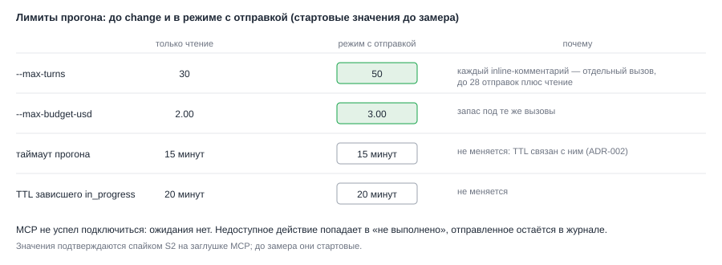

# ADR-009: Лимиты прогона для задач с отправкой и неполный MCP

- Status: Accepted (принято архитектором по умолчанию; значения стартовые, подтверждаются спайком S2)
- Drives: FR-007, FR-010, FR-011, NFR-003, AC-011, AC-024
- Source: SRC-3, SRC-11, SRC-13
- Decision: D7 из `proposal.md`

## Context

Лимиты прогона выбраны под чтение: `--max-turns 30`, `--max-budget-usd 2.00`, таймаут 15 минут. Ревью MR с 10 inline-комментариями делает по вызову `create_discussion` на каждый, плюс чтение диффа. Тридцати ходов может не хватить, и половина комментариев останется неотправленной.

В спайке прошлого change Jira, Confluence и GitLab в headless-режиме в момент старта часто были `pending`, GitLab в двух прогонах из трёх `failed`. Для чтения это означало «не хватило данных». Для отправки это значит частично выполненную задачу: сообщение ушло, комментарий в MR нет.

*Рис. 1. Ходы и бюджет растут в режиме с отправкой. Таймаут и TTL не меняются: TTL 20 минут связан с таймаутом 15 минут (ADR-002 архивного change).*

## Decision Drivers

- Потолки отправки (28 действий на задачу максимум) должны быть достижимы по ходам.
- Прогон не становится дороже без необходимости.
- Таймаут и TTL остаются связанными (ADR-002).
- Недоступный MCP не превращается в тихое «готово».

## Considered Options

| Вариант | Плюсы | Минусы |
|---|---|---|
| A. Оставить 30 ходов и 2.00 | Ничего не менять | Длинные ревью обрываются на середине |
| B. Поднять лимиты только в режиме с отправкой | Чтение дешёвое как раньше; больше места на отправку | Нужно измерить, значения стартовые |
| C. Поднять лимиты везде | Просто | Дороже без нужды для чтения |
| D. Ждать подключения MCP на старте (`--mcp-config`, `MCP_TIMEOUT`, повтор при `pending`) | Меньше частичных выполнений | Отдельная задача, вне этого change; нужно измерить |

## Decision

Вариант B. Для неполного MCP ожидания в этом change нет.

**Лимиты режима с отправкой** (константы в `LIMITS_RUN`, отдельный набор): `MAX_TURNS 50`, `MAX_BUDGET_USD 3.00`; `TASK_TIMEOUT_MS` 15 минут и TTL 20 минут без изменений. Режим «только чтение» остаётся на 30 и 2.00. Значения стартовые: спайк S2 измеряет три типовые задачи («поздравить в чат», «отревьюить MR с inline-комментариями», «создать страницу отчёта») на заглушке MCP и подтверждает их или меняет. Менять таймаут и TTL нельзя без пересмотра ADR-002.

**Неполный MCP.**
- Недоступное действие не заменяется другим инструментом: набор закрыт, а промпт запрещает обходные пути.
- Агент перечисляет в результате, что не выполнено, и приводит готовый текст.
- Исход выбирается так: если хоть одно действие выполнено или заблокировано, статус `review` и пометка «не всё выполнено» (ADR-007); если ничего сделать не удалось из-за недоступных серверов, `failed`. Повтор после `failed` безопасен: журнал передаётся агенту (FR-012).
- Исчерпание ходов или бюджета при уже сделанных отправках даёт `failed` с журналом (AC-024); пользователь видит, что ушло.
- Ожидание подключения MCP остаётся вне change; спайк S2 фиксирует частоту `pending` на старте как вход для отдельной задачи.

## Consequences

Положительные:
- Длинные ревью MR укладываются в лимит; чтение остаётся дешёвым.
- Недоступный MCP виден пользователю явно, а не молчаливым «готово».

Отрицательные и меры:
- Прогон с отправкой стоит до 3.00 USD. Принято: потолки отправки ограничивают число дорогих вызовов, за прогон не больше трёх задач.
- Значения не измерены. Мера: S2 до включения на боевых данных; константы и тест состава лимитов правятся по результату.
- Без ожидания MCP часть задач будет заканчиваться частично. Мера: честный журнал, повтор безопасен; отдельная задача по ожиданию подключения.
