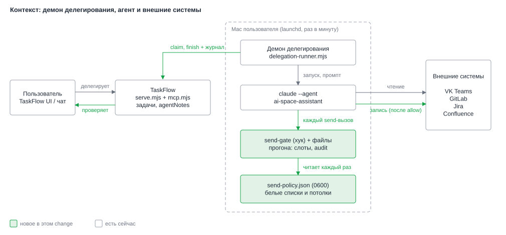
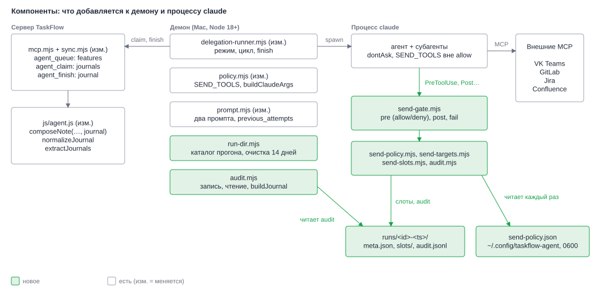
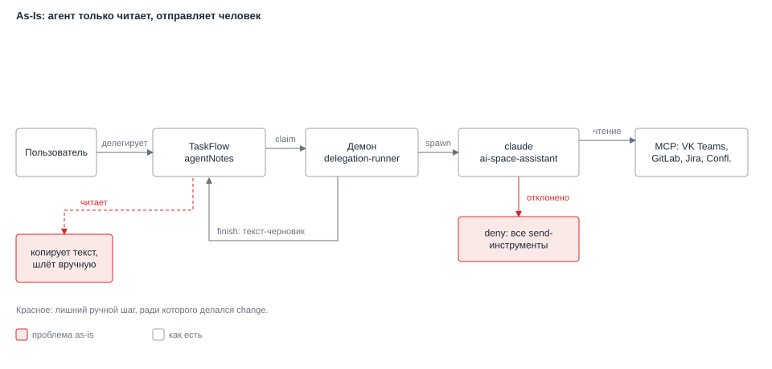
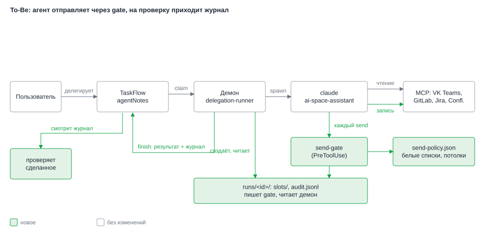
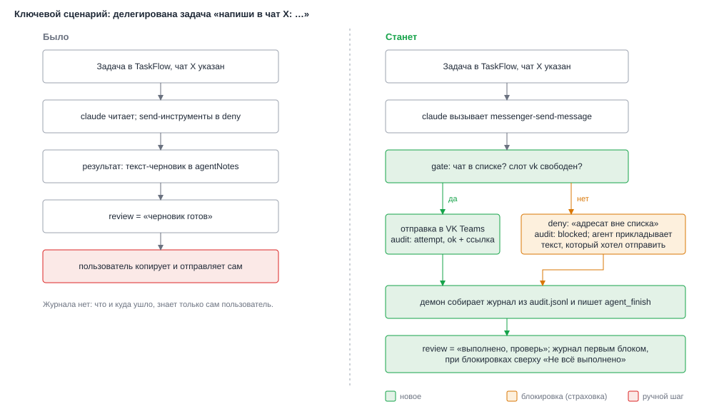
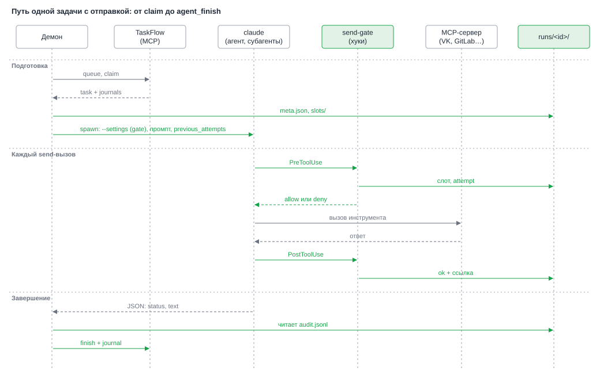

# HLD: agent-send-actions

**Date**: 2026-10-06
**Designer**: system-designer
**Status**: Draft (Gate A отменён пользователем: сразу hld.md и design.md)
**Proposal**: `openspec/changes/agent-send-actions/proposal.md`

## Overview

Демон делегирования сегодня только читает. Задача «напиши боту» кончается черновиком в `agentNotes`, а отправляет его человек. Этот change даёт агенту право выполнять шесть действий сам: сообщение в VK Teams, три вида комментариев в MR, комментарий в Jira, создание страницы Confluence. Всё остальное остаётся закрытым. На статус `review` теперь приходит сделанное, а не черновик, и к нему прилагается журнал.

Архитектура держится на одной мысли: право на отправку не лежит в списке разрешённых инструментов, его выдаёт отдельный процесс на каждый вызов. Это хук `PreToolUse` (gate). Он проверяет адресата по белому списку, занимает слот потолка и пишет попытку в журнал. Если хук упал, завис или не загрузился, права нет, и `dontAsk` отклоняет вызов. Журнал ведут те же хуки, а демон после завершения `claude` собирает его из файла и кладёт в `agentNotes` первым блоком результата. Модель в этом не участвует. Обоснование и разбор вариантов — в [ADR-004](adrs/004-send-gate-mechanism.md)..[ADR-009](adrs/009-run-limits-and-partial-mcp.md). Требования и допущения — в `proposal.md`.

Схема данных TaskFlow, набор статусов и девять инструментов MCP не меняются. Меняются необязательные поля: `agent_finish` принимает `journal`, ответ `agent_claim` получает ключ `journals`.

## Architecture

Фигуры лежат в `figures/` как SVG. Зелёным отмечено новое, белым — то, что уже есть.

### System Context (C4 Level 1)

*Новое в контексте: gate с файлами прогона и файл политики на Mac пользователя; внешние системы по-прежнему доступны только через процесс `claude`.*

### Component Diagram (C4 Level 2)

*Gate и его библиотеки живут в процессе `claude`, демон создаёт каталог прогона и читает из него журнал, сервер получает необязательные поля `journal` и `journals`.*

## Change Visualization (As-Is → To-Be)

Все три рисунка показывают одну и ту же проекцию: путь делегированной задачи от пользователя до внешних систем и обратно. Красным отмечена проблема as-is, зелёным — новое, оранжевым — страховка на случай блокировки.

### Как есть (As-Is)

*Рис. 1 — As-Is: send-инструменты лежат в deny, агент возвращает текст, а последний шаг (скопировать и отправить) делает человек.*

### Как станет (To-Be)

*Рис. 2 — To-Be: на каждый send-вызов встаёт gate, рядом появляются файл политики и каталог прогона, а результат возвращается вместе с журналом.*

### До/после для ключевого сценария

*Рис. 3 — Задача «напиши в чат X»: раньше она заканчивалась копированием текста, теперь заканчивается отправкой или блокировкой с готовым текстом в заметке.*

### Что меняется пошагово

1. **`policy.mjs`.** Было: один набор `ALLOWED_TOOLS`/`DISALLOWED_TOOLS`, все шесть send-инструментов в deny. Станет: константа `SEND_TOOLS` вне allow и вне deny, в allow добавлен конвертер `confluence_content_from_markdown`, `buildClaudeArgs` принимает режим и сам собирает `--settings` с хуками. Лимиты режима с отправкой: 50 ходов и 3.00 USD.
2. **Выключатель.** Было: нет. Станет: `TASKFLOW_AGENT_SEND` в env-файле; не `on` или не задан — прежний режим «только чтение» по аргументам, промпту и окружению.
3. **Каталог прогона.** Было: нет. Станет: демон создаёт `runs/<id задачи>-<время>/` с `slots/` и `meta.json`, путь отдаёт хуку в командной строке, старше 14 дней удаляет.
4. **Gate (`send-gate.mjs`).** Было: нет. Станет: на каждый send-вызов пять проверок (политика, адресат, белый список, слот, запись попытки). Прошёл всё — `allow`, иначе `deny` с причиной в журнал. Любой сбой — `exit 2`.
5. **Файл политики.** Было: нет. Станет: `~/.config/taskflow-agent/send-policy.json`, права `0600`, четыре белых списка и необязательные потолки вниз. Gate читает его на каждом вызове, пустой или битый файл закрывает отправку.
6. **Субагенты.** Было: голый `Agent`. Станет: тот же `Agent`, пока спайк S2 не подтвердит форму `Agent(<имя>)`; потолок считают слоты в каталоге прогона, поэтому он общий для агента и субагентов.
7. **Промпт.** Было: «только читаешь, результат — черновик». Станет в режиме с отправкой: делегирование — явный запрос, подписи нет, при блокировке не искать обход, а приложить готовый текст; блок `previous_attempts` с журналом прежних попыток. Окружение процесса получает `AUTONOMOUS_RUN=1`, чтобы пользовательский хук `confirm-outbound.sh` не просил подтверждения.
8. **Журнал.** Было: нет. Станет: демон читает `audit.jsonl` после завершения `claude` при любом исходе и передаёт `journal` в `agent_finish`. При TTL-reap журнал берётся из последнего каталога прогона этой задачи.
9. **Сервер и клиент.** Было: `composeNote(status, text)`. Станет: `composeNote(status, text, journal)`; журнал первым блоком с бюджетом 2400 символов, строка «Не всё выполнено» над ним строится из журнала, а не из слов модели. `agent_claim` возвращает `journals` прежних попыток с тем же сроком задачи.

### Key Architectural Decisions

| Decision | Choice | Drives | ADR |
|---|---|---|---|
| Кто выдаёт право на send | Gate-хук `allow` на каждый вызов; send-инструментов нет в `--allowedTools` | FR-001..FR-006, NFR-001, NFR-002 | [ADR-004](adrs/004-send-gate-mechanism.md) |
| Белый список и потолки | Файл `send-policy.json` 0600 вне репозитория, читается на каждом вызове; потолки только вниз | FR-007, FR-008, NFR-002 | [ADR-005](adrs/005-send-policy-and-killswitch.md) |
| Выключатель | `TASKFLOW_AGENT_SEND`, читается один раз на запуск демона; в поставляемом `agent/env.example` стоит `off` | NFR-004 | [ADR-005](adrs/005-send-policy-and-killswitch.md) |
| Общий потолок для субагентов | Слоты `O_EXCL` в каталоге прогона | FR-007, NFR-002 | [ADR-006](adrs/006-subagents-shared-counter.md) |
| Журнал | Аудит-файл хуков, сборка демоном, доставка в `agentNotes` через необязательный `journal` | FR-010, FR-012, NFR-003, NFR-005, NFR-007 | [ADR-007](adrs/007-audit-journal.md) |
| Явный запрос | `AUTONOMOUS_RUN=1` и фраза в системном промпте; файлы агента пользователя не правятся | FR-001, FR-009, NFR-006 | [ADR-008](adrs/008-explicit-request.md) |
| Лимиты прогона | 50 ходов, 3.00 USD в режиме с отправкой; ожидания MCP нет | FR-007, FR-010, NFR-003 | [ADR-009](adrs/009-run-limits-and-partial-mcp.md) |
| Контракт MCP | Только аддитивные поля: `journals` рядом с `task` в `agent_claim`, необязательный `journal` (в том числе при `by_ttl`) и `journalStored` в `agent_finish`; девять инструментов и прежние ответы не меняются | NFR-007, NFR-005 | [ADR-007](adrs/007-audit-journal.md) |
| Что значит `review` | «Выполнено, проверь»; закрывает по-прежнему только пользователь | FR-011 | — (следует из SRC-12) |
| Где живёт разбор журнала прежних попыток | Чистая функция `extractJournals` в `js/agent.js`, вызывается на сервере при claim | FR-012, NFR-005 | — (деталь реализации ADR-007) |
| Защита от старого сервера | Нет ключа `journals` в ответе `agent_claim` в режиме с отправкой: задача уходит в `failed`, `claude` не запускается | NFR-002, NFR-003, NFR-007 | — (деталь реализации ADR-007) |

## Decision Forks

### Fork 1: чем ограничивать отправку

Правила разрешений смотрят на имя инструмента и не умеют «только в этот чат» или «не больше трёх». Остаётся хук. Но упавший хук по умолчанию ничего не блокирует. Поэтому право выдаёт сам хук: упал — права нет. См. [ADR-004](adrs/004-send-gate-mechanism.md); условие включения — спайк S1.

### Fork 2: где хранить белый список

Приватные идентификаторы чатов нельзя в git, править список нужно без перезапуска. Выбран отдельный JSON с правами `0600`, который gate читает на каждом вызове. См. [ADR-005](adrs/005-send-policy-and-killswitch.md).

### Fork 3: как считать потолок через субагентов

Счёт по `session_id` зависит от того, одинаков ли он у субагента. Счёт файлами-слотами в каталоге прогона от этого не зависит. См. [ADR-006](adrs/006-subagents-shared-counter.md).

### Fork 4: откуда брать журнал

Журнал по `stream-json` показал бы попытку, но не итог, и меняет разбор вывода. Журнал, который пишут хуки, работает и при `failed`, и при убитом процессе. См. [ADR-007](adrs/007-audit-journal.md).

### Fork 5: как снять тормоза пользовательского агента

Агент `ai-space-assistant` просит превью, а его хук отвечает `ask`. Править файлы агента нельзя, поэтому демон передаёт `AUTONOMOUS_RUN=1` и говорит в промпте, что делегирование и есть запрос. См. [ADR-008](adrs/008-explicit-request.md).

### Fork 6: лимиты ходов и бюджета

Ревью MR с десятком inline-комментариев не умещается в 30 ходов. Для режима с отправкой 50 ходов и 3.00 USD, таймаут и TTL не меняются. См. [ADR-009](adrs/009-run-limits-and-partial-mcp.md).

## Data Flow

*Путь задачи: claim с журналами прежних попыток, запуск `claude` с gate, три шага на каждый send-вызов (проверка, вызов, фиксация итога) и сборка журнала демоном после завершения.*

## Cross-cutting Concerns

- **Observability**: в лог демона идут только состояния и счётчики: режим (`send` или `read`), состояние политики (`ok`, `empty`, `invalid`, `missing`), число записей журнала по исходам. Идентификаторов чатов, ссылок и текстов в логе нет. Подробности по каждому вызову лежат в `audit.jsonl` с правами `0600` на 14 дней.
- **Security**: защищает gate, а не промпт. Белый список и потолки применяются до вызова процессом вне модели. `SEND_TOOLS` вне allow, оставшиеся пишущие инструменты в deny с приоритетом, `bypassPermissions` и `auto` не используются. Токены TaskFlow в окружение `claude` не попадают (как раньше). Текст задачи, прочитанное и журнал прежней попытки идут в промпт как данные: JSON-строка, `<` заменён на `<`, обрезка. Остаточный риск (вредный текст в разрешённый чат) принят пользователем и сужен потолками и журналом.
- **Error handling**: любой сбой gate закрывает вызов. Сбой post-хука не ломает прогон: в журнале останется «начато, итог не подтверждён». Журнал, который не прочитался, превращается в строку «журнал недоступен». Недоступный MCP не заменяется другим инструментом. Исходы: что-то выполнено или заблокировано — `review` с пометкой «не всё выполнено»; ничего не удалось из-за серверов — `failed`; исчерпаны ходы или бюджет — `failed` с журналом.
- **Performance**: один вызов gate — это запуск `node`, чтение одного JSON (до 64 КиБ), один `open` на слот, одна дописанная строка. Таймаут хука 10 секунд. Прогон с отправкой стоит до 3.00 USD, за один запуск демона не больше трёх задач.

## Constraints for Developer

- C1: `SEND_TOOLS` (шесть имён) не входит ни в `--allowedTools`, ни в `--disallowedTools` режима с отправкой; пересечения `SEND_TOOLS ∩ allow`, `SEND_TOOLS ∩ deny`, `allow ∩ deny` проверяет тест, состав списков закреплён тестом.
- C2: в режиме «только чтение» аргументы запуска, промпт и окружение совпадают с теми, что есть сейчас; send-инструменты в этом режиме в deny.
- C3: gate ничего не меняет во входе вызова: `updatedInput` не используется, подписи автора нет.
- C4: любое исключение gate превращается в `exit 2`; команда хука заканчивается `|| exit 2`.
- C5: имена параметров адресата сверены с живыми схемами MCP (список в design.md, раздел «Проверенные схемы»). Остальное по ответам инструментов (форма `tool_response`, форма `project_id`) уточняет спайк S1.
- C6: схема данных TaskFlow и `SCHEMA = 1` не меняются; новые аргументы и ключи ответов только необязательные; тесты паритета, sync и контракта MCP прошлого change проходят без правок.
- C7: сначала раскатывается сервер (`serve.mjs`, `mcp.mjs`), потом демон; защита от старого сервера есть (ключ `journals`), но это последний рубеж.
- C8: включать отправку на боевых данных можно только после спайков S1 и S3, которые делает пользователь; до этого в env-файле `TASKFLOW_AGENT_SEND=off`.
- C9: автотесты идут на заглушке MCP и подставных хуках; реальный `claude` и реальные отправки в тестах запрещены.

## Superseded Documents

- Решение прошлого change «агент ничего не отправляет, только черновик» (SRC-12 и SRC-24 архивного `add-agent-delegation`) — отменено SRC-12 этого change.
- ADR-002 архивного change в части «права агента сужены до чтения» — теперь права сужены до чтения и шести send-инструментов под gate ([ADR-004](adrs/004-send-gate-mechanism.md)). Остальное в ADR-002 (TTL, перезапуск, таймаут) действует.
- Текст системного промпта «только читаешь, результат — черновик» остаётся только в режиме `TASKFLOW_AGENT_SEND=off`.

## References

- Proposal: `openspec/changes/agent-send-actions/proposal.md`
- Requirements Source: `openspec/changes/agent-send-actions/requirements-source.md`
- Research: `openspec/changes/agent-send-actions/research.md`
- ADRs: `openspec/changes/agent-send-actions/adrs/004-send-gate-mechanism.md`, `005-send-policy-and-killswitch.md`, `006-subagents-shared-counter.md`, `007-audit-journal.md`, `008-explicit-request.md`, `009-run-limits-and-partial-mcp.md`
- Design: `openspec/changes/agent-send-actions/design.md`
- Прошлый change: `openspec/changes/archive/2026-10-05-add-agent-delegation/` (ADR-001..003, `design.md`, `spike-u1-u5.md`)

---

*Created by System Designer agent (04). Pass to Task Planner after human approval.*
