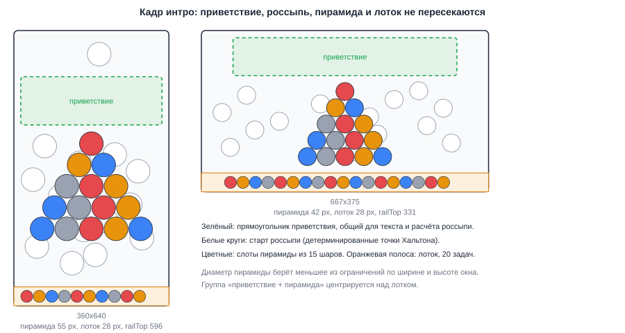
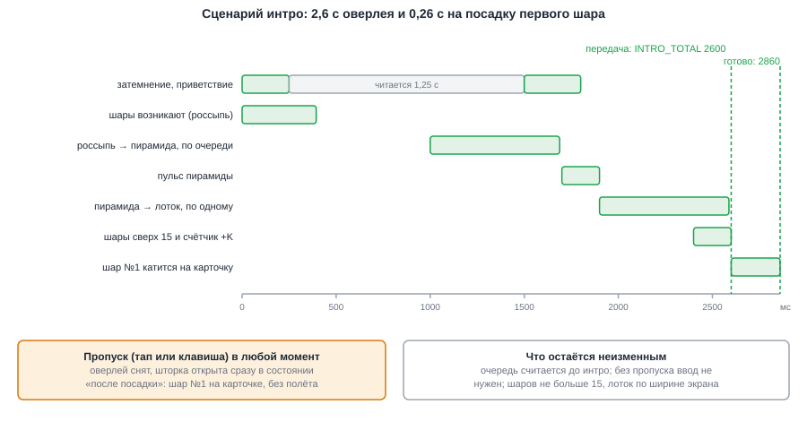
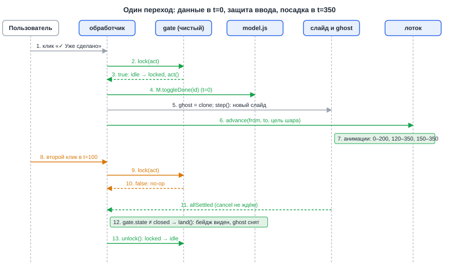
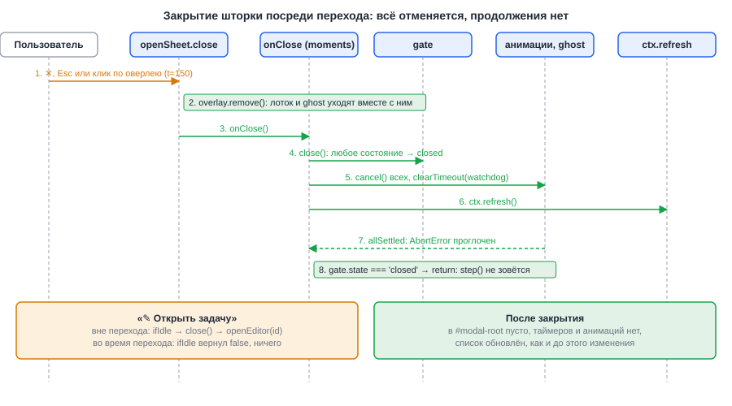
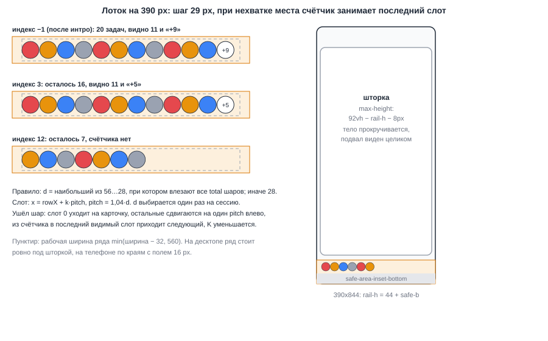
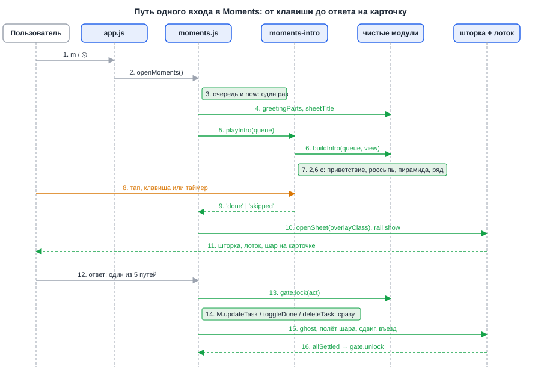
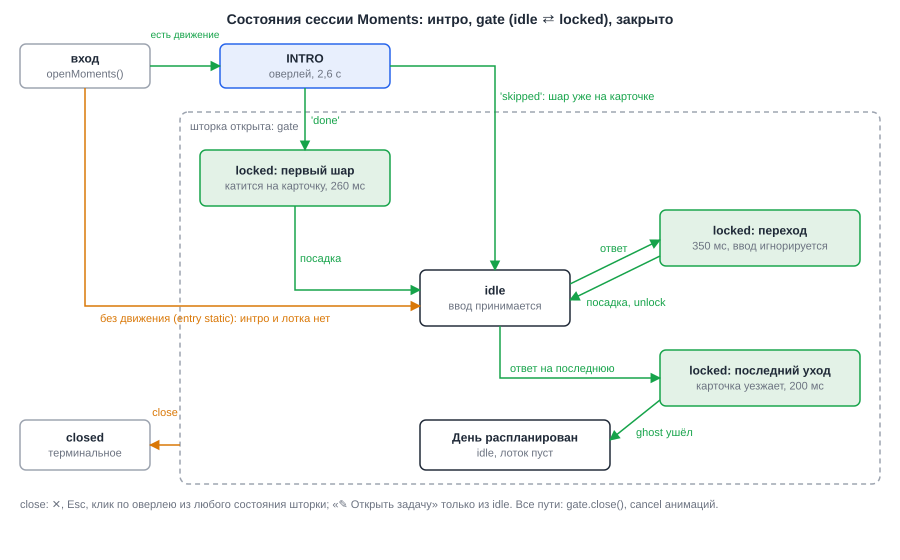

# Design: moments-welcome-and-rail

**Date**: 2026-10-06
**Designer**: system-designer
**Status**: Draft (Gate A и Gate B пройдены заранее оркестратором по стоящей инструкции пользователя «без подтверждений»)
**HLD**: `openspec/changes/moments-welcome-and-rail/hld.md`
**Proposal**: `openspec/changes/moments-welcome-and-rail/proposal.md`

## Overview

Проект на vanilla JS (ES-модули, без сборки), поэтому интерфейсы описаны JSDoc-сигнатурами, а не Go-типами.
Принцип «глубокий модуль»: наружу торчит несколько функций, вся геометрия, тайминг и правила защиты спрятаны внутри.

Разделение на два слоя:

- **Чистые модули** (без DOM, без `store.js` и `model.js`, без `Math.random` и часов; текущая дата приходит аргументом):
  `moments-flow.js` (M1: тексты, `createGate`, план перехода), `rail.js` (M2: раскладка и состояние лотка),
  `intro-scene.js` (M3: сцена интро), `pyramid.js` (M4: примитивы пирамиды, сжимается).
  Всё, что можно проверить числами, проверяется в `node:test`.
- **DOM-слой** (тонкий, только события и Web Animations API): `moments-rail.js` (M5: лоток и шар),
  `moments-intro.js` (M6: оверлей интро), `moments.js` (M7: оркестрация сессии), `ui.js` (M8: одна опция у `openSheet`),
  `styles.css` (M9), `sw.js` (M10).

Данные не меняются: формат задач, синхронизация, делегирование агенту и состав очереди остаются как были.
Выбор «лоток внутри оверлея шторки» (опция A) и «клон старой карточки» обоснован в `hld.md`, раздел Decision Forks.
ADR нет.

## Modules

Порядок: чистые модули M1–M4, затем DOM-модули M5–M8, затем стили и поставка.

### M1: `js/moments-flow.js` (чистый, новый)

**Seam**: импортируется из `moments.js`. Зависит только от `core.js` (`WEEKDAYS_FULL`, `MONTHS_GEN`, `plural`); `core.js` уже чистый.
**Depth**: три разные вещи (тексты, защита ввода, план перехода) заперты в одном модуле, потому что всех их проверяют без DOM
и все они нужны `moments.js` на одном шаге. Снаружи видно семь имён.

```js
/** '1 задача', '3 задачи', '12 задач', '21 задача'. */
export function taskCountLabel(n: number): string;

/** Приветствие. now: Date устройства на момент входа, count: полная длина очереди.
 *  {date:'Вторник, 6 октября', count:'12 задач на планирование',
 *   full:'Вторник, 6 октября · 12 задач на планирование'} */
export function greetingParts(now: Date, count: number): { date: string; count: string; full: string };

/** Заголовок шторки: 'Moments · вторник, 6 октября · 12 задач'. */
export function sheetTitle(now: Date, count: number): string;

/** План перехода: смещения и длительности в мс. kind: 'next' | 'last' | 'first'. */
export function transitionPlan(kind: 'next' | 'last' | 'first'): TransitionPlan;

/** Защита ввода. Состояние: 'idle' | 'locked' | 'closed'. */
export function createGate(): Gate;
```

```js
/** @typedef {{at:number, dur:number}} Span */
/** @typedef {{exit:Span|null, ghostBall:Span|null, ball:Span|null, shift:Span|null,
 *             pull:Span|null, enter:Span|null, total:number}} TransitionPlan */
/** @typedef {{
 *   readonly state: 'idle'|'locked'|'closed',
 *   lock(act?: () => void): boolean,   // idle → locked, выполняет act; иначе false и act не вызывается
 *   ifIdle(act: () => void): boolean,  // выполняет act только в idle, состояние не меняет
 *   unlock(): void,                    // locked → idle; в idle и closed ничего не делает
 *   close(): void                      // любое состояние → closed; идемпотентно
 * }} Gate */
```

Значения плана (мс), одно место правды для кода и тестов:

| kind | exit (карточка и ghost-шар) | ghostBall | ball (шар лотка летит на карточку) | shift (лоток сдвигается) | pull (шар из «+K») | enter (новая карточка) | total |
|---|---|---|---|---|---|---|---|
| `next` | 0 + 200 | 80 + 120 | 120 + 230 | 120 + 230 | 250 + 100 | 150 + 200 | **350** |
| `last` | 0 + 200 | 80 + 120 | — | — | — | — | **200** |
| `first` (после интро) | — | — | 0 + 260 | 0 + 260 | 160 + 100 | — | **260** |

`total` считается как максимум `at + dur` по непустым полям; для `next` он равен 350 и попадает в окно 300–400 мс (NFR-002).

**Invariants**:
- `greetingParts` и `sheetTitle` форматируют день недели и месяц по `WEEKDAYS_FULL[now.getDay()]` и `MONTHS_GEN[now.getMonth()]`;
  первая буква приветствия заглавная, в заголовке строчная. Число берётся из `count` как есть: 20 задач дают «20 задач» (FR-001, FR-008).
- `taskCountLabel` склоняет через `plural`: 1 → «задача», 3 → «задачи», 11 и 12 → «задач», 21 → «задача».
- `createGate`: `lock` при `idle` запускает `act` ровно один раз и ставит `locked`; при `locked` или `closed` возвращает `false`, `act` не вызывается.
  Если `act` бросил исключение, состояние откатывается в `idle`, исключение пробрасывается.
- `unlock` после `close` ничего не делает; `close` из любого состояния ведёт в `closed`, обратного пути нет.
- Модуль не читает часы и не создаёт `Date`: дату передаёт вызывающий.

**Error modes**: исключений нет, кроме проброса из `act`. Некорректный `kind` в `transitionPlan` бросает `TypeError`.

### M2: `js/rail.js` (чистый, новый)

**Seam**: импортируется из `intro-scene.js` (расчёт слотов) и `moments-rail.js` (отрисовка). Импортов не имеет.
**Depth**: одна функция выбирает диаметр шаров под ширину экрана и очередь, вторая говорит, какие шары лежат в лотке на шаге `index`.
DOM не знает, как считается «сколько влезет»: он рисует то, что вернул `railState`.

```js
export const D_MIN = 28, D_MAX = 56, NUM_MIN_D = 36;
export const RAIL_PAD_X = 16, RAIL_PAD_Y = 8, RAIL_MAX_W = 560, PITCH_K = 1.04;

/** Геометрия лотка. Считается один раз на сессию: total — длина очереди, viewW — ширина окна. */
export function railMetrics(total: number, viewW: number): RailMetrics;

/** Состояние лотка на шаге index: -1 — после интро (карточки ещё нет), 0..total-1 — карточка с индексом index,
 *  total — «День распланирован». Номер шара n — номер задачи в очереди, начиная с 1. */
export function railState(m: RailMetrics, total: number, index: number): RailState;

/** Что изменилось между двумя состояниями (для анимации). */
export function railDiff(prev: RailState, next: RailState): RailDiff;

/** Номер на шаре виден только от 36 px. */
export const showsNumber: (d: number) => boolean;

/** Перелёт шара: из позиции from в позицию to; to.d / from.d даёт масштаб. */
export function flightDelta(from: Disc, to: Disc): { dx: number; dy: number; scale: number };
```

```js
/** @typedef {{d:number, pitch:number, rowW:number, rowX:number, cap:number, bandH:number}} RailMetrics
 *  rowW = min(viewW - 2·16, 560), rowX = (viewW - rowW)/2, pitch = 1.04·d,
 *  cap(d) = floor((rowW + 0.04·d) / (1.04·d)), bandH = d + 2·8. */
/** @typedef {{index:number, remaining:number, slots:{n:number, x:number}[],
 *             counter:{k:number, x:number}|null, extra:number}} RailState */
/** @typedef {{leaving:number|null, moved:{n:number, fromX:number, toX:number}[],
 *             entering:{n:number, x:number}[], counter:{from:number, to:number, x:number}|null}} RailDiff */
/** @typedef {{cx:number, cy:number, d:number}} Disc */
```

**Правила**:
- `d` — наибольшее целое из 56…28, при котором `cap(d) >= total` (влезают все `total` шаров); если и при 28 не влезают, `d = 28`.
  `d` выбирается по `total` и **не растёт**, когда шары уходят: так лоток не прыгает и не нужен масштаб шаров при сдвиге.
- `railState`: `remaining = clamp(total - index - 1, 0, total)`. Если `remaining <= cap`, показаны все (`visible = remaining`),
  счётчика нет. Иначе счётчик занимает последний слот: `visible = cap - 1`, `extra = remaining - visible`, счётчик стоит в слоте `cap - 1`.
  Слот `j` содержит шар `n = index + 2 + j`, его `x = rowX + j·pitch` (левый край шара внутри полосы).
- Номера шаров идут по очереди слева направо: ближайший шар слева; уходит всегда слот 0, остальные сдвигаются на один `pitch` влево,
  из счётчика в последний видимый слот приходит следующий (`entering`), `K` уменьшается; при `K = 0` счётчик исчезает.
- Сумма сохраняется (AC-016): `slots.length + extra + (1, если 0 ≤ index < total) + max(index, 0) = total`.

Проверка на границах для ширины 390 px (`rowW = 358`, расчёт сверен одноразовым прототипом):

| total | d | cap | видно | K |
|---|---|---|---|---|
| 6 | 56 | 6 | 6 | 0 |
| 7 | 49 | 7 | 7 | 0 |
| 12 | 28 | 12 | 12 | 0 |
| 13 | 28 | 12 | 11 | 2 |
| 20 | 28 | 12 | 11 | 9 |
| 100 | 28 | 12 | 11 | 89 |

На десктопе (`viewW ≥ 592`, `rowW = 560`) 20 задач дают `d = 28`, `cap = 19`, видно 18, `K = 2`: шары 16–18 не имеют
пути из пирамиды и «выплывают» на своих местах (A6, см. M3).

**Invariants**: чистые функции, без побочных эффектов; `railMetrics(total, w).d ∈ [28, 56]`; ни один слот не выходит за `rowX + rowW`;
`showsNumber(35) = false`, `showsNumber(36) = true`.
**Error modes**: `total < 1` или нечисловая ширина бросают `TypeError`. При `cap ≤ 1` (окно уже ~60 px) `visible` приводится к нулю,
шар летит из места счётчика; на реальных экранах не встречается.

### M3: `js/intro-scene.js` (чистый, новый)

**Seam**: импортируется из `moments-intro.js`. Зависит от `pyramid.js` (`rackRows`, `slotCenters`, `ballDiameter`, `ballColorVar`, `MAX_BALLS`)
и `rail.js`. Старый `buildIntro` из `pyramid.js` переезжает сюда и заменяется.
**Depth**: внутри кадр (где стоит текст, пирамида и лоток), россыпь, расписание каждого шара в одной таблице ключевых кадров.
Снаружи одна функция; DOM только превращает кадры в `el.animate(...)`.

```js
export const MAX_BALLS = 15;           // реэкспорт из pyramid.js
export const INTRO_TOTAL_MS = 2600;    // оверлей снимается в этот момент
export const READY_MS = 2860;          // INTRO_TOTAL_MS + transitionPlan('first').total

/** Кадр: прямоугольник приветствия, центр пирамиды, диаметр шара пирамиды. */
export function introFrame(view: View, n: number, railTop: number): IntroFrame;

/** Детерминированная россыпь: n точек (центры, px окна) вне прямоугольника avoid. */
export function scatterPoints(n: number, d: number, area: Rect, avoid: Rect): {x:number, y:number}[];

/** Сцена интро. queue — очередь целиком; view: {w, h, railTop?}; railTop — измеренный верх полосы лотка (px окна). */
export function buildIntro(queue: {priority?: number|null}[], view: View): IntroScene;
```

```js
/** @typedef {{w:number, h:number, railTop?:number}} View */
/** @typedef {{x:number, y:number, w:number, h:number}} Rect */
/** @typedef {{t:number, x:number, y:number, rot:number, scale:number, opacity:number, ease:string}} Key
 *  Центр шара в px окна; t в мс от начала интро; ease задаёт кривую отрезка, который начинается в этом кадре. */
/** @typedef {{
 *   d:number, railD:number, total:number, readyAt:number,
 *   greeting: Rect & {fadeIn:[number,number], fadeOut:[number,number]},
 *   origin: {x:number, y:number}, pulse: {at:number, duration:number},
 *   railMetrics: RailMetrics, railTop:number,
 *   balls: {n:number, colorVar:string, slot:{x:number,y:number}, scatter:{x:number,y:number},
 *           fate:'rail'|'counter', numberFade:boolean, keys:Key[]}[],
 *   extras: {n:number, colorVar:string, x:number, y:number}[],   // шары лотка без пути из пирамиды
 *   counter: {k:number, x:number, y:number}|null,
 * }} IntroScene */
```

**Кадр** (`introFrame`; все размеры в px окна):
- Рабочая высота `free = railTop − 2·16`. Блок приветствия: `w = min(view.w − 32, 520)`, `h = 112` при `view.w < 480`, иначе `88`.
- Диаметр пирамиды: `d = clamp(min(⌊view.w / 6.5⌋, ⌊(free − h − 16) / span⌋), 28, 56)`, где `span = (rows − 1)·0,866·1,04 + 1`,
  `rows = rackRows(n).length`. Это решает R12 из research: диаметр зависит и от высоты окна.
- Группа «приветствие, зазор 16, пирамида» центрируется по вертикали в свободной зоне над лотком. Центр пирамиды `origin = (view.w / 2, …)`.
- `railTop` приходит измеренным из DOM (`getBoundingClientRect().top` пробной полосы `.rail`); если его нет (тесты), берётся `view.h − railMetrics(...).bandH`.

Расчёт проверен одноразовым прототипом для очереди из 20 задач (в репозиторий прототип не входит):

| окно | шар пирамиды (15 шаров) | шар лотка | railTop без safe-area | группа / свободно |
|---|---|---|---|---|
| 360×640 | 55 | 28 | 596 | 381 / 564 |
| 375×667 | 56 | 28 | 623 | 386 / 591 |
| 390×844 | 56 | 28 | 800 | 386 / 768 |
| 667×375 (ландшафт) | 42 | 28 | 331 | 297 / 299 |
| 1280×800 | 56 | 28 | 756 | 362 / 724 |


*Рис. 10 — приветствие, пирамида и лоток делят экран без пересечений на 360×640 и в ландшафте 667×375; россыпь начинается вокруг текста.*

**Россыпь** (`scatterPoints`): точки последовательности Хальтона (основания 2 и 3) в зоне `[d/2 + 8 … w − d/2 − 8] × [d/2 + 8 … railTop − d/2 − 8]`.
Точка отбрасывается, если круг шара задевает прямоугольник приветствия, увеличенный на `d/2 + 8`, или лежит ближе `0,9·d` к уже выбранной.
Если подходящая точка не находится за 300 попыток, порог дистанции умножается на 0,8 (до двух раз), затем берётся угол зоны. Случайности нет:
одна и та же очередь на окне того же размера даёт одну и ту же россыпь (AC-004). Россыпь может частично накрывать будущую пирамиду, но не текст (FR-021).

**Расписание** (`n = min(queue.length, 15)`, шар `i` от 0 до `n−1`; стартовые смещения растут строго по `i`, поэтому порядок «по очереди» виден в данных):

| фаза | интервал, мс | что делает шар `i` |
|---|---|---|
| затемнение и приветствие | 0–250 появляется, 1500–1800 гаснет | `greeting.fadeIn = [0, 250]`, `fadeOut = [1500, 1800]`; читается 1,25 с |
| россыпь | `i·sPop … i·sPop + 240`, `sPop = ⌊min(20, 160/(n−1))⌋` | масштаб 0 → 1 и непрозрачность 0 → 1 в точке россыпи |
| сбор в пирамиду | `1000 + i·sGather … +520`, `sGather = ⌊min(40, 180/(n−1))⌋` | катится в слот пирамиды, два оборота (±720°) |
| пульс | 1700–1900 | `rack` масштабируется до 1,05 и обратно |
| ряд | `1900 + i·sRail … +380`, `sRail = ⌊min(60, 320/(n−1))⌋` | катится в слот лотка (`fate: 'rail'`), масштаб `railD/d`, ещё оборот (360°) |
| не влезли | то же окно | `fate: 'counter'`: катится к месту счётчика, масштаб 0,3, прозрачность 0 |
| шары сверх пирамиды и счётчик | 2400–2600 | `extras` и чип «+K» проявляются на своих местах (A6) |
| передача | 2600 | оверлей снимается (`INTRO_TOTAL_MS`) |
| посадка первого шара | 2600–2860 | `transitionPlan('first')`, `READY_MS = 2860` |

Для `n = 1` все `s*` равны нулю. Для `2 ≤ n ≤ 15` все `s*` положительны (минимум 11, 12 и 22 мс), значит старты строго возрастают.
`numberFade = true`, если `showsNumber(railD)` ложно: номер на шаре плавно гаснет во время полёта в лоток, чтобы при передаче не было скачка.


*Рис. 6 — 2,6 с оверлея плюс 0,26 с на посадку первого шара дают 2,86 с до готовой первой карточки; пропуск возможен в любой момент.*

**Invariants**:
- `scene.total = 2600`, `scene.readyAt = 2860` (NFR-001: 2,5–3,0 с). Последний шаг расписания (`railAt + 380`) не позже 2600 при любом `n ≤ 15`.
- Все `keys` упорядочены по `t`, первый кадр `t = 0`, последний `t = 2600`. После фазы сбора `rot % 360 === 0`: номер стоит прямо.
- `balls.length = min(queue.length, 15)`; `balls[i].n = i + 1`; цвет `ballColorVar(queue[i].priority)`.
- Слоты лотка и счётчик берутся из `railState(railMetrics(queue.length, view.w), queue.length, -1)`, то есть те же, что нарисует лоток шторки.
- Нет `Math.random`, `Date`, `performance.now`. Пустая очередь даёт `balls: []`. `view.w` или `view.h` не число: `TypeError`.

### M4: `js/pyramid.js` (чистый, сжимается)

Остаются примитивы, у которых есть другие потребители: `MAX_BALLS`, `NEUTRAL_VAR`, `rackRows`, `ballDiameter(viewW)`,
`slotCenters`, `ballColorVar`. Уходят `INTRO_TOTAL_MS`, `ROLL_MS`, `MIN_HOLD_MS`, `PULSE_MS`, `EASE_ROLL`, `startPoint`, `ballTiming`,
`buildIntro`: их заменяет M3. Модуль по-прежнему не импортирует ничего (это проверяет существующий тест чистоты).

### M5: `js/moments-rail.js` (DOM, новый)

**Seam**: импортируется из `moments.js` и `moments-intro.js` (общий `makeBall`). Импортирует `rail.js`, `dom.js`.
**Depth**: прячет элементы шаров, счётчик, FLIP-расчёт полёта и уборку. Снаружи четыре вызова.

```js
/** Шар: <span class="ball"> с номером на светлом круге. Номер строится через textContent.
 *  d — диаметр, colorVar — '--p1'..'--p4' или '--ball-none', showNum — показывать ли номер. */
export function makeBall(opts: {n:number, colorVar:string, d:number, showNum:boolean}): HTMLElement;

/** Лоток внутри оверлея шторки. colors[i] — цвет шара задачи i, замороженный при входе. */
export function createRailView(opts: {overlay:HTMLElement, colors:string[], total:number, viewW:number}): RailView;

/** @typedef {{
 *   node: HTMLElement,                         // .rail, уже добавлен в overlay
 *   metrics: RailMetrics,
 *   show(index: number): void,                 // мгновенно, без анимации
 *   advance(from: number, to: number, o: {target: Disc, plan: TransitionPlan}):
 *           {anims: Animation[], settle(): void},
 *   destroy(): void                            // отменяет свои анимации и убирает node; идемпотентно
 * }} RailView */
```

**Поведение**:
- `createRailView` выставляет на `overlay` переменную `--rail-h: calc(<bandH>px + var(--safe-b))` и создаёт `.rail`. Шары лежат в полосе `position:absolute; top: 8px`,
  сдвиг по X задаётся `transform: translate(x px, 0)` (так же, как позиции в интро, поэтому и там, и там это `transform`).
- `show(index)` перерисовывает полосу целиком по `railState`: шары `slots` и чип «+K». Используется на открытии (`-1` или `0`) и не анимирует.
- `advance(from, to, {target, plan})` сначала обновляет DOM до состояния `to`, затем описывает движение анимациями (визуал, данные не трогает):
  - `leaving`: его элемент летит из своего слота в `target` (`flightDelta`: перенос, масштаб `target.d / d`, оборот 360°), `fill: 'forwards'`. Номер плавно появляется, если `d < 36`.
    `advance` вызывается только для переходов `next` и `first`; при `last` лоток уже пуст, шара для полёта нет и `advance` не зовётся.
  - `moved`: каждый шар получает финальный `transform` встроенным стилем и анимацию из прежней позиции (`fill: 'none'`).
  - `entering`: новый шар появляется в последнем видимом слоте с `opacity 0 → 1` по окну `plan.pull`.
  - чип «+K»: текст обновляется сразу; при `K = 0` исчезает по окну `plan.pull`.
  - `settle()` убирает элемент улетевшего шара и снимает временные стили; идемпотентен. Вызывается после посадки.
- `destroy()` отменяет все свои анимации (`try { a.cancel() } catch {}`) и убирает `node`. На закрытии шторки оверлей и так уходит целиком, `destroy` нужен для тестов и для случая, когда лоток убирают отдельно.

**Invariants**:
- Тексты на шарах и в чипе строятся только через `textContent`; заголовки задач в лоток не попадают.
- `.rail` принимает события (`pointer-events: auto`), сам ничего не делает; `mousedown` по нему не доходит до проверки `e.target === overlay` в `openSheet`, поэтому тап по лотку Moments не закрывает (FR-022).
- Один и тот же `makeBall` создаёт шары интро, лотка и бейдж на карточке, поэтому они выглядят одинаково (AC-005).

### M6: `js/moments-intro.js` (DOM, меняется)

**Seam**: `moments.js`. Контракт `playIntro` сохраняется: возвращает промис, который никогда не отклоняется, снимает свой оверлей и только потом разрешается.
**Depth**: оверлей, приветствие, шары, пропуск и уборка спрятаны за `introAllowed()` и `playIntro(queue, greeting)`.

```js
/** Разрешено ли движение. Читает matchMedia при каждом вызове, не при загрузке модуля. */
export function introAllowed(): boolean;                      // без изменений

/** greeting: {date, count} от greetingParts. Возвращает 'done' (таймер) или 'skipped' (тап, клавиша, ошибка). */
export function playIntro(queue: {priority?: number|null}[],
                          greeting: {date:string, count:string}): Promise<'done'|'skipped'>;
```

**Что меняется**:
- Оверлей `.intro[aria-hidden="true"]` теперь содержит: `.intro-greeting` (две строки, `textContent`; позиция и размер из `scene.greeting`),
  `.intro-rack` с шарами (через `makeBall`) и пустую пробную полосу `.rail.intro-rail`. Порядок:
  добавить оверлей и выставить `--rail-h` → измерить `railTop` у пробной полосы → `buildIntro(queue, {w, h, railTop})` → создать шары и анимации.
- Каждый шар получает одну WAAPI-анимацию на всю длительность (`duration = scene.total`, смещения `t / total`, `fill: 'both'`); приветствие, `.intro-rack` (пульс) и номер на шарах с `numberFade` — свои анимации.
- Пропуск как раньше: `click` по оверлею и `keydown` в capture-фазе на `document` (гасит событие, игнорирует `e.repeat`). Теперь это охватывает и приветствие: оверлей один.
  Таймер `setTimeout(() => finish('done'), intro.total)` сохраняется дословно. `finish` снимает слушатель, таймер и анимации, удаляет оверлей и разрешает промис.
- Повторный вызов во время интро возвращает тот же промис (`if (current) return current`).
- Любое исключение в построении: `finish('skipped')`.

### M7: `js/moments.js` (DOM, меняется)

**Seam**: `app.js` вызывает `openMoments()`. Всё остальное внутри файла.
**Depth**: функция входа и одна функция `openQueue` с локальным состоянием сессии. Она знает про очередь, `gate`, шторку, лоток и переход,
но не про геометрию (она в M2, M3) и не про правила защиты (M1).

```js
let active = false;            // одна сессия Moments за раз: от входа до закрытия шторки

export function openMoments(): void;
function openQueue(queue, o: {entry: 'done'|'skipped'|'static', title: string}): void;
```

**`openMoments`** (порядок важен):
1. `if (active) return`.
2. `const queue = M.momentsCandidates()` (единственный вызов в файле; статический тест это проверяет), пусто → `openEmpty()` и выход (до интро и без `active`).
3. `const now = new Date()` один раз; `title = sheetTitle(now, queue.length)`; `greeting = greetingParts(now, queue.length)` (A8: дата не обновляется, пока Moments открыт).
4. `active = true`. Если `!introAllowed()` — `openQueue(queue, {entry: 'static', title})`.
5. Иначе `playIntro(queue, greeting).then((reason) => openQueue(queue, {entry: reason, title})).catch(() => { active = false; })`.
   Причина (`'done'` или `'skipped'`) теперь нужна: от неё зависит, выкатывается ли первый шар. Прежний `.finally(...)` её терял.

`active` сбрасывается только в `onClose` шторки очереди. Это строже, чем требует FR-005: раньше `busy` жил лишь на время интро, и `m` при открытой
шторке открывал вторую (см. fig1); теперь одна сессия за раз, в том числе во время перехода.

**`openQueue`**: состояние сессии (`index`, `stats`, `gate`, `anims`, `watchdog`, `rail`, `motion = entry !== 'static'`, `colors`).
- Очередь и цвета замораживаются: `colors = queue.map((t) => ballColorVar(t.priority))`.
- `openSheet({title, bodyNodes, footNodes, overlayClass: motion ? 'overlay-rail' : undefined, onClose})`. У `body` класс `moments-body`; у `sheet` `tabindex="-1"`.
- Режим с лотком (`motion`): `rail = createRailView({overlay, colors, total, viewW: innerWidth})`, `rail.show(entry === 'done' ? -1 : 0)`.
- Подвал: слева `footInfo` («N из M», M = `queue.length`), справа «Пропустить» (`answer`, ниже).
- **Шаг `step()`** рисует текущий индекс: полоска прогресса, `footInfo`, слайд `div.moments-slide` с карточкой (`.moments-task`, у которой в режиме `motion` внутри бейдж-шар `.moments-ball` с номером `index + 1` и цветом `colors[index]`),
  пикер и ряд чипов. Затем `body.scrollTop = 0` и `sheet.focus({preventScroll: true})` (FR-020, в обоих режимах, кроме самого первого рендера).
  `finish()` рисует «День распланирован» как раньше.
- **Колбэки** (все пути через `gate`):
  ```js
  const answer = (act) => gate.lock(() => { act(); go(index + 1 >= queue.length ? 'last' : 'next'); });
  // пикер: onChange: (v) => gate.ifIdle(() => { M.updateTask(...); перекрасить бейдж });
  //        onDone:   ()   => answer(() => { stats.planned++; toast(...); });
  // ✓ Уже сделано:   answer(() => { M.toggleDone(id); stats.done++; toast(...); });
  // ✕ Не актуально:  answer(() => { M.deleteTask(id); stats.deleted++; toast(...); });
  // ↷ Пока не разбираю (входящие): answer(() => { stats.skipped++; });
  // «Пропустить» в подвале:       answer(() => { stats.skipped++; });
  // ✎ Открыть задачу:             gate.ifIdle(() => { sheetRef.close(); openEditor(task.id); });
  ```
  `M.*`, `stats`, `toast` вызываются только внутри колбэка, который пропустил `gate`: второй вызов ничего из этого не делает (AC-025). Данные пишутся в t=0, до анимации (FR-016).
  Закрытие (✕, Esc, клик по оверлею) защитой не закрывается.
- **`go(kind)`**: `from = index; index++`.
  - В режиме `static`: `step(); gate.unlock()`.
  - Иначе `runTransition(from, kind)`.
- **`runTransition(from, kind)`** (всё внутри `try`; при исключении отменить анимации, выполнить мгновенный `step()` и `gate.unlock()`):
  1. `plan = transitionPlan(kind)`.
  2. Измерить старый слайд и тело; построить ghost: `ghost = oldSlide.cloneNode(true)` (без обработчиков), `aria-hidden`, `inert`, положить в `div.moments-ghost`
     (абсолютный слой поверх тела внутри шторки, `overflow: hidden`) на то же место.
  3. `step()` (или `finish()`), `scrollTop = 0`, фокус на шторку. На новый слайд и кнопку подвала ставится `inert` на всё время блокировки.
  4. Для `next`: измерить бейдж нового слайда (`Disc`), спрятать его (`visibility: hidden`) до посадки. Измерение делается **до** создания анимации входа, поэтому в нём нет сдвига.
  5. Создать анимации: ghost уезжает вправо (`plan.exit`), его бейдж докатывается, сжимается и гаснет (`plan.ghostBall`), новый слайд въезжает снизу (`translateY(24px)` → 0, `plan.enter`, `fill: 'backwards'`),
     `rail.advance(from, index, {target, plan})`. Все анимации кладутся в `anims`.
  6. `Promise.allSettled(anims.map((a) => a.finished)).then(settle)`; параллельно сторож `setTimeout(settle, plan.total + 300)`.
  7. `settle` идемпотентен: `if (gate.state === 'closed') return;` затем показать бейдж, `rail`-`settle()`, снять ghost, снять `inert`, `gate.unlock()`.
- **Первый шар при `entry === 'done'`**: `gate.lock(() => runFirst())`: `step()` без бейджа, измерить цель, запустить анимацию входа шторки через WAAPI (см. M8, M9), `rail.advance(-1, 0, {target, plan: transitionPlan('first')})`. Остальное как в `runTransition`.
  Пока идёт полёт (260 мс), элементы карточки не отвечают (A3).
- **`entry === 'skipped'`**: `step()` с готовым бейджем, `rail.show(0)`, анимация входа шторки, gate остаётся `idle`.
- **`onClose`** (идемпотентно): `gate.close()`; `clearTimeout(watchdog)`; отменить все `anims` (`try { a.cancel() } catch {}`); `rail?.destroy()`; `active = false`; `ctx.refresh()`.
  Элементы лотка и ghost лежат внутри оверлея шторки и уходят вместе с `overlay.remove()` в `close()`.


*Рис. 7 — один переход: данные записываются в t=0, второй клик в t=100 упирается в занятый gate, посадка снимает защиту.*


*Рис. 8 — закрытие в любой момент отменяет анимации и сторож, а продолжение после `allSettled` видит `closed` и выходит.*

### M8: `js/ui.js` → `openSheet` (одна опция)

```js
export function openSheet({ title, bodyNodes, footNodes, onClose, wide = false, overlayClass = '' }): {overlay, sheet, body, close};
```

Единственная правка: `overlay = h('div', { class: overlayClass ? `overlay ${overlayClass}` : 'overlay' })`. Закрытие, Esc, клик по оверлею, `onClose` и возврат не меняются.
Все четыре способа закрыть шторку идут через `close`, поэтому один `onClose` в M7 покрывает их все.

### M9: `styles.css` (контракт, не код)

| Селектор | Что делает |
|---|---|
| `.overlay.overlay-rail` | `animation: none` (нет `fade`: интро уже затемнило экран); `padding-bottom: calc(var(--rail-h) + 12px)` на десктопе, `var(--rail-h)` + 8 px на телефоне |
| `.overlay-rail .sheet` | `animation: none` (вход шторки делает WAAPI после измерения цели), `position: relative`; `max-height: min(86vh, 760px, calc(100vh − var(--rail-h) − 44px))`; на ≤ 640 px `calc(92vh − var(--rail-h) − 8px)`, все углы скруглены; `.sheet-foot` без `safe-b` (его держит лоток) |
| `.rail` | `position: fixed; left: 0; right: 0; bottom: 0; height: var(--rail-h); padding-bottom: var(--safe-b); box-sizing: border-box; z-index: 2` (внутри оверлея, выше шторки); принимает события |
| `.intro .rail` | то же положение, `pointer-events: none`, без содержимого: пробная полоса |
| `.rail .ball` | `top: 8px`, позиция через `transform` |
| `.ball.no-num .ball-num` | `display: none` (шар лотка меньше 36 px показывает только цвет) |
| `.rail-more` | чип «+K»: круг `--d`, рамка, `font: 700 10–11px`, место последнего слота |
| `.moments-ball` | бейдж на карточке: `right: 0; top: 0; --d: 44px`; `.moments-task.has-ball` получает `position: relative; padding-right: 54px; min-height: 44px` |
| `.moments-body` | `overflow-x: hidden` (уезжающий слайд не рисует горизонтальный скролл) |
| `.moments-ghost` | `position: absolute; overflow: hidden; pointer-events: none` |
| `.intro-greeting`, `.intro-date`, `.intro-count` | белый текст на затемнении в обеих темах, `text-align: center`, `text-wrap: balance`; дата `clamp(22px, 6vw, 34px)`, строка с числом `clamp(15px, 4vw, 19px)` |
| `.sheet-head h2` | `min-width: 0; overflow-wrap: anywhere`: длинный заголовок «Moments · вторник, 6 октября · 12 задач» при необходимости переносится на две строки |
| `.sheet:focus` | `outline: none` (шторка принимает фокус только программно) |

`.intro` остаётся с `z-index: 70`. Правило `prefers-reduced-motion` не меняется: в режиме без движения оверлея, лотка и бейджа нет.


*Рис. 11 — на 390 px в лоток помещаются 12 шаров по 28 px: при 20 задачах видны 11 и «+9», по мере разбора счётчик убывает и исчезает; шторка стоит над лотком.*

### M10: `sw.js`

`CACHE = 'taskflow-v18'`; в `SHELL` добавляются `./js/moments-flow.js`, `./js/rail.js`, `./js/intro-scene.js`, `./js/moments-rail.js`.

## Data Models

Постоянных данных нет: задачи, схема хранилища и синхронизация не меняются. Все структуры живут в памяти на время сессии Moments.

| Структура | Где | Время жизни |
|---|---|---|
| `RailMetrics`, `RailState`, `RailDiff`, `Disc` | `rail.js` | считаются на вызов; метрики хранит `RailView` до закрытия |
| `IntroScene` | `intro-scene.js` | одна на интро, отбрасывается при снятии оверлея |
| `TransitionPlan` | `moments-flow.js` | константы, неизменяемые |
| `Gate` (`idle` / `locked` / `closed`) | `moments-flow.js` | одна на сессию, умирает при закрытии шторки |
| `colors: string[]`, `queue`, `stats` | `moments.js` (`openQueue`) | заморожены при входе |

## API Contracts

HTTP-интерфейсов нет. Внутренние контракты:

- `openMoments()` из `app.js`: без аргументов, не возвращает значения, повторный вызов во время сессии ничего не делает.
- `playIntro(queue, greeting) → Promise<'done'|'skipped'>`: не отклоняется, к моменту разрешения оверлей уже снят.
- `openSheet({…, overlayClass})`: единственное расширение.
- Модель вызывается теми же `M.updateTask`, `M.toggleDone`, `M.deleteTask`, `M.getTask`, `M.momentsCandidates` и теми же аргументами, что и до правки (NFR-003).

## Sequence Diagrams

Сквозной путь входа и ответа показан в `hld.md` на Рис. 5. Ниже диаграммы, которые детализируют отдельные потоки.
Сценарий интро по времени — Рис. 6 (M3), переход и закрытие — Рис. 7 и 8 (M7).

### Вход: интро или пропуск


*Рис. 5 — тот же рисунок, что в hld.md: очередь и дата считаются один раз, интро разрешается `done` или `skipped`, шторка открывается в одном и том же состоянии (шар №1 на карточке).*

### Переход после ответа

См. Рис. 7 (M7). Шаги 4 и 8–10 доказывают две вещи: `M.toggleDone` вызывается ровно один раз, а второй клик в t=100 не меняет ничего.

### Закрытие посреди перехода

См. Рис. 8 (M7). После `onClose` слушатели и таймеры не остаются, в `#modal-root` пусто.

## State Machines

Состояние сессии: фаза интро плюс `Gate` внутри открытой шторки.


*Рис. 9 — после интро шторка открывается в `idle` (пропуск) или в `locked` на 260 мс (шар №1 выкатывается); переход блокирует ввод на 350 мс; закрытие из любого состояния терминально.*

| Из | Событие | В | Побочный эффект |
|---|---|---|---|
| вход | нет движения (`introAllowed()` ложь) | idle (`static`) | шторка сразу, без лотка и бейджа |
| вход | есть движение | INTRO | оверлей, приветствие |
| INTRO | таймер 2600 мс | locked (первый шар) | оверлей снят, шторка с лотком, шар №1 катится |
| INTRO | тап или клавиша | idle | шторка с лотком, шар №1 уже на карточке |
| locked (первый шар) | посадка 260 мс | idle | `unlock` |
| idle | ответ, не последний | locked (переход) | `M.*`, анимации |
| locked (переход) | посадка 350 мс | idle | `unlock`, ghost снят |
| idle | ответ на последнюю | locked (последний уход) | `M.*`, ghost уезжает |
| locked (последний уход) | 200 мс | idle («День распланирован») | лоток пуст |
| любое состояние шторки | ✕, Esc, клик по оверлею | closed | `onClose`: `gate.close()`, отмена анимаций |
| idle | «✎ Открыть задачу» | closed | `close()`, затем `openEditor` |

## Тесты

Новые и изменённые тесты (`node:test`, `npm test` должен проходить). Тесты называются с идентификаторами AC, как принято в проекте.

**Новые файлы**

- `test/moments-flow.test.mjs`:
  - AC-001: во вторник 6 октября 2026 и очереди 12 приветствие равно «Вторник, 6 октября · 12 задач на планирование», заголовок «Moments · вторник, 6 октября · 12 задач»;
  - склонение 1, 3, 11, 12, 21 и «20 задач» при очереди 20 (AC-001, AC-002);
  - `createGate`: второй `lock` во время `locked` не вызывает `act`; `act` вызван ровно один раз; исключение в `act` возвращает `idle`; `ifIdle` в `locked` и `closed` ничего не делает;
    `unlock` после `close` не оживляет gate; `close` идемпотентен (AC-025, AC-026);
  - `transitionPlan('next').total` в 300–400, `'last'` без входа новой карточки, `'first'` равно 260 (AC-023, AC-007);
  - чистота: нет `Math.random`, `Date.now`, `new Date`, `performance.now`, импорта `dom.js`, `store.js`, `model.js` (AC-034).
- `test/rail.test.mjs`:
  - `railMetrics` на границах 6, 7, 12, 13, 20, 100 при 390 px (таблица выше) и 20 при 1280 px: `d`, `cap`, видно, `K`, ни один слот не выходит за ряд, `d ≥ 28` (AC-015);
  - `railState`: на каждом `index` от −1 до `total` выполняется сумма из AC-016; номера слотов идут подряд от `index + 2`; шара текущей задачи в лотке нет (AC-014);
  - `railDiff` между соседними индексами: ровно один `leaving`, остальные в `moved` сдвинуты на один `pitch` влево; при `K > 0` один `entering`, `K` уменьшается на 1; при `K = 0` счётчик исчезает (AC-016);
  - `showsNumber(35)` ложно, `showsNumber(36)` истинно (AC-017); `flightDelta` возвращает масштаб `to.d / from.d`.
- `test/intro-scene.test.mjs` (переехали тесты `buildIntro`, добавлены новые):
  - 20 задач дают 15 шаров с номерами 1…15; 3 задачи дают верхушку из двух рядов; вход без приоритета нейтрален (AC-004, AC-005);
  - детерминизм: две сборки одной очереди и окна равны; шары стартуют по очереди (старты строго возрастают при `2 ≤ n ≤ 15`) (AC-004, AC-006);
  - `total` равно 2600, `readyAt` в 2500–3000, последний шаг расписания не позже `total` при `n` от 1 до 15 и очереди до 100 (AC-007);
  - россыпь: на окнах 360×640, 375×667, 390×844, 667×375, 1280×800 все центры внутри окна с полем `d/2`, вне прямоугольника приветствия (с запасом `d/2 + 8`), приветствие и пирамида не пересекаются, пирамида и лоток не пересекаются (AC-031);
  - слоты лотка в `balls[].keys` и `extras` совпадают с `railState(railMetrics(total, w), total, −1)` (передача без скачка);
  - после фазы сбора `rot % 360 === 0`; пустая очередь даёт пустую сцену; `view` без чисел бросает `TypeError`;
  - чистота модуля.

**Изменённые файлы**

- `test/pyramid.test.mjs`: остаются тесты `rackRows`, `slotCenters`, `ballColorVar`, `ballDiameter`, чистоты. Удаляются или переезжают в `intro-scene.test.mjs`: импорты `buildIntro`, `startPoint`, `INTRO_TOTAL_MS`;
  проверки «`total` 1200–1800 мс», «посадка не позже 1250 мс», «путь `[0, 0.82, 0.92, 1]`», «старт на краю окна или за ним».
  Тест чистоты `pyramid.js` («без `import`») остаётся как есть.
- `test/ui-static.test.mjs`:
  1. Первый тест (`sw.js` и `agent.js` в оболочке): `taskflow-v17` → `taskflow-v18`, заголовок теста тоже.
  2. Тест про `--ball-none` и `.intro`: оставить; добавить селекторы `.rail`, `.rail-more`, `.moments-ball`, `.moments-ghost`, `.overlay-rail`; `.intro` остаётся с `z-index: 70`.
  3. Тест `moments-intro`: проверка `.textContent = String(b.n)` переезжает на `moments-rail.js` (`makeBall`); остаются проверки `matchMedia` только в `introAllowed`, `click` без `pointerdown`,
     `keydown` в capture, `preventDefault`, `stopPropagation`, `e.repeat`, `if (current) return current`, `if (finished) return`,
     `setTimeout(() => finish('done'), intro.total)`, отсутствие `.title|innerHTML|html:` и импортов `model.js`, `store.js`.
  4. Тест `sw.js`: `taskflow-v18` (две проверки), в `SHELL` добавить `./js/moments-flow.js`, `./js/rail.js`, `./js/intro-scene.js`, `./js/moments-rail.js` и проверить, что файлы существуют.
  5. Тест `openMoments`: `let busy = false` → `let active = false`; `if (busy) return` → `if (active) return`; ветка без движения: `openQueue(queue, { entry: 'static', … })` вместо `openQueue(queue)`;
     регулярка про `playIntro(queue).finally(() => { busy = false; openQueue(queue); })` заменяется проверкой `playIntro(queue, …).then((reason) => openQueue(queue, { entry: reason, … }))`;
     `onClose: () => ctx.refresh()` заменяется проверкой, что `ctx.refresh()` вызывается внутри функции `onClose`, а в ней же `gate.close()`, `active = false`;
     `momentsCandidates(` остаётся ровно один раз; `openEmpty()` по-прежнему раньше `introAllowed()`.
  6. Новые статические проверки `moments.js`: нет `await` перед `.finished`; есть `Promise.allSettled`; пять путей и «✎» идут через `answer(` или `gate.ifIdle(`; `M.toggleDone(` и `M.deleteTask(` встречаются только внутри `answer(`; `new Date()` один раз.
- `test/MANUAL-CHECKLIST.md`: новый раздел «Moments: приветствие и лоток» (ниже).

**Ручной чек-лист** (раздел в `test/MANUAL-CHECKLIST.md`, пункты **[ручной]**):

- AC-036, NFR-007: iOS Safari и устройство средней мощности, очередь из 15 и 20 задач: интро и переходы без заметных рывков.
- AC-009: передача интро → шторка без мигания: шары лотка встают в те же места, фон не вспыхивает.
- AC-018, AC-031: экраны 360×640, 375×667, 390×844 (с вырезом), 667×375, 1280×800: подвал «N из M», «Пропустить» виден целиком, приветствие не пересекается с пирамидой.
- AC-013, AC-005: светлая и тёмная темы, принудительные темы; номера на шарах читаемы; белый текст приветствия виден.
- AC-027: закрытие ✕, Esc и кликом по оверлею посреди перехода; «✎ Открыть задачу»: в `#modal-root` пусто, следующая карточка не появляется.
- AC-025: быстрые двойные клики и Enter по кнопке в фокусе во время перехода: задача не проскакивает, счётчик итога верный.
- AC-012: включить «уменьшить движение» без перезагрузки: следующий вход без оверлея и лотка, заголовок с датой и числом.
- AC-019: тап по лотку не закрывает Moments; клик по оверлею вне шторки и лотка закрывает.
- Поворот экрана при открытой шторке: лоток остаётся с прежней геометрией до следующего входа (известное ограничение, см. «Ограничения»).

## Constraints for Developer

- C1: Раскладка, тайминг, тексты и защита ввода живут только в `moments-flow.js`, `rail.js`, `intro-scene.js`, `pyramid.js`. Они не импортируют `dom.js`, `store.js`, `model.js`
  и не используют `Math.random`, `Date.now`, `new Date`, `performance.now`. Импорты: `moments-flow.js` → только `core.js`; `intro-scene.js` → `pyramid.js`, `rail.js`; `rail.js` и `pyramid.js` без импортов.
- C2: Входы в сессию: `openMoments` берёт `active` первой строкой, зовёт `M.momentsCandidates()` один раз и `new Date()` один раз. `active` сбрасывается только в `onClose` шторки очереди и в `.catch` цепочки интро.
- C3: `playIntro(queue, greeting)`: разрешается `'done'` (таймер, выражение `setTimeout(() => finish('done'), intro.total)` не менять) или `'skipped'`, не отклоняется, снимает оверлей до разрешения.
  Результат использовать как `.then((reason) => openQueue(…, {entry: reason}))`; `.finally` не подходит, он теряет причину.
- C4: Каждый обработчик карточки и подвала проходит через `gate`: пять путей ответа через `gate.lock`, `onChange` пикера и «✎» через `gate.ifIdle`. `M.*`, `stats` и `toast` вызываются только внутри пропущенного колбэка.
  Закрытие шторки не защищается. `inert` на новом слайде и кнопке подвала на время `locked` — вторая линия, а не замена `gate`.
- C5: Продолжение перехода: `Promise.allSettled(anims.map(a => a.finished)).then(settle)` + сторож `plan.total + 300`; `settle` идемпотентен и первой строкой проверяет `gate.state === 'closed'`. Нельзя `await anim.finished` (на `cancel()` он отклоняется с `AbortError`).
- C6: `onClose` идемпотентен: `gate.close()`, `clearTimeout`, `cancel()` всех анимаций (в `try`), `rail.destroy()`, `active = false`, `ctx.refresh()`. Лоток и ghost лежат внутри оверлея шторки и не требуют отдельного удаления.
- C7: Цвета замораживаются при входе (`colors = queue.map(t => ballColorVar(t.priority))`). Лоток и интро используют `colors`; бейдж начинает с `colors[index]` и красится по `v.priority` из пикера (при `v.priority !== null`). Шары лотка цвет не меняют.
- C8: Режим с лотком (`entry !== 'static'`): `overlayClass: 'overlay-rail'`; `--rail-h` ставится на оверлее шторки (в `createRailView`) и на оверлее интро; `railTop` для интро измеряется у пустой `.rail.intro-rail` (там же учтён `safe-area-inset-bottom`, JS его не читает).
  Анимация входа шторки в этом режиме запускается через WAAPI **после** измерения цели полёта; CSS `rise` и `fade` для `.overlay-rail` отключены.
- C9: Режим `static` (нет движения или нет WAAPI): без оверлея, лотка, бейджа и перехода; `go()` = `step()` + `gate.unlock()`; заголовок с датой и числом остаётся. `introAllowed()` читается один раз на вход.
- C10: Смена карточки: `body.scrollTop = 0`, `sheet.focus({preventScroll: true})` при каждом `step()` (кроме первого рендера); у `sheet` `tabindex="-1"` и `outline: none`.
- C11: Анимируются только `transform` и `opacity`; `will-change: transform` только у `.ball`. Тело шторки в Moments получает `overflow-x: hidden`. `.rail` выше `.sheet` по z-порядку и принимает события; `.intro` остаётся `z-index: 70`.
- C12: Тексты на шарах, в чипе и в приветствии строятся через `textContent`; заголовки задач в оверлей интро и лоток не попадают. Шары создаёт только `makeBall`.
- C13: `sw.js`: `taskflow-v18`; `SHELL` дополняется четырьмя модулями (M10). Тесты из раздела «Тесты» переписываются в том же MR, `npm test` проходит.
- C14: Документация: абзац «Вход в Moments» в `README.ru.md` (приветствие, лоток, переход, 2,5–3 с, пропуск) и строки таблицы модулей; раздел в `test/MANUAL-CHECKLIST.md`.
- C15: Данные не трогать: `model.js`, `store.js`, `sync.js`, `agent.js`, формат задач без правок (NFR-003). `schedulePicker` не менять: защита снаружи, через `gate`.

## Ограничения (известные, приняты)

- Лоток считается на ширину окна при входе. Поворот экрана или смена размера при открытой шторке лоток не пересчитывает; следующий вход возьмёт новый размер.
  Перерасчёт по `resize` не входит в запросы и не закладывается.
- Если в браузере нет `inert` (старый Safari), второй клик по уже отработавшему шагу пикера внутри блокировки меняет только состояние самого пикера на уходящей или входящей карточке:
  `gate.ifIdle` не пускает его к данным, при следующем ответе пикер всё равно отдаёт полное состояние.
- `m` при уже открытой шторке Moments теперь не открывает вторую (раньше открывал). Это строже FR-005 и согласуется с AC-010 («в `#modal-root` ровно одна шторка»).

## Requirements Traceability

Каждый FR и NFR из `proposal.md` реализован хотя бы одним элементом дизайна. Ссылки конкретные: модуль и функция, контракт, рисунок.

| FR/NFR | Source | Реализуется в дизайне | Проверяется |
|---|---|---|---|
| FR-001 | SRC-8, 18, 19, 23, 25 | M1 `greetingParts`, `taskCountLabel`; M7 `openMoments` (один `now`, `queue.length`); M6 `playIntro(queue, greeting)`, блок `.intro-greeting`; Рис. 5, 6 | AC-001, AC-002, AC-003 |
| FR-002 | SRC-1, 18, 19 | M3 `buildIntro`, `scatterPoints`, слоты пирамиды из M4 `slotCenters` и `rackRows`; M6; Рис. 6, 10 | AC-004 |
| FR-003 | SRC-2, 18 | M3 `buildIntro` (фаза «ряд»: `1900 + i·sRail`, `sRail > 0`), M2 `railState(…, −1)`; Рис. 6 | AC-004, AC-006 |
| FR-004 | SRC-14, 16, 18 | M6 пропуск (`click`, capture `keydown`); M7 `openQueue(entry)`: `'done'` → `runFirst`, `'skipped'` → `rail.show(0)`; M5 `RailView.advance`; Рис. 9 | AC-008, AC-009 |
| FR-005 | SRC-14, 23 | M7 `active` до `onClose`; M6 `current`; M1 `createGate` (во время перехода и первого полёта) | AC-010 |
| FR-006 | SRC-21 | M7 `openMoments`: `openEmpty()` до интро и до `active` | AC-011 |
| FR-007 | SRC-14, 22 | M6 `introAllowed()` на входе; M7 `entry: 'static'` (без `overlay-rail`, лотка, бейджа, перехода) | AC-012 |
| FR-008 | SRC-15, 19, 22, 25 | M1 `sheetTitle`; M7 `title` и `footInfo` из одной `queue.length` | AC-013, AC-002 |
| FR-009 | SRC-16, 24 | M2 `railState`; M5 `createRailView.show`; M7 замороженные `colors` | AC-005, AC-014 |
| FR-010 | SRC-16, 19 | M2 `railMetrics` (28 px, `cap`, слот под «+K»), `railState`, `railDiff`, `showsNumber`; M5 чип «+K»; M3 `fate: 'counter'` и `extras`; Рис. 11 | AC-015, AC-016, AC-017 |
| FR-011 | SRC-16 | M9 `.overlay-rail` (отступ, `max-height` на ≤ 640 px); M5 `--rail-h`; Рис. 11 | AC-018 |
| FR-012 | SRC-20 | M1 `transitionPlan('last')`; M7 `finish()` | AC-028 |
| FR-013 | SRC-3, 6, 16, 24 | M5 `makeBall` (бейдж); M7 `step` и перекраска в `onChange` пикера; M2 `flightDelta`; M1 `transitionPlan('first'|'next')` | AC-009, AC-020 |
| FR-014 | SRC-4, 5, 6, 7, 17 | M1 `transitionPlan('next')`; M7 `runTransition` (ghost, въезд); M5 `RailView.advance`; Рис. 3, 7 | AC-021, AC-022 |
| FR-015 | SRC-17, 20 | M7 `answer()`: единый путь для пяти обработчиков | AC-021 |
| FR-016 | SRC-12 | M7: `M.*` внутри колбэка `gate.lock`, до `go()` | AC-024 |
| FR-017 | SRC-12, 17 | M1 `createGate` (`lock`, `ifIdle`); M7 обработчики и `inert`; Рис. 7 | AC-025, AC-026 |
| FR-018 | SRC-20 | M7 `onClose`; M8 `close()`; M5 `destroy`; Рис. 8 | AC-026, AC-027 |
| FR-019 | SRC-11, 24 | M7: очередь и `colors` один раз; M1 тексты из `queue.length` | AC-029 |
| FR-020 | SRC-17 | M7 `step()`: `scrollTop = 0`, `sheet.focus()` | AC-030 |
| FR-021 | SRC-18 | M3 `introFrame` (диаметр по ширине и высоте), `scatterPoints` (вне блока приветствия); Рис. 10 | AC-031 |
| FR-022 | SRC-16 | M5 `.rail` принимает события; M8 `mousedown` только по самому оверлею (без правок) | AC-019 |
| NFR-001 | SRC-18 | M3 расписание, `readyAt = 2860`; M1 `transitionPlan('first').total` | AC-007 |
| NFR-002 | SRC-17 | M1 `transitionPlan('next').total = 350` | AC-023 |
| NFR-003 | SRC-12, 13 | M7 вызывает те же `M.*`; `model.js`, `store.js`, `sync.js`, `agent.js` без правок | AC-032 |
| NFR-004 | SRC-9 | M10 `sw.js` (`taskflow-v18`, `SHELL`) | AC-033 |
| NFR-005 | SRC-9, 17 | M1–M4 чистые; раздел «Тесты» | AC-034 |
| NFR-006 | SRC-10 | не элемент дизайна: покрыто delta-файлами `specs/moments-intro/spec.md` и `specs/task-scheduling/spec.md` | AC-035 |
| NFR-007 | SRC-16 | hld.md, Cross-cutting «Performance»; C11; ручной чек-лист | AC-036 |

**Coverage**: 29 из 29 FR/NFR имеют элемент дизайна (NFR-006 закрыт delta-файлами, а не модулем).

**Элементы дизайна без привязки к FR** (обоснование обязательно):
- Сторож `plan.total + 300 мс` в M7: инфраструктурная необходимость, защита от того, что зависшая анимация оставит gate в `locked` навсегда (поддерживает FR-017: ввод не должен блокироваться безвозвратно).
- M4 `pyramid.js` (сжатие): сопровождает FR-002; удаляет код, который заменяет M3.
- M8 `overlayClass`: нужен для FR-004 и FR-009 (оверлей без `fade`, отступ под лоток); не самостоятельная фича.

Остальные модули привязаны к требованиям в таблице выше.

## References

- Requirements Source: `openspec/changes/moments-welcome-and-rail/requirements-source.md`
- HLD: `openspec/changes/moments-welcome-and-rail/hld.md`
- Proposal: `openspec/changes/moments-welcome-and-rail/proposal.md`
- Research: `openspec/changes/moments-welcome-and-rail/research.md`
- Delta-спеки: `openspec/changes/moments-welcome-and-rail/specs/{moments-intro,task-scheduling}/spec.md`
- ADR: нет (`adrs: []`)
- Прошлый change: `openspec/changes/archive/2026-10-06-tweak-entry-and-moments/` (design.md, figures/)
- Код: `js/moments.js`, `js/moments-intro.js`, `js/pyramid.js`, `js/ui.js` (`openSheet`), `js/scheduler.js` (`emit`), `js/core.js`, `sw.js`, `styles.css`
- [MDN: Animation.cancel()](https://developer.mozilla.org/en-US/docs/Web/API/Animation/cancel)

---

*Created by System Designer agent. Pass to Task Planner after human approval.*
