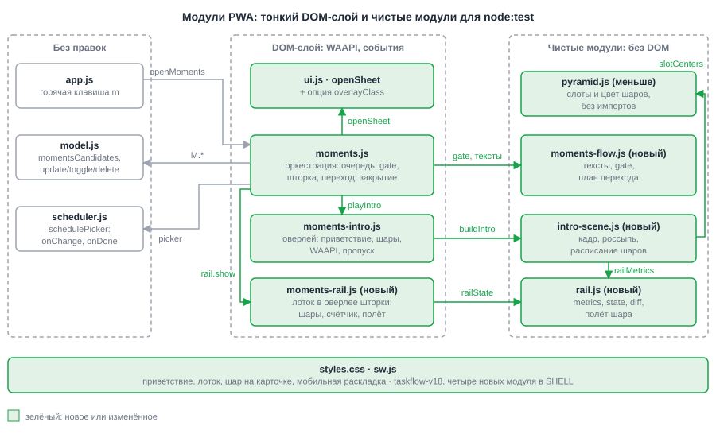
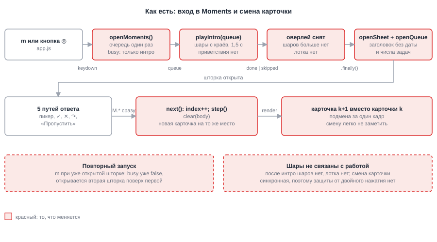
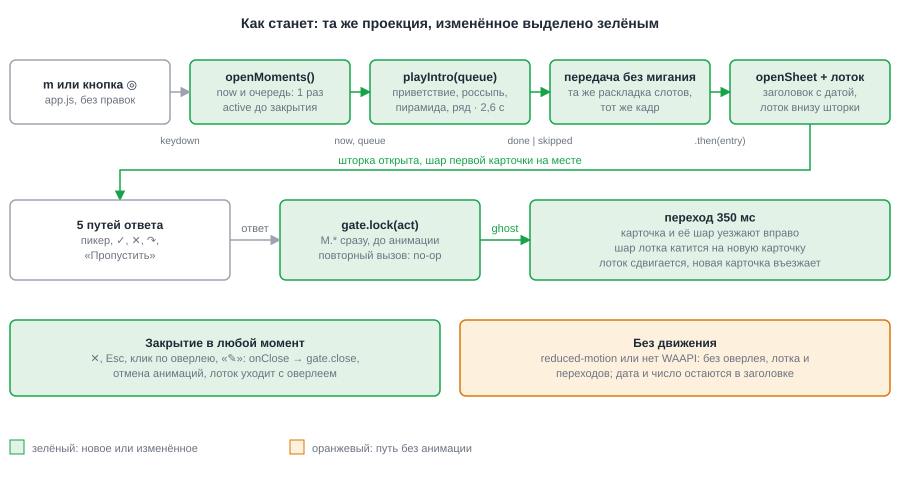
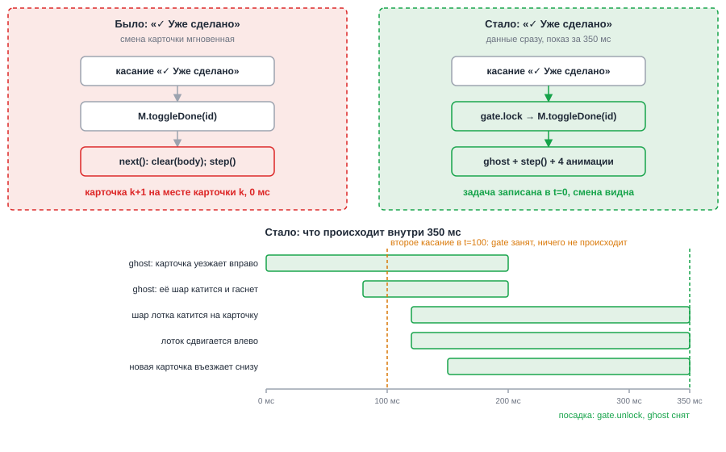

# HLD: moments-welcome-and-rail

**Date**: 2026-10-06
**Designer**: system-designer
**Status**: Draft (Gate A пройден заранее оркестратором по стоящей инструкции пользователя «без подтверждений»)
**Proposal**: `openspec/changes/moments-welcome-and-rail/proposal.md`

## Overview

Правка целиком во фронтенде TaskFlow (vanilla JS, ES-модули, без сборки). Бильярдные шары
перестают быть разовым интро и становятся рабочим элементом Moments. Вход начинается с
приветствия («Вторник, 6 октября · 12 задач на планирование»): вокруг текста рассыпаны шары,
они собираются в пирамиду и по одному встают в ряд внизу экрана. Этот ряд (лоток) остаётся,
пока открыта шторка. Шар текущей задачи сидит на карточке, после ответа уезжает вместе с ней
вправо, а следующий шар выкатывается из лотка на новую карточку.

Данные, схема, синхронизация и состав очереди не меняются: `M.updateTask`, `M.toggleDone`
и `M.deleteTask` вызываются в момент ответа, анимация только показывает уже сделанное.
Архитектурных развилок нет, ADR не пишутся (`adrs: []`). Развилка «лоток внутри оверлея шторки
или единый сценический слой» лежит внутри фронтенда и разобрана ниже, в разделе Decision Forks.
Подробности модулей и контрактов: `design.md`. Требования: `proposal.md`.

Главное, что добавляется в архитектуру:

- четыре чистых модуля без DOM для `node:test`: тексты и защита ввода (`moments-flow.js`),
  раскладка лотка (`rail.js`), сцена интро (`intro-scene.js`), а старый `pyramid.js` сжимается до примитивов;
- два DOM-модуля: лоток внутри оверлея шторки (`moments-rail.js`) и переписанный оверлей интро;
- состояние «идёт переход» внутри открытой шторки, которого раньше не было. Вокруг него построены
  защита ввода и отмена при закрытии.

## Architecture

Система одна: статическая PWA, которая ходит на свой сервер синхронизации. Этот change
сервера и API не касается, поэтому схема C4 Level 1 ничего не добавила бы. Компоненты
внутри PWA и границы между DOM-слоем и чистыми модулями показаны на Рис. 4.

### Component Diagram (C4 Level 2)

*Рис. 4 — всё, что считает раскладку, тайминг, тексты и защиту ввода, лежит в чистых модулях; DOM-слой остаётся тонким и только запускает анимации.*

## Change Visualization (As-Is → To-Be) — обязательный раздел

Показана затрагиваемая часть: путь от нажатия `m` до смены карточки. Обе схемы нарисованы
в одной проекции, чтобы их можно было сравнить глазами. Легенда: красный — то, что меняется
(as-is), зелёный — новое или изменённое (to-be), оранжевый — путь без анимации.

### Как есть (As-Is)

*Рис. 1 — As-Is: шары живут только в интро, шторка открывается без даты и числа, карточка подменяется на месте, а `m` при открытой шторке открывает вторую.*

### Как станет (To-Be)

*Рис. 2 — To-Be: между входом и шторкой идёт интро с приветствием, лоток переходит в шторку, ответ запускает защищённый переход.*

### До/после для ключевого сценария

*Рис. 3 — «✓ Уже сделано»: задача записывается в t=0, а смена карточки растягивается на 350 мс; второе касание в это время ничего не делает.*

### Что меняется пошагово

Порядок: от пользовательского действия к результату.

1. `app.js`: `m` и обе кнопки зовут `openMoments()` → без правок.
2. `moments.js`, `openMoments`: очередь считается один раз, флаг `busy` жил только на время интро →
   очередь и `now = new Date()` считаются один раз; флаг `active` держится до закрытия шторки, поэтому
   повторное `m` не открывает вторую шторку и во время перехода.
3. `moments-flow.js` (новый, чистый): текст приветствия «Вторник, 6 октября · 12 задач на планирование»
   и заголовок «Moments · вторник, 6 октября · 12 задач» берутся из одной пары `(now, queue.length)`.
4. `moments-intro.js` + `intro-scene.js`: шары скатываются с краёв за 1,5 с → приветствие, россыпь,
   пирамида из шаров (не больше 15), затем шары по одному встают в ряд внизу; сценарий 2,6 с.
   Оверлей по-прежнему разрешается `'done'` или `'skipped'` и сам себя снимает.
5. Передача в шторку: оверлей интро снимается, и в том же кадре открывается шторка. Лоток в ней
   рисуется по той же функции раскладки, поэтому шары стоят там же, где остановились.
6. `moments.js`, `openQueue`: заголовок получает дату и число; под шторкой появляется лоток
   (`moments-rail.js`); шар текущей задачи сидит на карточке значком с номером и цветом приоритета.
   Первый шар при естественном окончании интро выкатывается из лотка; после пропуска он уже на карточке.
7. Пять путей ответа (последний шаг пикера, «✓ Уже сделано», «✕ Не актуально», «↷ Пока не разбираю»,
   «Пропустить») → все идут через `gate.lock`. Данные пишутся сразу, потом запускается переход.
8. Переход 350 мс: клон старой карточки (ghost) уезжает вправо вместе со своим шаром, шар из лотка катится
   на новую карточку, лоток сдвигается, новая карточка въезжает снизу. Повторные нажатия в это время игнорируются.
9. Закрытие шторки в любой момент (✕, Esc, клик по оверлею, «✎ Открыть задачу») отменяет анимации и
   таймеры; лоток и ghost уходят вместе с оверлеем.
10. `styles.css`, `sw.js`, тесты, README: стили приветствия, лотка и шара на карточке; `taskflow-v18` и
    четыре новых модуля в `SHELL`; обновлённые и новые тесты.

### Key Architectural Decisions

Решения очевидные или внутренние для фронтенда, поэтому ADR нет.

| Decision | Choice | Drives | ADR |
|---|---|---|---|
| Где живёт лоток | Внутри оверлея шторки; интро остаётся отдельным оверлеем с прежним контрактом `playIntro` (опция A из `research.md`) | FR-004, FR-009, FR-018, FR-022 | — (no fork) |
| Передача интро → шторка | Обе стороны считают слоты одной чистой `railMetrics` + `railState`; оверлей шторки идёт без `fade` и без CSS-`rise`; передача в одном JS-таске | FR-003, FR-004 | — (no fork) |
| Размер шаров лотка | `d` выбирается один раз на сессию по `total` и не растёт при уходе шаров; слот занимает счётчик «+K» | FR-009, FR-010 | — (no fork) |
| Смена карточки | Клон старой карточки (ghost) уезжает поверх, новая карточка рендерится сразу; цель полёта шара измеряется до анимации | FR-014, FR-015, FR-020 | — (no fork) |
| Защита ввода | Чистый `createGate()`: первая строка каждого обработчика; `inert` на слайде и кнопке подвала как вторая линия | FR-005, FR-017, NFR-005 | — (no fork) |
| Закрытие и отмена | Продолжение на `Promise.allSettled`, а не `await finished`; флаг `closed` проверяется перед каждым шагом; сторож на случай зависшей анимации | FR-018 | — (no fork) |
| Один запуск за раз | Флаг `active` до `onClose` шторки, а не только на время интро | FR-005 | — (no fork) |
| Уменьшенное движение | `introAllowed()` читается при каждом входе; режим `static`: нет оверлея, лотка, шара и переходов, дата и число в заголовке | FR-007, FR-008 | — (no fork) |
| Тайминг | Расписание интро и плана перехода задано числами в чистых модулях и проверяется тестами | NFR-001, NFR-002 | — (no fork) |

## Decision Forks

ADR нет. Две развилки внутри фронтенда решены здесь, чтобы Developer не выбирал заново.

### Fork 1: опция A или B из `research.md`

Опция A: лоток живёт внутри оверлея шторки, интро остаётся отдельным оверлеем и в конце оставляет шары
в слотах лотка. Опция B: один «сценический» слой на всю сессию, шары интро и есть шары лотка.

**Выбрана A.** Причины:

- Лоток нужен ровно столько, сколько открыта шторка. В опции A он лежит внутри её оверлея, и любой
  путь закрытия (✕, Esc, клик мимо, «✎ Открыть задачу») снимает его вместе с оверлеем. В опции B слой
  пришлось бы снимать отдельным вызовом, и каждый забытый путь оставил бы шары в `#modal-root` (FR-018).
- `playIntro(queue)` сохраняет контракт «снимает свой оверлей и разрешается `done`/`skipped`», который
  закреплён в действующей спеке и в тестах (SRC-14). B ломает его: оверлей перестаёт сниматься.
- Лоток должен лежать над шторкой по z-порядку, чтобы шар мог лететь на карточку, и при этом принимать
  клики, не закрывая Moments (FR-022). Внутри оверлея шторки это решается одним правилом
  (`mousedown` закрывает только при `e.target === overlay`, лоток — отдельный элемент).

Цена A: нужна точная передача шаров между двумя оверлеями. Снимаем её так: `railMetrics` и
`railState` общие для интро и лотка; оба оверлея ставят один и тот же `--rail-h`, а Y полосы лотка
интро берёт из пустой «пробной» полосы с тем же CSS-правилом (так `env(safe-area-inset-bottom)`
не надо читать из JS); у оверлея шторки нет `fade`; передача идёт в одном JS-таске
(`playIntro(...).then(openQueue)`), кадра между оверлеями нет.

### Fork 2: как менять карточку

Варианты: (a) последовательно «ушла, затем пришла» в одном слое; (b) два живых слоя; (c) клон старой
карточки поверх, новая рендерится сразу; (d) View Transitions API.

**Выбран (c).** Клон не имеет обработчиков, поэтому у него нельзя дважды нажать кнопку: целый класс
двойных срабатываний (research R1) исчезает. Новая карточка стоит в потоке сразу, её бейдж можно
измерить до анимации и заранее знать, куда катить шар, поэтому всё идёт параллельно и укладывается в 350 мс.
В (a) цель шара известна только после смены содержимого и анимации идут друг за другом; (b) держит две
живые карточки с кнопками; (d) блокирует ввод снимком страницы и требует полного запасного пути в Firefox ниже 144.

## Data Flow

*Рис. 5 — от нажатия `m` до ответа на карточку: очередь и дата считаются один раз, интро разрешается `done` или `skipped`, шторка получает лоток, ответ идёт через `gate`.*

## Cross-cutting Concerns

- **Observability**: фронтенд без телеметрии. Проверка вручную по `test/MANUAL-CHECKLIST.md`.
- **Security**: данные не меняются, новых входов нет. Тексты на шарах и в приветствии строятся через
  `textContent`; на шарах только номер, заголовки задач в оверлей интро не попадают.
- **Error handling**: сбой анимации не должен блокировать Moments. `playIntro` не отклоняется: при ошибке
  снимает оверлей и разрешается `'skipped'`. Переход при исключении откатывается к мгновенной смене карточки
  и снимает защиту. Сторож `plan.total + 300 мс` снимает защиту, если анимация зависла.
- **Performance**: анимируются только `transform` и `opacity`. В интро до 15 шаров плюс «лишние» шары лотка
  на широком экране (не больше 19 на десктопе); переход двигает до 3 элементов плюс сдвиг лотка. Цель 60 fps,
  `will-change: transform` только у `.ball`. Раскладка считается один раз за вход.
- **Accessibility**: оверлей интро декоративный (`aria-hidden`), информация приветствия остаётся доступной в заголовке
  шторки (`aria-label` диалога). Лоток и шар на карточке декоративные. После смены карточки фокус возвращается
  на шторку, а тело прокручивается к началу. `prefers-reduced-motion` читается при каждом входе.
- **Offline / PWA**: `taskflow-v18`; четыре новых модуля в `SHELL`, иначе старая вкладка сломается при импорте.
- **Совместимость**: формат данных, `sync.mjs`, `agent.js`, `model.js` и очередь не меняются (NFR-003).

## Constraints for Developer

- C1: Раскладка, тайминг, тексты и защита ввода лежат только в чистых модулях (`moments-flow.js`, `rail.js`,
  `intro-scene.js`, `pyramid.js`): без DOM, без `store.js` и `model.js`, без `Math.random`, `Date.now`
  и `performance.now`; текущая дата приходит аргументом.
- C2: Каждый обработчик карточки и подвала начинается с проверки `gate`; `M.*` вызывается только внутри
  колбэка, который `gate` пропустил. Закрытие шторки (✕, Esc, клик по оверлею) защитой не закрывается.
- C3: Продолжение перехода не держится на `await anim.finished` (на отмене он отклоняется с `AbortError`);
  используется `Promise.allSettled` плюс проверка `gate.state === 'closed'` и сторож.
- C4: `onClose` шторки идемпотентно закрывает `gate`, отменяет анимации, снимает сторож и таймеры,
  убирает лоток, сбрасывает `active` и зовёт `ctx.refresh()`.
- C5: `momentsCandidates()` и `new Date()` вызываются один раз в `openMoments`; приветствие, заголовок и
  «N из M» берут число из одной `queue.length`.
- C6: Цвета шаров замораживаются при входе (`ballColorVar(t.priority)` по очереди); шары лотка цвет не меняют,
  шар на карточке следует за пикером.
- C7: Оверлей шторки в режиме с лотком получает класс `overlay-rail` (без `fade` и без CSS-`rise`, отступ под
  лоток); `--rail-h` выставляется на обоих оверлеях, Y полосы лотка интро берётся из пробной полосы.
- C8: Режим без движения (`introAllowed()` ложь на входе) не создаёт ни оверлея, ни лотка, ни шара, ни перехода;
  заголовок с датой и числом остаётся.
- C9: Стили: `.intro` остаётся с `z-index: 70`; `.rail` выше `.sheet` и принимает события; тело шторки получает
  `overflow-x: hidden`, чтобы уезжающая карточка не рисовала горизонтальный скролл.
- C10: `sw.js`: `taskflow-v18` и `./js/moments-flow.js`, `./js/rail.js`, `./js/intro-scene.js`, `./js/moments-rail.js` в `SHELL`.
- C11: Тесты, которые ломаются от этой правки, перечислены в `design.md` (раздел «Тесты»); `npm test` должен проходить.

## Superseded Documents

ADR не затронуты. Требования действующей спеки `moments-intro` заменяются delta-файлами этого change
(`specs/moments-intro/spec.md`, `specs/task-scheduling/spec.md`).

## References

- Proposal: `openspec/changes/moments-welcome-and-rail/proposal.md`
- Source: `openspec/changes/moments-welcome-and-rail/requirements-source.md`
- Research: `openspec/changes/moments-welcome-and-rail/research.md`
- Specs (delta): `openspec/changes/moments-welcome-and-rail/specs/{moments-intro,task-scheduling}/spec.md`
- Design: `openspec/changes/moments-welcome-and-rail/design.md`
- Прошлый change: `openspec/changes/archive/2026-10-06-tweak-entry-and-moments/` (hld.md, figures/)
- [MDN: Animation.cancel()](https://developer.mozilla.org/en-US/docs/Web/API/Animation/cancel)

---

*Created by System Designer agent (04). Pass to Task Planner after human approval.*
