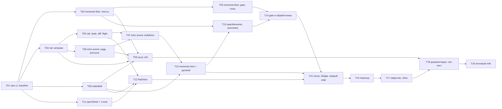

# Tasks: moments-welcome-and-rail

**Date**: 2026-10-06
**Planner**: task-planner
**Status**: Draft, ждёт approve (Gate A снят оркестратором по стоящей инструкции пользователя «без подтверждений»; Gate B остаётся за пользователем)
**Design**: `openspec/changes/moments-welcome-and-rail/design.md`
**HLD**: `openspec/changes/moments-welcome-and-rail/hld.md`
**Proposal**: `openspec/changes/moments-welcome-and-rail/proposal.md`

## Overview

19 задач, 38 story points (S=1, M=2, L=3). Проект на vanilla JS с `node:test`, DOM-окружения в тестах нет. Поэтому порядок такой:

1. Подготовка: зависимости в worktree и зелёный baseline (T01).
2. Чистые модули с тестами, TDD: `moments-flow.js` (T02, T03), `rail.js` (T04, T05), `intro-scene.js` (T06, T07).
3. Prefactoring DOM: общий `makeBall` (T08) и поставка `sw.js` (T09), пока код ещё не менялся по существу.
4. DOM-слой: переписанное интро + сжатие `pyramid.js` (T10), `openSheet` и стили (T11), лоток (T12).
5. Оркестрация сессии в `moments.js`: вход и заголовок (T13), защита ввода (T14), лоток, бейдж и первый шар (T15), переход (T16), закрытие и сбои (T17).
6. Документация и ручной чек-лист (T18), итоговый гейт (T19).

Роли: роль одна, задачи выполняет агент `developer`. `GO` ниже означает «прикладной JS-код» (в этом репозитории Go нет), `Infra` зависимости и поставка, `QA` тесты, чек-листы и итоговые проверки.

**Total tasks**: 19
**Total effort**: 38 SP

> Каждая задача оставляет `npm test` зелёным и имеет `Verification`: команду, которая падает до реализации и проходит после (для T01 и T19 это команды-гейты, обоснование в их описании). Тесты называются с идентификаторами AC этого change в имени `test('... AC-0NN ...')`: так их находит `scripts/ac-trace-check.mjs`.

### Принятые решения оркестратора по вопросам дизайнера

- Q1: `m` при открытой шторке второй не открывает (`active` живёт до `onClose` шторки).
- Q2: лоток считается при входе и не пересчитывается по `resize` и повороту экрана.
- Q3: без `inert` второй клик по пикеру внутри блокировки меняет только состояние самого пикера; `gate.ifIdle` не пускает его к данным.

### Общие правила (constraints_for_developer, C1-C15 из design.md)

- C1: `moments-flow.js`, `rail.js`, `intro-scene.js`, `pyramid.js` чистые: без `dom.js`, `store.js`, `model.js`, без `Math.random`, `Date.now`, `new Date`, `performance.now`. Импорты: `moments-flow.js` только `core.js`; `intro-scene.js` только `pyramid.js` и `rail.js`; `rail.js` и `pyramid.js` без импортов.
- C2: `openMoments`: `active` первой строкой, `M.momentsCandidates()` один раз, `new Date()` один раз; `active` сбрасывается только в `onClose` шторки очереди и в `.catch` цепочки интро.
- C3: `playIntro(queue, greeting)` разрешается `'done'` (выражение `setTimeout(() => finish('done'), intro.total)` не менять) или `'skipped'`, не отклоняется, снимает оверлей до разрешения; в `moments.js` результат берётся через `.then((reason) => ...)`, не `.finally`.
- C4: все обработчики карточки и подвала идут через `gate` (пять путей ответа через `gate.lock`, пикер `onChange` и «✎» через `gate.ifIdle`); закрытие шторки защитой не закрывается; `inert` только вторая линия.
- C5: продолжение перехода на `Promise.allSettled(anims.map(a => a.finished)).then(settle)` плюс сторож `plan.total + 300`; `settle` идемпотентен и первой строкой проверяет `gate.state === 'closed'`; `await anim.finished` запрещён.
- C6: `onClose` идемпотентен: `gate.close()`, `clearTimeout`, `cancel()` анимаций в `try`, `rail.destroy()`, `active = false`, `ctx.refresh()`.
- C7: цвета замораживаются при входе (`colors = queue.map(t => ballColorVar(t.priority))`); бейдж красится по `v.priority` пикера (при `!== null`), шары лотка цвет не меняют.
- C8: режим с лотком: `overlayClass: 'overlay-rail'`; `--rail-h` на обоих оверлеях; `railTop` интро измеряется у пустой `.rail.intro-rail`; вход шторки через WAAPI после измерения цели.
- C9: режим `static`: без оверлея, лотка, бейджа, перехода; `go()` = `step()` + `gate.unlock()`; `introAllowed()` читается один раз на вход.
- C10: `step()` делает `body.scrollTop = 0` и `sheet.focus({preventScroll: true})` (кроме первого рендера); у `sheet` `tabindex="-1"` и `outline: none`.
- C11: анимируются только `transform` и `opacity`; `will-change: transform` только у `.ball`; тело шторки Moments `overflow-x: hidden`; `.rail` выше `.sheet` и принимает события; `.intro` остаётся `z-index: 70`.
- C12: тексты на шарах, в чипе и приветствии только через `textContent`; шары создаёт только `makeBall`.
- C13: `sw.js` `taskflow-v18` и четыре модуля в `SHELL`; тесты из design.md переписываются в том же change.
- C14: абзац «Вход в Moments» и таблица модулей в `README.ru.md`; раздел в `test/MANUAL-CHECKLIST.md`.
- C15: `model.js`, `store.js`, `sync.mjs`, `agent.js`, формат задач не трогать; `schedulePicker` не менять.
- Работа только в этом worktree. Без атрибуции Claude или ИИ в коммитах и файлах. `.workflow-state.yaml` не трогать.
- Файл `test/moments-static.test.mjs` не упомянут в design.md: это организационный выбор (новые статические проверки этого change отделены от `ui-static.test.mjs`, где остаются номера AC прежних change, чтобы `ac-trace-check --files` не засчитывал чужое покрытие), а не изменение дизайна. Переписанные тесты из design.md остаются в `ui-static.test.mjs` и `pyramid.test.mjs`.
- Коллизия номеров AC: в репозитории уже есть тесты с AC-001..AC-036 прежних change. Все переписанные и новые тесты этого change называются идентификаторами AC из `proposal.md` этого change. Дефолтный тест `test/ac-trace.test.mjs` (AC-001..AC-029) обязан оставаться зелёным после каждой задачи, которая удаляет или переименовывает тесты.

## Task Graph

Порядок tracer-bullet: T01, T02, T03, T04, T05, T06, T07, T08, T09, T10, T11, T12, T13, T14, T15, T16, T17, T18, T19.

## Progress

## 1. Подготовка

- [x] 1.1 (T01) `npm ci` в worktree и зелёный baseline `npm test`

## 2. Чистые модули (TDD)

- [x] 2.1 (T02) `js/moments-flow.js`: `taskCountLabel`, `greetingParts`, `sheetTitle`
- [x] 2.2 (T03) `js/moments-flow.js`: `createGate`, `transitionPlan`
- [x] 2.3 (T04) `js/rail.js`: `railMetrics`, `showsNumber`
- [x] 2.4 (T05) `js/rail.js`: `railState`, `railDiff`, `flightDelta`
- [x] 2.5 (T06) `js/intro-scene.js`: `introFrame`, `scatterPoints`
- [x] 2.6 (T07) `js/intro-scene.js`: `buildIntro` (расписание сцены)

## 3. Prefactoring DOM и поставка

- [x] 3.1 (T08) `makeBall` в `js/moments-rail.js`, интро строит шары через него
- [x] 3.2 (T09) `sw.js`: `taskflow-v18`, четыре модуля в `SHELL`, обновление `ui-static.test.mjs`

## 4. DOM-слой

- [x] 4.1 (T10) `js/moments-intro.js` на новой сцене, сжатие `js/pyramid.js`, переписанные тесты
- [x] 4.2 (T11) `openSheet({overlayClass})` и стили лотка, бейджа, ghost
- [x] 4.3 (T12) `createRailView` в `js/moments-rail.js`

## 5. Сессия Moments

- [x] 5.1 (T13) `openMoments`: `active`, приветствие, заголовок с датой и числом, режим `static`, фокус и прокрутка
- [x] 5.2 (T14) Защита ввода: пять путей через `gate.lock`, пикер и «✎» через `gate.ifIdle`
- [x] 5.3 (T15) Лоток в шторке, бейдж на карточке, первый шар, пропуск интро
- [x] 5.4 (T16) Переход между карточками: ghost, шар, сдвиг лотка, въезд, «День распланирован»
- [x] 5.5 (T17) Закрытие посреди перехода, сторож, откат при сбое

## 6. Документация и гейт

- [x] 6.1 (T18) `README.ru.md`, `test/MANUAL-CHECKLIST.md`
- [x] 6.2 (T19) Итоговый гейт: `npm test`, трассировка AC, `openspec validate`, запретные файлы

## Tasks

### T01: `npm ci` в worktree и зелёный baseline

- **Progress**: 1.1
- **Role**: Infra
- **Effort**: S
- **Blocked by**: нет
- **Covers**: нет (prerequisite, см. unmapped_tasks)
- **What to build**: в worktree нет `node_modules`; выполнить `npm ci` (при падении `npm install`, не меняя `package-lock.json` сверх необходимого) и зафиксировать baseline: `npm test` на чистой ветке проходит. Если baseline красный из-за прежних причин (не из-за этого change), записать падающие тесты в сообщение разработчика и не чинить их в этом change.
- **Acceptance criteria**:
  - `node_modules` существует, `node --test test/pyramid.test.mjs` запускается.
  - Результат baseline `npm test` записан (число тестов и падений); дальше падения считаются регрессией только относительно него.
  - `git status` не показывает правок `package.json` и `package-lock.json`.
- **Verification**: `npm ci && npm test` (гейт готовности окружения: до `npm ci` падает на импорте зависимостей, после проходит; «красный до» здесь означает «нет окружения»).

### T02: `moments-flow.js`: тексты приветствия и заголовка

- **Progress**: 2.1
- **Role**: GO
- **Effort**: S
- **Blocked by**: T01
- **Covers**: FR-001, FR-008 (AC-001, AC-002, AC-013, AC-034)
- **What to build**: новый чистый модуль `js/moments-flow.js` (импорт только `./core.js`) с экспортами `taskCountLabel(n)`, `greetingParts(now, count)`, `sheetTitle(now, count)` по сигнатурам design M1. Склонение через `plural`; день недели и месяц через `WEEKDAYS_FULL[now.getDay()]` и `MONTHS_GEN[now.getMonth()]`; приветствие с заглавной, заголовок со строчной; число задач берётся из `count` как есть (20 даёт «20 задач»). Модуль не читает часы и не создаёт `Date`. Создать `test/moments-flow.test.mjs`.
- **Acceptance criteria**:
  - Во вторник 6 октября 2026 и очереди 12: `full` = «Вторник, 6 октября · 12 задач на планирование», `sheetTitle` = «Moments · вторник, 6 октября · 12 задач» (AC-001).
  - `taskCountLabel`: 1 «задача», 3 «задачи», 11 и 12 «задач», 21 «задача»; `20` даёт «20 задач» в приветствии и заголовке (AC-001, AC-002).
  - Заголовок одинаков для любого вызова с теми же `(now, count)` и не зависит от прогресса (AC-013, на уровне чистой функции).
  - Тест чистоты: в тексте модуля нет `Math.random`, `Date.now`, `new Date`, `performance.now`, импортов `dom.js`, `store.js`, `model.js` (AC-034).
- **Verification**: `node --test test/moments-flow.test.mjs` (падает до реализации: нет модуля).

### T03: `moments-flow.js`: `createGate` и `transitionPlan`

- **Progress**: 2.2
- **Role**: GO
- **Effort**: M
- **Blocked by**: T02
- **Covers**: FR-005, FR-017, NFR-002, NFR-005 (AC-007, AC-023, AC-025, AC-026, AC-034)
- **What to build**: в `js/moments-flow.js` добавить `createGate()` (состояния `idle`, `locked`, `closed`; `lock(act?)`, `ifIdle(act)`, `unlock()`, `close()`) и `transitionPlan(kind)` с таблицей из design M1 (`next`, `last`, `first`; `total` как максимум `at + dur` по непустым полям). `lock` при `idle` вызывает `act` ровно один раз и ставит `locked`; при `locked` или `closed` возвращает `false` без вызова `act`; исключение из `act` откатывает в `idle` и пробрасывается. `unlock` после `close` ничего не делает; `close` идемпотентно ведёт в `closed`. Некорректный `kind` бросает `TypeError`. Расширить `test/moments-flow.test.mjs`.
- **Acceptance criteria**:
  - Второй `lock` во время `locked` не вызывает `act` и возвращает `false`; `act` вызван ровно один раз (AC-025).
  - `ifIdle` в `locked` и `closed` ничего не вызывает; в `idle` вызывает и состояние не меняет (AC-025).
  - Исключение в `act` возвращает gate в `idle`; `unlock` после `close` не оживляет gate; `close` идемпотентен; `lock` после `close` возвращает `false` (AC-025, AC-026).
  - `transitionPlan('next').total` равен 350 и лежит в 300–400; `'last'` без `enter`, `ball`, `shift`, `pull`, `total` 200; `'first'` `total` 260 (AC-023, AC-007).
  - `transitionPlan('bad')` бросает `TypeError`. Тест чистоты из T02 остаётся зелёным.
- **Verification**: `node --test test/moments-flow.test.mjs` (новые тесты падают до реализации).

### T04: `rail.js`: метрики лотка

- **Progress**: 2.3
- **Role**: GO
- **Effort**: M
- **Blocked by**: T01
- **Covers**: FR-010, NFR-005 (AC-015, AC-017, AC-034)
- **What to build**: новый чистый модуль `js/rail.js` без импортов. Константы `D_MIN=28`, `D_MAX=56`, `NUM_MIN_D=36`, `RAIL_PAD_X=16`, `RAIL_PAD_Y=8`, `RAIL_MAX_W=560`, `PITCH_K=1.04`; `railMetrics(total, viewW)` (`rowW = min(viewW - 32, 560)`, `rowX`, `pitch = 1.04·d`, `cap(d) = floor((rowW + 0.04·d)/(1.04·d))`, `bandH = d + 16`; `d` наибольшее целое из 56…28, при котором `cap(d) >= total`, иначе 28); `showsNumber(d)`. `total < 1` или нечисловая ширина бросают `TypeError`. Создать `test/rail.test.mjs`.
- **Acceptance criteria**:
  - На ширине 390 px (таблица design M2): 6 → `d=56, cap=6`; 7 → `49, 7`; 12 → `28, 12`; 13, 20, 100 → `28, 12` (AC-015).
  - На ширине 1280 px для 20 задач: `d=28`, `cap=19` (AC-015).
  - Для любых `total` 1…100 и ширин 320…1600: `d ∈ [28, 56]`, `rowW <= 560`, последний слот в пределах `rowX + rowW` (AC-015).
  - `showsNumber(35)` ложно, `showsNumber(36)` истинно (AC-017).
  - Чистота модуля: нет импортов и запрещённых вызовов (AC-034).
- **Verification**: `node --test test/rail.test.mjs` (падает до реализации).

### T05: `rail.js`: состояние, разница и перелёт

- **Progress**: 2.4
- **Role**: GO
- **Effort**: M
- **Blocked by**: T04
- **Covers**: FR-009, FR-010 (AC-014, AC-016, AC-017)
- **What to build**: в `js/rail.js` добавить `railState(m, total, index)` (`remaining = clamp(total - index - 1, 0, total)`; если `remaining <= cap`, показаны все без счётчика, иначе счётчик занимает последний слот, `visible = cap - 1`, `extra = remaining - visible`; слот `j` содержит шар `n = index + 2 + j`, `x = rowX + j·pitch`), `railDiff(prev, next)` (`leaving`, `moved`, `entering`, `counter`) и `flightDelta(from, to)` (`dx`, `dy`, `scale = to.d / from.d`). Расширить `test/rail.test.mjs`.
- **Acceptance criteria**:
  - Для каждого `index` от −1 до `total` и `total` ∈ {1, 6, 7, 12, 13, 20, 100} выполняется `slots.length + extra + (1, если 0 ≤ index < total) + max(index, 0) = total` (AC-016).
  - Номера слотов идут подряд от `index + 2`; шара текущей задачи в лотке нет (AC-014).
  - Между соседними индексами `railDiff` даёт ровно один `leaving`, остальные в `moved` сдвинуты на один `pitch` влево; при `K > 0` один `entering` и `K` меньше на 1; при `K = 0` счётчик исчезает (AC-016).
  - Очередь из одной задачи: после посадки шара лоток пуст (`index = 0`, `slots = []`, счётчика нет).
  - `flightDelta` возвращает масштаб `to.d / from.d` и перенос между центрами (AC-017 косвенно: перелёт в 56 px шаре карточки).
- **Verification**: `node --test test/rail.test.mjs` (новые тесты падают до реализации).

### T06: `intro-scene.js`: кадр и россыпь

- **Progress**: 2.5
- **Role**: GO
- **Effort**: M
- **Blocked by**: T04
- **Covers**: FR-002, FR-021 (AC-004, AC-031, AC-034)
- **What to build**: новый чистый модуль `js/intro-scene.js` (импорты только `./pyramid.js` и `./rail.js`). Константы `MAX_BALLS=15`, `INTRO_TOTAL_MS=2600`, `READY_MS=2860`. `introFrame(view, n, railTop)`: блок приветствия `w = min(view.w - 32, 520)`, `h = 112` при `view.w < 480`, иначе 88; диаметр пирамиды `d = clamp(min(floor(view.w / 6.5), floor((free - h - 16) / span)), 28, 56)`, `free = railTop - 32`, `span = (rows - 1)·0.866·1.04 + 1`; группа «приветствие, зазор 16, пирамида» центрируется по вертикали над лотком. `scatterPoints(n, d, area, avoid)`: точки Хальтона (основания 2 и 3) в зоне `[d/2 + 8 … w - d/2 - 8] × [d/2 + 8 … railTop - d/2 - 8]`, отбраковка по прямоугольнику приветствия (с запасом `d/2 + 8`) и по дистанции `0.9·d`, до 300 попыток, затем порог ×0.8 (до двух раз), затем угол зоны. Без случайности. `railTop` без измерения берётся как `view.h - railMetrics(...).bandH`. Создать `test/intro-scene.test.mjs`.
- **Acceptance criteria**:
  - На окнах 360×640, 375×667, 390×844, 667×375, 1280×800 (очередь 20): все центры россыпи внутри окна с полем `d/2`, вне прямоугольника приветствия с запасом `d/2 + 8`; приветствие и пирамида не пересекаются; пирамида и полоса лотка не пересекаются; ничего не выходит за экран (AC-031).
  - Диаметр пирамиды зависит и от высоты окна (на 667×375 меньше, чем на 667×800) и лежит в 28..56.
  - Россыпь детерминирована: два вызова с теми же аргументами равны (AC-004).
  - Тест чистоты `intro-scene.js` (AC-034).
- **Verification**: `node --test test/intro-scene.test.mjs` (падает до реализации).

### T07: `intro-scene.js`: `buildIntro` и расписание

- **Progress**: 2.6
- **Role**: GO
- **Effort**: L
- **Blocked by**: T05, T06
- **Covers**: FR-002, FR-003, FR-010, FR-021, NFR-001 (AC-004, AC-005, AC-006, AC-007, AC-031)
- **What to build**: в `js/intro-scene.js` добавить `buildIntro(queue, view)` с таблицей расписания из design M3: `greeting.fadeIn=[0,250]`, `fadeOut=[1500,1800]`; россыпь `i·sPop … +240`, `sPop = floor(min(20, 160/(n-1)))`; сбор `1000 + i·sGather … +520`, `sGather = floor(min(40, 180/(n-1)))`, два оборота; пульс 1700–1900; ряд `1900 + i·sRail … +380`, `sRail = floor(min(60, 320/(n-1)))`, масштаб `railD/d`, ещё оборот; `fate: 'counter'` для шаров, не влезших в лоток (катятся к счётчику, масштаб 0.3, прозрачность 0); `extras` и чип «+K» проявляются 2400–2600; `numberFade = !showsNumber(railD)`. `n = min(queue.length, 15)`; для `n = 1` все `s*` равны нулю. Слоты лотка и счётчик берутся из `railState(railMetrics(queue.length, view.w), queue.length, -1)`. Цвет `ballColorVar(queue[i].priority)`. Пустая очередь даёт `balls: []`, нечисловой `view.w` или `view.h` бросает `TypeError`. Перенести в `test/intro-scene.test.mjs` тесты `buildIntro` из `test/pyramid.test.mjs` (20 задач дают 15 шаров, 3 задачи верхушка из двух рядов, детерминизм, пустая очередь, плохой `view`), адаптировав под новые числа. Старые тесты в `pyramid.test.mjs` пока не удалять (их уберёт T10).
- **Acceptance criteria**:
  - 20 задач дают 15 шаров с номерами 1…15 в порядке очереди, 3 задачи верхушку из рядов 1 и 2; вход без приоритета нейтральный (AC-004, AC-005).
  - Старты шаров строго возрастают при `2 ≤ n ≤ 15` (в россыпи, сборе и ряду): шары встают в ряд по одному в порядке очереди (AC-006).
  - `scene.total === 2600`, `readyAt` в 2500–3000, последний шаг расписания не позже `total` для `n` от 1 до 15 и очереди до 100 (AC-007, NFR-001).
  - Первый кадр `t = 0`, последний `t = 2600`, `keys` упорядочены по `t`; после фазы сбора `rot % 360 === 0`.
  - Слоты лотка в `balls[].keys` и `extras` совпадают с `railState(..., -1)` (передача без скачка); при `total = 13` и 390 px два шара имеют `fate: 'counter'`, `counter.k = 2`; на 1280 px при 20 задачах `extras` содержит шары 16–18 без пути из пирамиды.
  - Остаются зелёными тесты T06 (геометрия без пересечений) и тест чистоты.
- **Verification**: `node --test test/intro-scene.test.mjs` (новые тесты падают до реализации).

### T08: `makeBall` в `moments-rail.js`, интро строит шары через него

- **Progress**: 3.1
- **Role**: GO
- **Effort**: S
- **Blocked by**: T01
- **Covers**: FR-013 (общий вид шара), NFR-005 (AC-005, AC-017)
- **What to build**: prefactoring без смены поведения. Новый файл `js/moments-rail.js` с экспортом `makeBall({n, colorVar, d, showNum})`: `` с номером на светлом круге, номер через `textContent`, диаметр и цвет через CSS-переменные как сейчас у шаров интро, класс `no-num` при `showNum` ложном. `js/moments-intro.js` создаёт шары только через `makeBall` (параметры из текущего `buildIntro` из `pyramid.js`); остальное поведение интро не меняется. В `test/ui-static.test.mjs` проверку `.textContent = String(b.n)` перенести с `moments-intro.js` на `moments-rail.js`.
- **Acceptance criteria**:
  - В `moments-rail.js` номер строится через `textContent`, нет `innerHTML`, `.title`, `html:` и импортов `model.js`, `store.js` (C12).
  - В `moments-intro.js` нет собственного создания `.ball` (весь код шара в `makeBall`).
  - Весь `npm test` зелёный: поведение интро не изменилось.
- **Verification**: `node --test test/ui-static.test.mjs` (обновлённый тест падает до выноса: в `moments-rail.js` нет `textContent`).

### T09: `sw.js`: `taskflow-v18` и новые модули в `SHELL`

- **Progress**: 3.2
- **Role**: Infra
- **Effort**: S
- **Blocked by**: T02, T04, T06, T08
- **Covers**: NFR-004 (AC-033)
- **What to build**: `CACHE = 'taskflow-v18'`; в `SHELL` добавить `./js/moments-flow.js`, `./js/rail.js`, `./js/intro-scene.js`, `./js/moments-rail.js`. В `test/ui-static.test.mjs` обновить: первый тест (`taskflow-v17` в заголовке и проверке на `taskflow-v18`) и тест `sw.js` («две проверки» на `taskflow-v18`, четыре модуля в `SHELL`, файлы существуют); новые тесты называть с `AC-033`.
- **Acceptance criteria**:
  - `sw.js` содержит `taskflow-v18` и не содержит `taskflow-v17`.
  - Все четыре новых модуля перечислены в `SHELL`, соответствующие файлы существуют.
  - `npm test` зелёный (в том числе `deploy-check` и прочие тесты, читающие `sw.js`).
- **Verification**: `node --test test/ui-static.test.mjs test/deploy-check.test.mjs` (обновлённые тесты падают, пока в `sw.js` v17).

### T10: `moments-intro.js` на новой сцене, сжатие `pyramid.js`

- **Progress**: 4.1
- **Role**: GO
- **Effort**: L
- **Blocked by**: T07, T08
- **Covers**: FR-001, FR-002, FR-003, FR-004, FR-021, NFR-001 (AC-003, AC-004, AC-008, AC-031)
- **What to build**: переписать `js/moments-intro.js` под `buildIntro` из `intro-scene.js`. `playIntro(queue, greeting)`: оверлей `.intro[aria-hidden="true"]` с `.intro-greeting` (две строки через `textContent`, `greeting = {date, count}`; позиция из `scene.greeting`), `.intro-rack` с шарами (через `makeBall`) и пустой пробной полосой `.rail.intro-rail`; порядок: добавить оверлей и выставить `--rail-h`, измерить `railTop` у пробной полосы, `buildIntro(queue, {w, h, railTop})`, создать шары и анимации. Каждый шар: одна WAAPI-анимация на всю `scene.total` (смещения `t / total`, `fill: 'both'`); приветствие, пульс `.intro-rack` и `numberFade` номера на шарах (с `numberFade`) получают свои анимации. Пропуск: `click` по оверлею и `keydown` в capture на `document` (`preventDefault`, `stopPropagation`, `e.repeat` игнорируется); `setTimeout(() => finish('done'), intro.total)` сохранить дословно; `if (current) return current`, `if (finished) return`; любое исключение в построении ведёт к `finish('skipped')`. Параметр `greeting` необязателен на этом шаге (при `undefined` блок приветствия не создаётся): так старый вызов `playIntro(queue)` в `moments.js` остаётся рабочим до T13. Добавить стили `.intro-greeting`, `.intro-date`, `.intro-count` (белый текст в обеих темах, `text-wrap: balance`, `clamp(22px, 6vw, 34px)` и `clamp(15px, 4vw, 19px)`), `.intro .rail` (`position: fixed`, `pointer-events: none`, высота `var(--rail-h)`), `.ball.no-num .ball-num`, `will-change: transform` только у `.ball`; `.intro` остаётся `z-index: 70`. Сжать `js/pyramid.js` до примитивов (`MAX_BALLS`, `NEUTRAL_VAR`, `rackRows`, `ballDiameter`, `slotCenters`, `ballColorVar`), убрав `INTRO_TOTAL_MS`, `ROLL_MS`, `MIN_HOLD_MS`, `PULSE_MS`, `EASE_ROLL`, `startPoint`, `ballTiming`, `buildIntro`. Переписать `test/pyramid.test.mjs` (остаются `rackRows`, `slotCenters`, `ballColorVar`, `ballDiameter`, чистота; убрать импорты `buildIntro`, `startPoint`, `INTRO_TOTAL_MS` и проверки «1200–1800 мс», «посадка не позже 1250 мс», «путь `[0, 0.82, 0.92, 1]`», «старт на краю окна»). В `test/ui-static.test.mjs` обновить тест `moments-intro`: остаются проверки `matchMedia` только в `introAllowed`, `click` без `pointerdown`, `keydown` в capture, `preventDefault`, `stopPropagation`, `e.repeat`, `if (current) return current`, `if (finished) return`, `setTimeout(() => finish('done'), intro.total)`, нет `.title|innerHTML|html:` и импортов `model.js`, `store.js`; добавить проверку, что приветствие строится через `textContent`, что импортируется `intro-scene.js` и нет импорта `pyramid.js`-`buildIntro`; добавить селекторы `.intro-greeting`, `.intro .rail` в проверку стилей.
- **Acceptance criteria**:
  - Оверлей интро содержит приветствие, шары и пробную полосу; все тексты через `textContent`, заголовки задач в оверлей не попадают (AC-003, AC-004).
  - Пропуск (клик, любая клавиша, Esc) снимает оверлей и разрешает `'skipped'`; естественное окончание разрешает `'done'` по таймеру 2600 мс (AC-008, AC-003).
  - `pyramid.js` не экспортирует удалённых имён, ничего не импортирует, не использует `Math.random`/`Date`; никто в `js/` не импортирует удалённые имена.
  - Дефолтный `test/ac-trace.test.mjs` и весь `npm test` зелёные; тесты `buildIntro` живут только в `intro-scene.test.mjs`.
  - Приветствие и пирамида не пересекаются на размерах из AC-031 (покрыто T06, T07; здесь проверяется, что DOM берёт значения из сцены, без собственной геометрии).
- **Verification**: `node --test test/pyramid.test.mjs test/ui-static.test.mjs test/intro-scene.test.mjs` (обновлённые статические тесты падают до переписывания: нет `intro-scene.js` в импортах, нет `.intro-greeting`).

### T11: `openSheet({overlayClass})` и стили лотка, бейджа, ghost

- **Progress**: 4.2
- **Role**: GO
- **Effort**: M
- **Blocked by**: T01
- **Covers**: FR-011, FR-022 (AC-018, AC-019, AC-034)
- **What to build**: в `js/ui.js` у `openSheet` добавить опцию `overlayClass = ''`: `overlay = h('div', { class: overlayClass ? \`overlay ${overlayClass}\` : 'overlay' })`; закрытие, Esc, клик по оверлею (только при `e.target === overlay`), `onClose` и возврат не менять. В `styles.css` добавить по контракту M9 таблицы design: `.overlay.overlay-rail` (нет `fade`; `padding-bottom` под `--rail-h`), `.overlay-rail .sheet` (нет `rise`, `position: relative`, `max-height` с учётом `--rail-h`; на ≤ 640 px `calc(92vh - var(--rail-h) - 8px)`, все углы скруглены; `.sheet-foot` без `safe-b`), `.rail` (`position: fixed; left:0; right:0; bottom:0; height: var(--rail-h); padding-bottom: var(--safe-b); box-sizing: border-box; z-index: 2; pointer-events: auto`), `.rail .ball` (`top: 8px`), `.rail-more` (чип «+K»), `.moments-ball` (`--d: 44px`, справа сверху), `.moments-task.has-ball` (`position: relative; padding-right: 54px; min-height: 44px`), `.moments-body` (`overflow-x: hidden`), `.moments-ghost` (`position: absolute; overflow: hidden; pointer-events: none`), `.sheet-head h2` (`min-width: 0; overflow-wrap: anywhere`), `.sheet:focus` (`outline: none`). Правило `prefers-reduced-motion` не менять. Создать `test/moments-static.test.mjs` (сюда идут все новые статические проверки этого change) и обновить в `test/ui-static.test.mjs` тест про `--ball-none` и `.intro` селекторами `.rail`, `.rail-more`, `.moments-ball`, `.moments-ghost`, `.overlay-rail`.
- **Acceptance criteria**:
  - `openSheet` принимает `overlayClass` и ставит класс `overlay overlay-rail`; без опции класс `overlay` как раньше.
  - Клик по оверлею закрывает шторку только при `e.target === overlay`: тап по `.rail` Moments не закрывает (AC-019).
  - Все перечисленные селекторы есть в `styles.css`; `.rail` имеет `pointer-events: auto`, `z-index` выше `.sheet`; `.intro` остаётся `z-index: 70` (C11).
  - На ≤ 640 px шторка ниже (`max-height` с `--rail-h`), подвал виден (статически: правила на месте, `.sheet-foot` без `safe-b` в режиме лотка) (AC-018).
  - `npm test` зелёный.
- **Verification**: `node --test test/moments-static.test.mjs test/ui-static.test.mjs` (падает до реализации: нет опции и селекторов).

### T12: `createRailView` в `moments-rail.js`

- **Progress**: 4.3
- **Role**: GO
- **Effort**: L
- **Blocked by**: T05, T08, T11
- **Covers**: FR-009, FR-010, FR-018 (уборка), FR-022 (AC-014, AC-016, AC-017, AC-019, AC-022)
- **What to build**: в `js/moments-rail.js` добавить `createRailView({overlay, colors, total, viewW})` по контракту M5. Ставит на `overlay` переменную `--rail-h: calc(<bandH>px + var(--safe-b))` и создаёт `.rail`; шары в полосе `position: absolute; top: 8px`, позиция через `transform: translate(x px, 0)`. `show(index)` перерисовывает полосу целиком по `railState` (шары и чип «+K», номер на шаре через `showsNumber`). `advance(from, to, {target, plan})`: обновляет DOM до `to`, описывает движение анимациями: `leaving` летит в `target` (`flightDelta`, оборот 360°, `fill: 'forwards'`, номер плавно проявляется при `d < 36`), `moved` сдвигаются на `pitch` (`fill: 'none'`), `entering` проявляется по окну `plan.pull`, чип «+K» обновляется сразу, при `K = 0` гаснет по окну `plan.pull`; возвращает `{anims, settle()}`, `settle` идемпотентен и убирает улетевший шар. `destroy()` отменяет анимации (`try { a.cancel() } catch {}`) и убирает `node`, идемпотентен. Только `transform` и `opacity`; тексты только через `textContent`; заголовки задач в лоток не попадают; шары создаёт только `makeBall`.
- **Acceptance criteria**:
  - `moments-rail.js` импортирует только `./rail.js` и `./dom.js`; нет `innerHTML`, `.title`, `html:`, `model.js`, `store.js`, `await` перед `.finished` (C1, C5, C12).
  - В коде `advance`/`show` есть вызовы `railState`, `railDiff`, `flightDelta`, `showsNumber`; чип «+K» создаётся с классом `rail-more`; у `destroy` и `settle` есть защита от повторного вызова.
  - `.rail` не вешает обработчиков закрытия и не мешает событиям: нет `stopPropagation` на лотке, клики по лотку дают `e.target !== overlay` (AC-019).
  - После `settle` в DOM нет улетевшего шара; после `destroy` нет `.rail` (AC-022 для шара лотка).
  - `npm test` зелёный.
- **Verification**: `node --test test/moments-static.test.mjs` (новые статические тесты для `moments-rail.js` падают до реализации).

### T13: `openMoments`: `active`, приветствие, заголовок, режим `static`

- **Progress**: 5.1
- **Role**: GO
- **Effort**: M
- **Blocked by**: T02, T10
- **Covers**: FR-001, FR-005, FR-006, FR-007, FR-008, FR-019, FR-020 (AC-001, AC-002, AC-010, AC-011, AC-012, AC-013, AC-029, AC-030)
- **What to build**: в `js/moments.js` заменить `let busy` на `let active = false`. `openMoments`: `if (active) return`; `queue = M.momentsCandidates()` (единственный вызов в файле); пусто ведёт в `openEmpty()` до интро и без `active`; `now = new Date()` один раз; `title = sheetTitle(now, queue.length)`, `greeting = greetingParts(now, queue.length)`; `active = true`; при `!introAllowed()` вызвать `openQueue(queue, {entry: 'static', title})`, иначе `playIntro(queue, greeting).then((reason) => openQueue(queue, {entry: reason, title})).catch(() => { active = false; })`. `openQueue(queue, {entry, title})`: заголовок шторки из `title`; `footInfo` «N из M» (M = `queue.length`); у `body` класс `moments-body`; у `sheet` `tabindex="-1"`; `step()` после первого рендера делает `body.scrollTop = 0` и `sheet.focus({preventScroll: true})`. `onClose`: gate появится только в T14, поэтому на этом шаге `onClose` сбрасывает `active = false` и зовёт `ctx.refresh()`. Остальное поведение (лоток, переход) пока не добавлять: режим `static` и режим с интро открывают одинаковую шторку без лотка. Переписать тест `openMoments` в `test/ui-static.test.mjs`: `let active = false`, `if (active) return`, ветка без движения `openQueue(queue, { entry: 'static', … })`, `playIntro(queue, …).then((reason) => openQueue(queue, { entry: reason, … }))`, `ctx.refresh()` и `active = false` внутри `onClose`, `momentsCandidates(` ровно один раз, `new Date()` ровно один раз, `openEmpty()` раньше `introAllowed()`. Дополнить `test/moments-static.test.mjs` проверками `step()` (прокрутка, фокус, `tabindex="-1"`) и неизменности `M.*`-вызовов.
- **Acceptance criteria**:
  - Заголовок «Moments · вторник, 6 октября · 12 задач» берётся из `sheetTitle(now, queue.length)`; число не уменьшается по ходу разбора, «N из M» растёт по прежним правилам (AC-013, AC-002).
  - Очередь, `now` и `title` вычисляются один раз до приветствия; синхронизация во время интро не меняет число (AC-029).
  - Повторное `m` или кнопка во время интро и пока открыта шторка не запускают второе интро и вторую шторку (AC-010); пустая очередь сразу ведёт в «Планировать нечего» без интро и без `active` (AC-011).
  - При `introAllowed()` ложном: шторка открывается сразу, заголовок с датой и числом остаётся (AC-012).
  - После смены карточки `scrollTop = 0` и фокус на шторке (AC-030).
  - `.finally` в цепочке интро отсутствует (C3); `npm test` зелёный.
- **Verification**: `node --test test/ui-static.test.mjs test/moments-static.test.mjs` (обновлённый тест `openMoments` падает до правки).

### T14: Защита ввода: пять путей через `gate.lock`, пикер и «✎» через `gate.ifIdle`

- **Progress**: 5.2
- **Role**: GO
- **Effort**: M
- **Blocked by**: T03, T13
- **Covers**: FR-015, FR-016, FR-017, NFR-003 (AC-021, AC-024, AC-025, AC-032)
- **What to build**: в `openQueue` создать `gate = createGate()`; `const answer = (act) => gate.lock(() => { act(); go(...) })`. Пять путей: `onDone` пикера (`stats.planned++`, тост), «✓ Уже сделано» (`M.toggleDone(id)`, `stats.done++`, тост), «✕ Не актуально» (`M.deleteTask(id)`, `stats.deleted++`, тост), «↷ Пока не разбираю» (`stats.skipped++`) и «Пропустить» в подвале (`stats.skipped++`) идут через `answer`; `onChange` пикера и «✎ Открыть задачу» идут через `gate.ifIdle`. `M.*`, `stats`, `toast` вызываются только внутри колбэка, пропущенного gate. Данные пишутся до `go()`. Пока `go()` делает мгновенный `index++; step(); gate.unlock()` (анимации появятся в T16). `onClose` дополнить `gate.close()`. Закрытие шторки защитой не закрывается. Дополнить `test/moments-static.test.mjs` и расширить переписанный в T13 тест `openMoments` в `test/ui-static.test.mjs` проверкой, что в `onClose` стоят `gate.close()`, `active = false` и `ctx.refresh()` (пункт 5 раздела «Тесты» design.md).
- **Acceptance criteria**:
  - Каждый из пяти путей и «✎» с пикером ссылаются на `answer(` или `gate.ifIdle(`; `M.toggleDone(` и `M.deleteTask(` встречаются только внутри `answer(` (AC-025).
  - Для каждого пути `M.updateTask`, `M.toggleDone`, `M.deleteTask` вызываются в момент ответа с теми же аргументами, что до правки; «Пропустить» и «Пока не разбираю» данные не меняют (AC-024).
  - Нет прямых обработчиков `onclick` на карточке и подвале, минующих gate; закрытие (`✕`, Esc, клик по оверлею) не обёрнуто в gate (AC-025).
  - Формат данных, `model.js`, `store.js` не тронуты (`git diff --stat` по ним пуст) (AC-032).
  - Логика «второй вызов ничего не делает» доказана на чистом `createGate` в `moments-flow.test.mjs` (T03); `npm test` зелёный.
- **Verification**: `node --test test/moments-static.test.mjs` (новые проверки падают, пока обработчики вызывают `next()` напрямую).

### T15: Лоток в шторке, бейдж на карточке, первый шар, пропуск интро

- **Progress**: 5.3
- **Role**: GO
- **Effort**: L
- **Blocked by**: T10, T12, T14
- **Covers**: FR-004, FR-009, FR-013, FR-022 (AC-005, AC-008, AC-009, AC-014, AC-017, AC-019, AC-020)
- **What to build**: в `openQueue` для `entry !== 'static'` (режим с лотком, `motion`): `colors = queue.map((t) => ballColorVar(t.priority))` (замораживаются при входе); `openSheet({..., overlayClass: 'overlay-rail'})`; `rail = createRailView({overlay, colors, total: queue.length, viewW: innerWidth})`; `rail.show(entry === 'done' ? -1 : 0)`. На карточке в режиме `motion` бейдж-шар `.moments-ball` (через `makeBall`, номер `index + 1`, цвет `colors[index]`, номер всегда виден), `.moments-task.has-ball`; в `onChange` пикера бейдж перекрашивается по `v.priority` (при `v.priority !== null`), шары лотка цвет не меняют. Анимация входа шторки в этом режиме через WAAPI после измерения цели полёта (CSS `rise` и `fade` отключены классом `overlay-rail`). `entry === 'skipped'`: `step()` с готовым бейджем, `rail.show(0)`, вход шторки, gate остаётся `idle`. `entry === 'done'`: `gate.lock(() => runFirst())`: `step()` без бейджа, измерить цель, вход шторки, `rail.advance(-1, 0, {target, plan: transitionPlan('first')})`, посадка 260 мс, по окончании показать бейдж и `gate.unlock()` (используя тот же `settle`-механизм, что в T16: здесь достаточно `allSettled` без `await`). `onClose` дополнить `rail?.destroy()`. Режим `static`: без лотка, бейджа и перехода. Дополнить `test/moments-static.test.mjs`.
- **Acceptance criteria**:
  - В режиме с лотком у шторки `overlayClass: 'overlay-rail'`, лоток создаётся один раз на сессию, `colors` вычисляется один раз при входе и не пересчитывается (AC-014, AC-020).
  - В `static` режиме нет вызовов `createRailView`, `makeBall` бейджа, `overlay-rail` (AC-012 косвенно, C9).
  - Бейдж содержит номер `index + 1`, всегда виден (`showNum: true`); перекраска только бейджа по `v.priority !== null` (AC-020, AC-017).
  - При `skipped` шар уже на карточке и выкатывания нет; при `done` шар первой карточки выкатывается из лотка и итоговое состояние совпадает с `skipped` (AC-008, AC-009).
  - Тап по лотку не закрывает Moments, клик по оверлею вне шторки и лотка закрывает (AC-019).
  - Вторая линия защиты: на время `locked` на новом слайде и кнопке подвала стоит `inert` (если поддерживается); в первом полёте элементы карточки не отвечают, закрытие работает.
  - Нет `await` перед `.finished`; `npm test` зелёный.
- **Verification**: `node --test test/moments-static.test.mjs` (новые проверки падают до реализации).

### T16: Переход между карточками

- **Progress**: 5.4
- **Role**: GO
- **Effort**: L
- **Blocked by**: T15
- **Covers**: FR-012, FR-014, FR-015, NFR-002 (AC-021, AC-022, AC-023, AC-028)
- **What to build**: `go(kind)` в режиме с лотком вызывает `runTransition(from, kind)` (в `static` остаётся `step(); gate.unlock()`). `runTransition`: `plan = transitionPlan(kind)`; измерить старый слайд и тело; `ghost = oldSlide.cloneNode(true)` (без обработчиков), `aria-hidden`, `inert`, в `div.moments-ghost` поверх тела на том же месте; `step()` (или `finish()`), `scrollTop = 0`, фокус на шторку, `inert` на новый слайд и кнопку подвала на время блокировки; для `next` измерить бейдж нового слайда (`Disc`) до создания анимации входа и спрятать его (`visibility: hidden`) до посадки; анимации: ghost уезжает вправо (`plan.exit`), его бейдж докатывается, сжимается и гаснет (`plan.ghostBall`), новый слайд въезжает снизу (`translateY(24px)` в 0, `plan.enter`, `fill: 'backwards'`), `rail.advance(from, index, {target, plan})`; все анимации в `anims`. Завершение: `Promise.allSettled(anims.map((a) => a.finished)).then(settle)` плюс сторож `setTimeout(settle, plan.total + 300)`; `settle` идемпотентен, первой строкой `if (gate.state === 'closed') return;`, затем показать бейдж, `rail`-`settle()`, снять ghost и `inert`, `gate.unlock()`. Для `last`: ghost уезжает (200 мс), затем «День распланирован» без въезда, лоток пуст. Данные уже записаны в t=0 (T14). Дополнить `test/moments-static.test.mjs`.
- **Acceptance criteria**:
  - Все пять путей используют один и тот же `runTransition` (через `answer`/`go`) (AC-021).
  - Ghost создаётся клоном без обработчиков, помечен `aria-hidden` и `inert`, после `settle` в DOM нет ни старой карточки, ни её шара (AC-022).
  - `transitionPlan('next').total` в 300–400 используется как единственный источник длительностей (нет магических чисел длительности в `moments.js`) (AC-023).
  - В `moments.js` есть `Promise.allSettled` и сторож `plan.total + 300`, нет `await` перед `.finished`; `settle` начинается с проверки `closed` (C5).
  - После ответа на последнюю карточку и ухода ghost показан «День распланирован» со сводкой как раньше, лоток пуст или скрыт (AC-028).
  - Анимируются только `transform` и `opacity`; `npm test` зелёный.
- **Verification**: `node --test test/moments-static.test.mjs` (новые проверки падают до реализации).

### T17: Закрытие посреди перехода, сторож и откат при сбое

- **Progress**: 5.5
- **Role**: GO
- **Effort**: M
- **Blocked by**: T16
- **Covers**: FR-017, FR-018 (AC-025, AC-026, AC-027)
- **What to build**: довести `onClose` до идемпотентного вида по C6: `gate.close()`, `clearTimeout(watchdog)`, `cancel()` всех `anims` в `try`, `rail?.destroy()`, `active = false`, `ctx.refresh()`; повторный вызов безвреден. `runTransition` и `runFirst` целиком в `try`: при исключении отменить анимации, выполнить мгновенный `step()` и `gate.unlock()`. После закрытия продолжение `allSettled`/сторожа видит `closed` и ничего не рисует; следующая карточка не отрисовывается. «✎ Открыть задачу» вне перехода: `gate.ifIdle(() => { sheetRef.close(); openEditor(task.id); })`, во время перехода игнорируется. Закрытие (✕, Esc, клик по оверлею) доступно в любом состоянии gate, включая первый полёт. Ghost и лоток лежат в оверлее и уходят с `overlay.remove()`. Дополнить `test/moments-static.test.mjs`.
- **Acceptance criteria**:
  - `onClose` содержит `gate.close()`, `clearTimeout`, цикл `cancel()` в `try`, `rail?.destroy()`, `active = false`, `ctx.refresh()` и защищён от повторного вызова (AC-027).
  - `settle` и сторож первой строкой проверяют `gate.state === 'closed'` (AC-027).
  - `runTransition` и `runFirst` обёрнуты в `try` с откатом к мгновенной смене карточки и `gate.unlock()` (устойчивость к сбою анимации).
  - Закрытие (✕, Esc, клик по оверлею) не проходит через `gate` и работает в состоянии `locked` (AC-026).
  - `grep` по `js/moments.js` не находит `await` перед `.finished`; `npm test` зелёный.
- **Verification**: `node --test test/moments-static.test.mjs` (новые проверки падают до доводки `onClose` и `try`).

### T18: `README.ru.md` и ручной чек-лист

- **Progress**: 6.1
- **Role**: QA
- **Effort**: M
- **Blocked by**: T09, T17
- **Covers**: NFR-005, NFR-007 (AC-034, AC-036, а также ручные AC-009, AC-012, AC-013, AC-018, AC-019, AC-025, AC-027, AC-031)
- **What to build**: в `README.ru.md` заменить абзац «Вход в Moments» (приветствие «Вторник, 6 октября · 12 задач на планирование», шары-россыпь, пирамида, лоток внизу, шар на карточке, переход 350 мс, интро 2,5-3 с, пропуск тапом или клавишей, при «уменьшить движение» без анимации) и дополнить таблицу модулей строками для `js/moments-flow.js`, `js/rail.js`, `js/intro-scene.js`, `js/moments-rail.js`, обновить строку `js/moments-intro.js` и `js/pyramid.js`. В `test/MANUAL-CHECKLIST.md` добавить раздел `## Moments: приветствие и лоток` с пунктами `- [ ] **[ручной]** AC-…` из design.md («Ручной чек-лист»): AC-036 и NFR-007 (iOS Safari, 15 и 20 задач), AC-009 (передача интро → шторка без мигания), AC-018 и AC-031 (360×640, 375×667, 390×844, 667×375, 1280×800), AC-013 и AC-005 (светлая, тёмная и принудительные темы, читаемость номеров и белого текста), AC-027 (закрытие ✕, Esc, кликом, «✎» посреди перехода), AC-025 (двойные клики и Enter), AC-012 (reduce motion без перезагрузки), AC-019 (тап по лотку не закрывает), поворот экрана при открытой шторке (известное ограничение: лоток не пересчитывается). В начале раздела дать команду трассировки: `node scripts/ac-trace-check.mjs --proposal openspec/changes/moments-welcome-and-rail/proposal.md --section "Moments: приветствие и лоток" --files moments-flow.test.mjs,rail.test.mjs,intro-scene.test.mjs,moments-static.test.mjs,ui-static.test.mjs`. Пункты остаются незакрытыми `[ ]` (они ручные, их закрывает пользователь).
- **Acceptance criteria**:
  - Раздел чек-листа существует, каждый пункт помечен `**[ручной]**` и назван идентификатором AC этого change.
  - `README.ru.md` описывает приветствие, лоток, переход, длительность и пропуск; в таблице модулей четыре новых файла.
  - Дефолтный `test/ac-trace.test.mjs` зелёный (раздел чек-листа не ломает прежнюю трассировку).
  - В тексте нет упоминаний Claude или ИИ.
- **Verification**: `node --test test/ac-trace.test.mjs && grep -q "## Moments: приветствие и лоток" test/MANUAL-CHECKLIST.md && grep -q "js/rail.js" README.ru.md` (grep падает до правки).

### T19: Итоговый гейт

- **Progress**: 6.2
- **Role**: QA
- **Effort**: S
- **Blocked by**: T18
- **Covers**: NFR-003, NFR-004, NFR-005, NFR-006 (AC-032, AC-033, AC-034, AC-035)
- **What to build**: ничего не писать, только прогнать и зафиксировать. 1) `npm test` целиком. 2) Трассировка AC этого change: `node scripts/ac-trace-check.mjs --proposal openspec/changes/moments-welcome-and-rail/proposal.md --files moments-flow.test.mjs,rail.test.mjs,intro-scene.test.mjs,moments-static.test.mjs,ui-static.test.mjs --section "Moments: приветствие и лоток"`: код 1 допускается только если AC не упомянут нигде; незакрытые ручные пункты не валят. Помнить: `ui-static.test.mjs` содержит и AC прежних change, поэтому совпадение номера не доказательство покрытия; для каждого AC из таблицы «Requirements Coverage» разработчик называет конкретный тест нового файла или пункт чек-листа. 3) `openspec validate moments-welcome-and-rail`. 4) `git diff --stat $(git merge-base HEAD main) -- js/model.js js/store.js js/sync.js js/agent.js sync.mjs` пуст; `grep -rn "taskflow-v1" sw.js` показывает только `taskflow-v18`. 5) Просмотр `git status`: нет артефактов (`node_modules` игнорируется, нет временных файлов).
- **Acceptance criteria**:
  - `npm test` проходит полностью; число тестов не меньше baseline из T01 плюс новые.
  - `ac-trace-check` для этого change выходит с кодом 0; список «только ручные пункты» соответствует незакрытым пунктам чек-листа (AC-034).
  - `openspec validate moments-welcome-and-rail` проходит; delta `moments-intro` содержит MODIFIED и ADDED, `task-scheduling` MODIFIED (AC-035).
  - `model.js`, `store.js`, `sync.js`, `agent.js`, `sync.mjs` не изменены; формат данных не менялся (AC-032, NFR-003).
  - `CACHE` равен `taskflow-v18`, четыре новых модуля в `SHELL` (AC-033).
- **Verification**: `npm test && node scripts/ac-trace-check.mjs --proposal openspec/changes/moments-welcome-and-rail/proposal.md --files moments-flow.test.mjs,rail.test.mjs,intro-scene.test.mjs,moments-static.test.mjs,ui-static.test.mjs --section "Moments: приветствие и лоток" && openspec validate moments-welcome-and-rail && git diff --exit-code $(git merge-base HEAD main) -- js/model.js js/store.js js/sync.js js/agent.js sync.mjs` (гейт: до T18 падает на трассировке и отсутствующем разделе чек-листа, после проходит).

## Requirements Coverage

Проверка Phase 3.5: каждый FR и NFR из `proposal.md` закрыт хотя бы одной задачей.

| FR/NFR | Задачи | Основные AC |
|---|---|---|
| FR-001 | T02, T10, T13 | AC-001, AC-002, AC-003 |
| FR-002 | T06, T07, T10 | AC-004, AC-005 |
| FR-003 | T07, T10 | AC-004, AC-006 |
| FR-004 | T10, T15 | AC-008, AC-009 |
| FR-005 | T03, T13 | AC-010 |
| FR-006 | T13 | AC-011 |
| FR-007 | T13 | AC-012 |
| FR-008 | T02, T13 | AC-002, AC-013 |
| FR-009 | T05, T12, T15 | AC-005, AC-014 |
| FR-010 | T04, T05, T07, T12 | AC-015, AC-016, AC-017 |
| FR-011 | T11 | AC-018 |
| FR-012 | T16 | AC-028 |
| FR-013 | T08, T15 | AC-009, AC-017, AC-020 |
| FR-014 | T16 | AC-021, AC-022 |
| FR-015 | T14, T16 | AC-021 |
| FR-016 | T14 | AC-024 |
| FR-017 | T03, T14, T17 | AC-025, AC-026 |
| FR-018 | T12, T17 | AC-026, AC-027 |
| FR-019 | T13 | AC-029 |
| FR-020 | T13 | AC-030 |
| FR-021 | T06, T07, T10 | AC-031 |
| FR-022 | T11, T12, T15 | AC-019 |
| NFR-001 | T07, T10 | AC-007 |
| NFR-002 | T03, T16 | AC-023 |
| NFR-003 | T14, T19 | AC-032 |
| NFR-004 | T09, T19 | AC-033 |
| NFR-005 | T02, T03, T04, T18, T19 | AC-034 |
| NFR-006 | T19 (сами delta-файлы уже в `specs/`, `openspec validate`) | AC-035 |
| NFR-007 | T18 (ручной чек-лист, iOS Safari) | AC-036 |

**Итого**: 29 из 29 FR/NFR покрыты (22 FR + 7 NFR), 100%.

**Задачи без `Covers`, обоснование**:
- T01: prerequisite, в worktree нет `node_modules`; без `npm ci` ни один тест не запустится.

**Заметки по трассировке с design.md**:
- M1 `moments-flow.js`: T02, T03. M2 `rail.js`: T04, T05. M3 `intro-scene.js`: T06, T07. M4 `pyramid.js`: T10. M5 `moments-rail.js`: T08 (`makeBall`), T12 (`createRailView`). M6 `moments-intro.js`: T10. M7 `moments.js`: T13-T17. M8 `ui.js`: T11. M9 `styles.css`: T10 (интро), T11 (лоток, бейдж, ghost). M10 `sw.js`: T09.
- Тесты из design «Тесты»: `moments-flow.test.mjs` (T02, T03), `rail.test.mjs` (T04, T05), `intro-scene.test.mjs` (T06, T07), `pyramid.test.mjs` (T10), `ui-static.test.mjs` пункты 1-5 (T08, T09, T10, T11, T13), пункт 6 и прочие новые статические проверки (T11-T17, файл `moments-static.test.mjs`), `MANUAL-CHECKLIST.md` (T18).

## References

- Design: `openspec/changes/moments-welcome-and-rail/design.md`
- HLD: `openspec/changes/moments-welcome-and-rail/hld.md`
- Proposal: `openspec/changes/moments-welcome-and-rail/proposal.md`
- Requirements Source: `openspec/changes/moments-welcome-and-rail/requirements-source.md`
- Delta-спеки: `openspec/changes/moments-welcome-and-rail/specs/{moments-intro,task-scheduling}/spec.md`
- Формат прошлого change: `openspec/changes/archive/2026-10-06-tweak-entry-and-moments/tasks.md`
