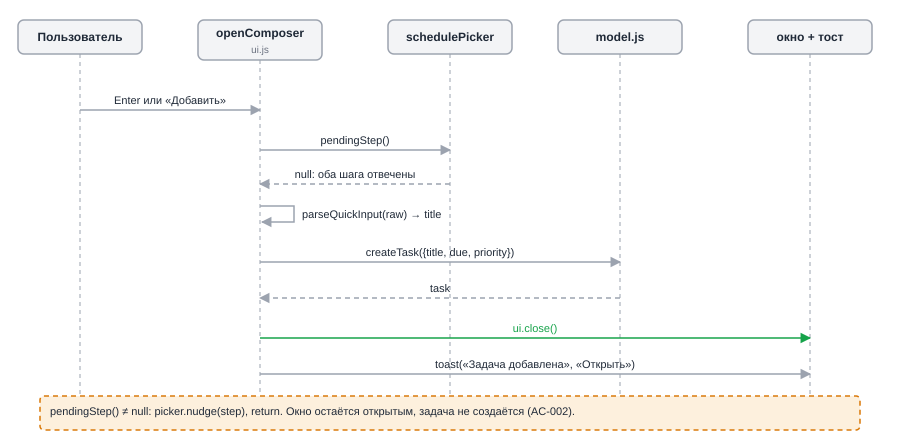
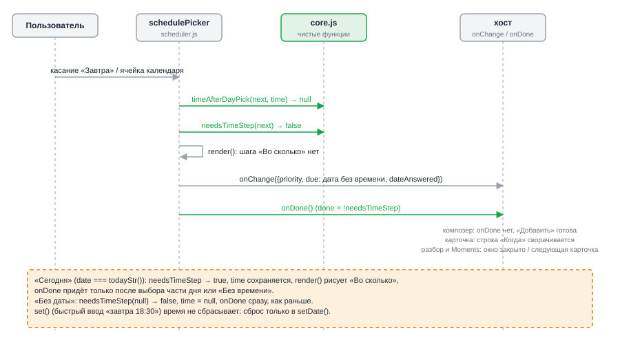
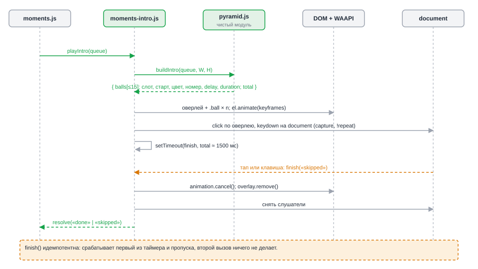
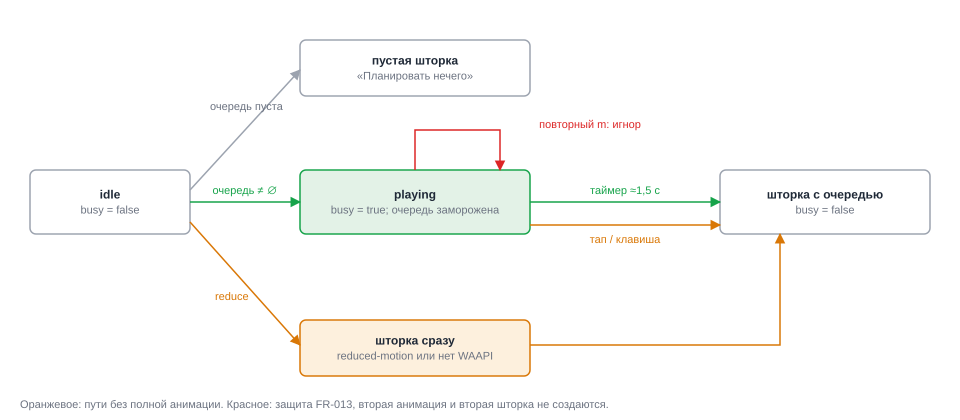
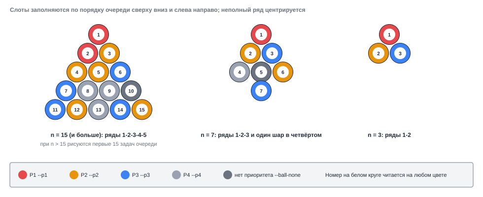

# Design: tweak-entry-and-moments

**Date**: 2026-10-06
**Designer**: system-designer
**Status**: Draft (Gate A и Gate B отменены пользователем по запросу оркестратора)
**HLD**: `openspec/changes/tweak-entry-and-moments/hld.md`
**Proposal**: `openspec/changes/tweak-entry-and-moments/proposal.md`

## Overview

Проект на vanilla JS (ES-модули, без сборки), поэтому интерфейсы ниже описаны JSDoc-сигнатурами,
а не Go-типами. Подход «глубокий модуль»: наружу торчит минимум.

- `core.js` получает две чистые функции правила «время только для сегодня».
- `schedulePicker` использует их в `setDate` и `render`; четыре хоста компонента не меняются.
- Композер закрывает окно после добавления.
- Новые `pyramid.js` (чистая раскладка и тайминг) и `moments-intro.js` (оверлей и WAAPI) прячут за двумя вызовами
  (`buildIntro`, `playIntro`) всю геометрию, траектории, пропуск и уборку.
- `moments.js` вставляет `playIntro` между очередью и шторкой.

ADR нет, развилок нет. Постоянных данных и API нет: формат задач, синхронизация и делегирование не меняются.

## Modules

Список по зонам: правило срока (M1, M2), окно добавления (M3), анимация (M4..M6), оформление и поставка (M7, M8).

### M1: правило шага времени (`js/core.js`, чистые функции)

**Seam**: `core.js` уже импортируется и браузером, и `mcp.mjs` без обращений к странице; функции остаются чистыми и берут `today` параметром, чтобы тест подменял дату.
**Depth**: две однострочные функции прячут всё правило; места использования не знают про «сегодня».

```js
/** Шаг «во сколько» нужен только для сегодняшней даты. null и любая другая дата: нет. */
export const needsTimeStep = (date, today = todayStr()) => date != null && date === today;

/** Время после выбора дня кнопкой или календарём: у сегодняшнего сохраняется, у остальных сбрасывается. */
export const timeAfterDayPick = (nextDate, prevTime, today = todayStr()) =>
  needsTimeStep(nextDate, today) ? (prevTime ?? null) : null;
```

**Invariants**:
- `needsTimeStep(null)` равно `false`; прошедшая дата тоже `false` (FR-005).
- `timeAfterDayPick` никогда не возвращает время для несегодняшней даты.
- `today` вычисляется при каждом вызове: ночная смена суток отражается на следующем рендере.

**Error modes**: исключений нет; невалидная строка даты просто не равна сегодняшней.

### M2: `schedulePicker` (`js/scheduler.js`, изменение)

**Seam**: единственный потребитель M1 в интерфейсе. Публичный интерфейс компонента (`node`, `get`, `isComplete`, `pendingStep`, `set`, `nudge`) и контракт `onChange`/`onDone` не меняются.
**Depth**: четыре хоста получают новое поведение без правок; условие «когда готово» остаётся внутри компонента.

Изменения:

```js
// setDate: вызывается кнопками быстрых дат, ячейками календаря и «Без даты»
function setDate(next) {
  date = next;
  dateAnswered = true;
  calMonth = null;
  time = timeAfterDayPick(next, time);     // FR-006
  const askTime = needsTimeStep(next);     // FR-003, FR-004
  if (!askTime) timeAnswered = false;
  emit('date', !askTime);                  // onDone сразу, если спрашивать время не о чем
}

// render: шаг «Во сколько» только для сегодняшней даты
if (shows('time') && prioReady && dateAnswered && needsTimeStep(date)) {
  node.append(step('Во сколько', timeRow()));
}
```

**Invariants**:
- Сброс времени только в `setDate`. `set()` (быстрый ввод «завтра 18:30») время не сбрасывает (FR-006, AC-013).
- `emit('date', true)` вызывает `render()`, `onChange(get(), 'date')`, затем `onDone()`, в таком порядке: разбор входящего успевает сделать `inboxToTask`, потом закрыть окно.
- Календарь: `setDate(iso)` без особых случаев; сегодняшняя ячейка попадает в ветку `askTime = true` (FR-005, AC-011).
- `isComplete()` не меняется (`priority !== null && dateAnswered`), поэтому «Добавить» и Enter в композере доступны сразу после «Завтра» (AC-007).
- Подсветка шага «Когда» для «Сегодня» без времени, `pendingStep`, `nudge` не меняются.

**Поведение по хостам** (без правок кода):

| Хост | После несегодняшнего дня |
|---|---|
| окно «Новая задача» (`onDone` нет) | шаги закрыты, «Добавить» доступна |
| карточка задачи (`onDone: collapse`) | строка «Когда» сворачивается |
| разбор входящего (`openInboxSort`) | `inboxToTask(дата)`, окно закрывается, тост |
| Moments | `onChange` пишет срок, `onDone` листает очередь |

### M3: композер (`js/ui.js`, `openComposer` → `submit`)

**Seam**: функция внутри `ui.js`. `ui` (результат `openSheet`) объявлена через `const` ниже `submit`, но вызывается после присвоения, поэтому порядок безопасен (проверено в `research.md`).
**Depth**: форму не нужно сбрасывать, окно уничтожается целиком.

```js
const submit = () => {
  const raw = input.value.trim();
  if (!raw) { input.focus(); return; }
  const pending = picker.pendingStep();
  if (pending) { picker.nudge(pending); return; }      // AC-002: окно остаётся, задачи нет
  const { title } = parseQuickInput(raw);
  if (!title) return;
  const v = picker.get();
  const task = M.createTask({ title, due: v.due, priority: v.priority ?? 4 });
  ui.close();                                           // FR-001; список перерисует commit
  toast('Задача добавлена', { actionLabel: 'Открыть', action: () => openEditor(task.id) });  // FR-002
};
```

**Invariants**:
- Блок сброса (`input.value = ''`, `picker.set(...)`, `syncFoot()`, `input.focus()`) удаляется целиком.
- Комментарий над `openComposer` («Окно не закрывается после Enter…») переписывается.
- Esc, крестик и клик мимо работают как раньше; `+` и `n` открывают пустое окно (AC-004).
- Подсказка в настройках («Во сколько ставить задачу, когда в Moments выбрано «Сегодня».») становится «…когда выбрано «Сегодня».».

**Error modes**: `parseQuickInput` вернул пустой `title`: тихий return без закрытия, как сейчас.

### M4: `js/pyramid.js` (новый модуль, чистый)

**Seam**: потребитель только `moments-intro.js`; модуль не импортирует `dom.js`, `store.js`, `model.js`, поэтому загружается в `node:test`.
**Depth**: маленький интерфейс (`buildIntro`) скрывает раскладку рядов, размер шара, траектории, тайминг и палитру токенов.

```js
export const MAX_BALLS = 15;
export const INTRO_TOTAL_MS = 1500;
export const ROLL_MS = 800;
export const MIN_HOLD_MS = 250;
export const NEUTRAL_VAR = '--ball-none';

/** Ряды пирамиды сверху вниз: 15 → [1,2,3,4,5], 7 → [1,2,3,1], 3 → [1,2], 0 → []. n режется до 15. */
export function rackRows(n) {}

/** Диаметр шара по ширине экрана: clamp(floor(w / 6.5), 28, 56). */
export function ballDiameter(viewW) {}

/** Центры слотов в px относительно центра пирамиды. Слот i получает шар с номером i + 1. */
export function slotCenters(n, d) {}

/** '--p1'..'--p4' по приоритету; null, undefined и всё прочее → '--ball-none' (FR-012). */
export function ballColorVar(priority) {}

/** Точка старта у края экрана; детерминирована от индекса, случайности нет. */
export function startPoint(i, view, d) {}

/** Задержка и длительность i-го шара; сумма не больше INTRO_TOTAL_MS - MIN_HOLD_MS. */
export function ballTiming(i, n) {}

/**
 * @param {{priority?: number|null}[]} queue  очередь Moments целиком
 * @param {{w: number, h: number}} view       размер окна
 * @returns {{
 *   d: number,
 *   total: number,                                  // всегда INTRO_TOTAL_MS
 *   origin: {x: number, y: number},                 // центр пирамиды в px окна
 *   pulse: {delay: number, duration: number},       // лёгкий «удар» всей пирамиды после посадки
 *   balls: {
 *     n: number, colorVar: string,
 *     slot: {x: number, y: number}, start: {x: number, y: number},
 *     path: {x: number, y: number, rot: number, offset: number}[],
 *     delay: number, duration: number,
 *   }[],
 * }}
 */
export function buildIntro(queue, view) {}
```

**Раскладка** (Рис. 9):
- шаги слотов: шаг по горизонтали `p = 1.04 · d`, высота ряда `0.866 · p`; ряд `r` из `c` шаров: `x = (k − (c − 1)/2) · p`, `y = r · 0.866 · p`;
- слоты заполняются по порядку очереди сверху вниз и слева направо; неполный ряд центрируется;
- пирамида центрируется по горизонтали, по вертикали на уровне `0.45 · h`.

**Траектория шара** (4 ключевых точки, все сдвиги в px окна):
1. `offset 0`: старт `startPoint`, `rot 0`;
2. `offset 0.82`: слот (шар «ударился» о соседей), `rot = ±720`;
3. `offset 0.92`: слот, отодвинутый назад по линии подхода на `0.18 · d` (отскок);
4. `offset 1`: слот, `rot = ±720` (кратно 360, номер стоит прямо).

Первый отрезок идёт с `cubic-bezier(.4, 0, .9, .6)` (ускорение, как скатывание), остальные `ease-out`.

**Тайминг** (NFR-001, AC-021):
- `ROLL_MS = 800`; `stagger = n > 1 ? min(90, (INTRO_TOTAL_MS − MIN_HOLD_MS − ROLL_MS) / (n − 1)) : 0`;
- `delay(i) = i · stagger`; `duration = ROLL_MS`; последняя посадка не позже `1250 мс`;
- `total = INTRO_TOTAL_MS = 1500` всегда; пирамида «отдыхает» от `landing` до `total` (не меньше 250 мс), в этот отрезок идёт `pulse` (`scale 1 → 1.05 → 1`, 220 мс).

**Invariants**:
- `balls.length === min(queue.length, 15)`; номера `1..balls.length` без пропусков, порядок как в очереди (FR-008, AC-015).
- Все `delay + duration ≤ total − MIN_HOLD_MS`.
- Все старты вне окна или на его краю, финальная точка пути равна `slot` (после сдвига на `origin`).
- Результат детерминирован: одинаковые `queue`, `view` дают одинаковый результат.
- Пустая очередь даёт `balls: []`; вызывающий код пустую очередь сюда не передаёт.

**Error modes**: бросает только на нечисловом `view` (программная ошибка); `priority` вне 1..4 или нечисловой не бросает, даёт `--ball-none`.

### M5: `js/moments-intro.js` (новый модуль, DOM)

**Seam**: потребитель `moments.js`. Зависит от `dom.js` (`h`, `$`) и `pyramid.js`.
**Depth**: два экспортируемых имени скрывают построение оверлея, WAAPI, таймер, слушатели пропуска, уборку и защиту от двойного запуска.

```js
/** Анимация разрешена: нет «уменьшить движение» и есть Element.prototype.animate.
 *  matchMedia читается при каждом вызове (FR-010, AC-017). */
export function introAllowed() {}

/**
 * Показывает оверлей с пирамидой и разрешается, когда он снят.
 * Никогда не отклоняется: при ошибке снимает оверлей и разрешается 'skipped'.
 * @param {{priority?: number|null}[]} queue  непустая очередь Moments
 * @returns {Promise<'done'|'skipped'>}
 */
export function playIntro(queue) {}
```

**Устройство** (Рис. 7):
- один оверлей на документ: `.intro[aria-hidden="true"]` в `#modal-root`, внутри `.intro-rack` и `.ball × n`; повторный вызов возвращает тот же промис;
- шар: `<span class="ball" style="--c: var(--pN); --d: Npx"><span class="ball-num">N</span></span>`; номер ставится через `textContent`;
- анимация шара: `el.animate(keyframes, { delay, duration, easing: 'linear', fill: 'both' })`, где `keyframes` строятся из `ball.path` (`transform: translate(x − d/2, y − d/2) rotate(rot)`); пирамида целиком: `rack.animate(pulse)`;
- главные часы: `setTimeout(() => finish('done'), total)`;
- пропуск: `click` по оверлею и `keydown` на `document` в capture-фазе; `keydown` гасится (`preventDefault`, `stopPropagation`), `e.repeat` игнорируется, модификаторы не исключаются (любая клавиша, включая Esc: AC-016);
- `finish(reason)` идемпотентна: снимает слушатели, `clearTimeout`, `animation.cancel()`, `overlay.remove()`, сбрасывает флаг активности, разрешает промис.

**Invariants**:
- Максимум один оверлей и один таймер одновременно (FR-013).
- Данные не читаются и не пишутся (`M.*` не импортируется): анимация не меняет задачи (spec «Анимация не меняет данные»).
- Фокус не забирается; resize и поворот экрана во время 1,5 с не пересчитывают раскладку: оверлей просто снимается по таймеру.
- Тап ловится как `click`, а не `pointerdown`: иначе `click` после исчезновения оверлея попал бы в элемент под пальцем.

**Error modes**:
- нет `Element.prototype.animate` или reduce: `introAllowed()` вернёт `false`, `playIntro` не вызывают;
- любое исключение в построении или анимации: `finish('skipped')`, промис разрешается.

### M6: `openMoments` (`js/moments.js`, изменение)

**Seam**: точка входа для `app.js` (клавиша `m`, две кнопки); сигнатура `openMoments()` не меняется.
**Depth**: вход прячет четыре ветки (повтор, пусто, reduce, анимация).

```js
let busy = false;                                  // идёт анимация, FR-013

export function openMoments() {
  if (busy) return;
  const queue = M.momentsCandidates();             // один раз, до анимации (FR-007, FR-013)
  if (!queue.length) return openEmpty();           // FR-011: без анимации
  if (!introAllowed()) return openQueue(queue);    // FR-010
  busy = true;
  playIntro(queue).finally(() => { busy = false; openQueue(queue); });
}

function openEmpty() { /* прежняя ветка «Планировать нечего» */ }
function openQueue(queue) { /* прежнее тело openMoments начиная с `let index = 0` */ }
```

**Invariants**:
- `busy` снимается в `finally`, значит и при пропуске, и при ошибке; шторка открывается ровно один раз.
- `openQueue` получает ту же очередь, что и анимация: число шаров и карточек согласовано, при очереди из 20 задач шаров 15, карточек 20 (AC-015).
- Прежнее поведение шторки (`step`, `finish`, `onClose: ctx.refresh`) не меняется.
- `app.js` не меняется: `m` во время анимации гасится capture-слушателем, повторный вызов (кнопки) отсекается `busy`.

### M7: стили и токен (`styles.css`)

```css
/* токен нейтрального шара: рядом с --p1..--p4 в каждом из четырёх блоков (light, dark, [data-theme]) */
--ball-none: #6b7280;   /* тёмная тема: #8b93a1 */

.intro { position: fixed; inset: 0; z-index: 70; background: rgba(8, 10, 16, .5);
  backdrop-filter: blur(2px); animation: fade .15s ease-out; }
.intro-rack { position: absolute; inset: 0; pointer-events: none; }
.ball { position: absolute; left: 0; top: 0; width: var(--d); height: var(--d); border-radius: 50%;
  background: radial-gradient(circle at 35% 30%, rgba(255,255,255,.45), rgba(255,255,255,0) 45%), var(--c);
  box-shadow: 0 2px 6px rgba(0,0,0,.35), inset 0 -3px 5px rgba(0,0,0,.2);
  display: grid; place-items: center; will-change: transform; }
.ball-num { width: 46%; height: 46%; border-radius: 50%; background: #fff; color: #1f2937;
  font: 700 calc(var(--d) * .26)/1 system-ui, sans-serif; display: grid; place-items: center; }
```

**Invariants**: `z-index: 70` выше шторок (`.overlay`, 50) и ниже тоста (90). Цвет номера и круга не зависит от темы (NFR-005, AC-019). Существующее правило `prefers-reduced-motion` не используется: при reduce оверлея нет вообще.

### M8: поставка и проверки

- `sw.js`: `CACHE = 'taskflow-v17'`; в `SHELL` добавить `'./js/pyramid.js'` и `'./js/moments-intro.js'` (NFR-003, AC-023).
- `test/ui-static.test.mjs`: обновить проверку версии кэша; статические проверки: оба модуля в `SHELL`; `scheduler.js` вызывает `needsTimeStep` в `render` и `setDate`; `submit` композера вызывает `ui.close()`; `moments-intro.js` читает `matchMedia('(prefers-reduced-motion: reduce)')` внутри функции, а не на уровне модуля; `moments.js` держит флаг `busy`; `styles.css` содержит `--ball-none` во всех блоках темы.
- Новые тесты (NFR-004): `test/scheduling-rules.test.mjs` для M1; `test/pyramid.test.mjs` для M4 (см. «Constraints for Developer»).
- `test/MANUAL-CHECKLIST.md`: пункты на жесты и анимацию (AC-001, AC-003, AC-014..AC-021).
- `README.md`, `README.ru.md`: абзацы про окно добавления и шаг «во сколько»; список модулей дополнить `js/pyramid.js` и `js/moments-intro.js`.

## Data Models

Постоянных данных нет, формат задач не меняется (NFR-002). Новые типы существуют только в памяти на время анимации.

### Структуры в памяти

```js
/** Результат buildIntro: описание сцены, только чтение. */
// Ball = { n, colorVar, slot:{x,y}, start:{x,y}, path:[{x,y,rot,offset}], delay, duration }
// Intro = { d, total, origin:{x,y}, pulse:{delay,duration}, balls: Ball[] }

/** Состояние в moments.js: один булев флаг. */
let busy = false;
```

Цвет шара: приоритет `1..4` → `--p1..--p4` (те же токены, что `M.PRIORITIES[n].varName`); иначе `--ball-none`.

### Схема хранилища

Не меняется. Старые задачи со временем на несегодняшние даты (например, «через 3 дня, 09:00») отображаются и синхронизируются как раньше; миграции нет (AC-022).

## API Contracts

HTTP и серверных контрактов нет. Внутренние контракты модулей приведены в M1..M6. Сводка:

| Контракт | Вход | Выход / эффект |
|---|---|---|
| `needsTimeStep(date, today?)` | дата `YYYY-MM-DD` или `null` | `boolean` |
| `timeAfterDayPick(next, prev, today?)` | дата, прежнее время | время или `null` |
| `buildIntro(queue, view)` | очередь, размер окна | описание сцены |
| `playIntro(queue)` | непустая очередь | `Promise<'done'\|'skipped'>`, не отклоняется |
| `introAllowed()` | нет | `boolean` |
| `openMoments()` | нет | эффект: анимация и/или шторка |

## Sequence Diagrams

### Добавление задачи в окне


*Рис. 5 — `submit` проверяет оба шага, создаёт задачу, закрывает окно и показывает тост; неготовая форма окно не закрывает.*

### Выбор дня в `schedulePicker`


*Рис. 6 — несегодняшний день сбрасывает время и вызывает `onDone` сразу; «Сегодня» раскрывает шаг «Во сколько».*

### Вход в Moments с анимацией


*Рис. 7 — `playIntro` строит сцену чистой функцией, рисует оверлей, ждёт таймер или пропуск и один раз разрешает промис.*

Общая картина с участием `app.js` и шторки: `hld.md`, Рис. 4.

## State Machines

Единственная сущность с жизненным циклом: запуск Moments (`busy`).


*Рис. 8 — `idle`, `playing` (очередь заморожена, повторный запуск игнорируется) и выходы в шторку: по таймеру, по пропуску, сразу при reduced-motion; пустая очередь ведёт к пустой шторке.*

### Раскладка пирамиды


*Рис. 9 — слоты заполняются по порядку очереди; при 15 и больше рисуются первые 15, при 7 и 3 заполняется верхушка.*

## Constraints for Developer

- C1: Новая логика срока живёт в `core.js` (M1) и `scheduler.js` (M2). Не копировать условие «date === today» в хосты.
- C2: Сброс времени только в `setDate`; `set()` не трогать (FR-006, AC-013). Кнопки отсрочки и перетаскивание (`M.scheduleTask`) не менять (Non-goals proposal).
- C3: `pyramid.js` без импортов `dom.js`, `store.js`, `model.js`, без `Math.random`, без `Date`. Размер окна приходит параметром.
- C4: `matchMedia` вызывается внутри `introAllowed()` на каждый запуск; не кэшировать.
- C5: Очередь считается один раз в `openMoments` и целиком передаётся в `playIntro` и `openQueue`.
- C6: Пропуск: `click` по оверлею (не `pointerdown`) и `keydown` на `document` в capture-фазе с `preventDefault` и `stopPropagation`; `e.repeat` игнорировать.
- C7: Номер на шаре строить через `textContent`; заголовки задач на оверлей не выводить.
- C8: Тесты `node:test` для чистой логики, имена тестов с идентификаторами AC этого change (`AC-005..AC-013`, `AC-015`, `AC-019`, `AC-021`). Внимание: `scripts/ac-trace-check.mjs` считает AC-001..AC-029 прежнего change; номера AC-001..AC-023 этого change с ними пересекаются. Это безвредно (проверка ищет только отсутствующие AC), но не принимать зелёную проверку за доказательство покрытия нового набора.
- C9: Минимальный набор тестов:
  - `scheduling-rules.test.mjs`: `needsTimeStep` (сегодня, завтра, вчера, `null`, подмена `today`, граница полуночи); `timeAfterDayPick` (сегодня с временем и без, завтра с временем, `null`).
  - `pyramid.test.mjs`: `rackRows` (0, 1, 3, 7, 15, 20); `slotCenters` (число, симметрия, апекс сверху); `ballColorVar` (1..4, `null`, `undefined`, 9); `buildIntro` (20 задач дают 15 шаров с номерами 1..15, 3 задачи дают ряды 1-2, детерминированность, все `delay + duration ≤ 1250`, `total` в `[1200, 1800]`, финальная точка пути в слоте, `rot % 360 === 0`).
- C10: Не менять `model.js`, `store.js`, `sync.mjs`, `agent.js`, `app.js` (NFR-002).
- C11: Ручной чек-лист: жесты композера, четыре хоста выбора дня, длительность 1,2..1,8 с на iPhone в PWA (U3 из `research.md`), reduced-motion в ОС, светлая и тёмная темы, зажатая клавиша `m`, повторное `m` во время анимации.

## Requirements Traceability

Каждый FR/NFR из `proposal.md` привязан к элементу дизайна. Колонка Source — из таблицы требований proposal.

| FR/NFR | Source | Реализуется в дизайне | Проверяется |
|---|---|---|---|
| FR-001 | SRC-1, SRC-11 | M3 `openComposer.submit` (`ui.close()`), Рис. 5 | AC-001, AC-002, AC-004 |
| FR-002 | SRC-1 | M3 `toast(«Задача добавлена», «Открыть»)` после `ui.close()`, Рис. 5 | AC-003 |
| FR-003 | SRC-2 | M1 `needsTimeStep`, M2 `render`, Рис. 6 | AC-005, AC-006 |
| FR-004 | SRC-3 | M2 `setDate` (`emit('date', !askTime)`), M1, Рис. 3, Рис. 6 | AC-006..AC-010 |
| FR-005 | SRC-10, SRC-11 | M2: `setDate` общий для быстрых дат, ячеек календаря и «Без даты»; таблица по хостам | AC-008..AC-011 |
| FR-006 | SRC-3, SRC-10 | M1 `timeAfterDayPick`, M2 `setDate` (сброс), `set()` без сброса, Рис. 6 | AC-012, AC-013 |
| FR-007 | SRC-4, SRC-5 | M6 `openMoments`, M5 `playIntro`, M4 `buildIntro`, M7 `.intro`, Рис. 4, 7, 8 | AC-014 |
| FR-008 | SRC-5, SRC-6 | M4 `rackRows`, `slotCenters`, `buildIntro` (номера и срез до 15), `ballColorVar`, Рис. 9 | AC-015 |
| FR-009 | SRC-8 | M5 пропуск: `click` по оверлею и `keydown` capture, `finish('skipped')` | AC-016 |
| FR-010 | SRC-9 | M5 `introAllowed` (`matchMedia` на каждый запуск), M6 ветка | AC-017 |
| FR-011 | SRC-4, SRC-5 | M6 ветка `openEmpty` до анимации, Рис. 8 | AC-018 |
| FR-012 | SRC-6 | M4 `ballColorVar` → `--ball-none`, M7 токен | AC-019 |
| FR-013 | SRC-4 | M6 флаг `busy`, M5 один оверлей, очередь до анимации, Рис. 8 | AC-020 |
| NFR-001 | SRC-7 | M4 `ballTiming`, `INTRO_TOTAL_MS = 1500`, M5 `setTimeout(total)` | AC-021 |
| NFR-002 | SRC-12 | Данные и модули `model`, `store`, `sync`, `agent` не меняются (C10); `M.scheduleTask` как есть | AC-022 |
| NFR-003 | SRC-13 | M8 `sw.js` (`taskflow-v17`, два модуля в `SHELL`) | AC-023 |
| NFR-004 | SRC-13 | M1 и M4 чистые, M8 тесты и ручной чек-лист (C8, C9, C11) | AC-023 |
| NFR-005 | SRC-6 | M4 `ballColorVar` (токены), M7 белый круг и тёмная цифра независимо от темы | AC-019 |

**Coverage**: 18 из 18 FR/NFR имеют элемент дизайна.

**Элементы дизайна без привязки к FR** (обоснование обязательно):
- `pulse` (лёгкий «удар» пирамиды после посадки, M4/M5): косметика внутри FR-007; стоит 3 строки и убирается без последствий для требований. Если Developer или Task Planner сочтут лишним, удалить.
- Остальные элементы (M1..M8) привязаны к требованиям.

## References

- Requirements Source: `openspec/changes/tweak-entry-and-moments/requirements-source.md`
- HLD: `openspec/changes/tweak-entry-and-moments/hld.md`
- Proposal: `openspec/changes/tweak-entry-and-moments/proposal.md`
- Research: `openspec/changes/tweak-entry-and-moments/research.md`
- ADRs: нет
- Код: `js/scheduler.js` (`setDate`, `render`), `js/ui.js` (`openComposer`, `openInboxSort`, `makePicker`), `js/moments.js` (`openMoments`), `js/model.js` (`momentsCandidates`, `PRIORITIES`), `sw.js`, `styles.css` (токены `--p1..--p4`, `.overlay`)

---

*Created by System Designer agent. Pass to Task Planner after human approval.*
