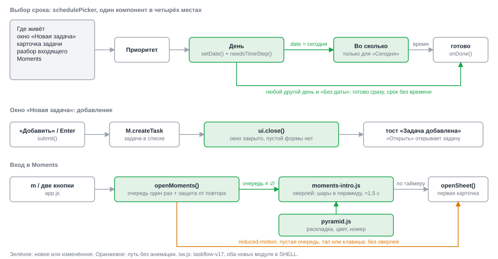
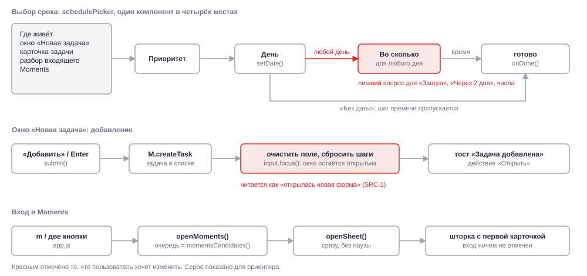
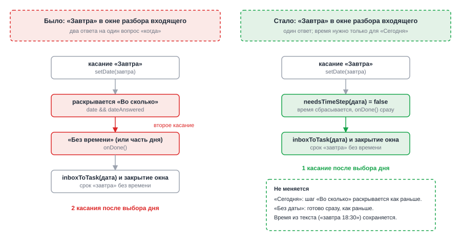
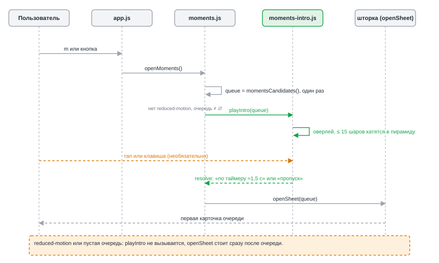

# HLD: tweak-entry-and-moments

**Date**: 2026-10-06
**Designer**: system-designer
**Status**: Draft (HLD_REVIEW пропущен по решению пользователя, схема считается принятой)
**Proposal**: `openspec/changes/tweak-entry-and-moments/proposal.md`

## Overview

Три правки пользовательского потока в TaskFlow, все во фронтенде (vanilla JS, без сборки).
Окно «Новая задача» закрывается после добавления. Шаг «во сколько» остаётся только у
«Сегодня»: любой другой день сразу завершает вопрос «когда». При входе в Moments
показывается короткая анимация: шары-задачи скатываются с краёв и собираются в бильярдную
пирамиду, после чего открывается шторка.

Архитектурных развилок нет, ADR не пишутся. Новые границы две: чистый модуль `js/pyramid.js`
(раскладка, цвет, номер, тайминг; без DOM, тестируется `node:test`) и DOM-модуль
`js/moments-intro.js` (оверлей, Web Animations API, пропуск, reduced-motion). Остальное:
точечные правки `core.js`, `scheduler.js`, `ui.js`, `moments.js`, `styles.css`, `sw.js`.
Формат данных, синхронизация и делегирование агенту не меняются. Требования: см. `proposal.md`.

## Architecture

Система одна: статическая PWA, которая ходит на свой сервер синхронизации. Этот change
сервера и API не касается, поэтому отдельная схема C4 Level 1 ничего бы не добавила.
Компоненты внутри PWA и новые модули показаны на Рис. 2 (проекция «как станет»).

### Component Diagram (C4 Level 2)

*Рис. 2 — три зоны правки: общий выбор срока (`schedulePicker`), окно добавления, вход в Moments; зелёным отмечены новые и изменённые элементы.*

## Change Visualization (As-Is → To-Be) — обязательный раздел

Показана только затрагиваемая часть: общий компонент выбора срока, добавление задачи в окне
и вход в Moments. Обе схемы в одной проекции, чтобы их можно было сравнить глазами.
Легенда: красный — то, что меняется (as-is), зелёный — новое или изменённое (to-be),
оранжевый — путь без анимации.

### Как есть (As-Is)

*Рис. 1 — As-Is: шаг «Во сколько» спрашивают для любого дня, окно после добавления очищается и остаётся открытым, вход в Moments мгновенный.*

### Как станет (To-Be)

*Рис. 2 — To-Be: время спрашивают только после «Сегодня», окно закрывается, между входом и шторкой стоит оверлей с пирамидой.*

### До/после для ключевого сценария

*Рис. 3 — выбор «Завтра» в окне разбора входящего: два касания превращаются в одно.*

### Что меняется пошагово

Порядок: от пользовательского действия к результату.

1. `core.js`: функции для даты нет, правило «нужен ли шаг времени» размазано по условиям в `scheduler.js` → чистые `needsTimeStep(date)` и `timeAfterDayPick(next, time)`; правило проверяется тестами без DOM.
2. `scheduler.js`, `setDate`: onDone вызывался только при «Без даты» → onDone сразу для любого дня, кроме сегодняшнего; время при этом сбрасывается. Выбор сегодняшней ячейки календаря равносилен кнопке «Сегодня».
3. `scheduler.js`, `render`: шаг «Во сколько» рисовался при любой выбранной дате → рисуется только когда `date === todayStr()`. Быстрый ввод (`set()`) время не сбрасывает.
4. Четыре хоста компонента (окно новой задачи, карточка, разбор входящего, Moments) кода не получают: условие живёт в общем компоненте, хосты реагируют на `onChange` и `onDone` как раньше.
5. `ui.js`, `submit` композера: очистка формы и `input.focus()` → `ui.close()`; тост «Задача добавлена / Открыть» остаётся.
6. `moments.js`, `openMoments`: сразу `openSheet` → очередь считается один раз, при непустой очереди и без «уменьшить движение» вызывается `playIntro(queue)`, затем `openSheet` с той же очередью. Флаг `busy` отсекает повторный запуск.
7. `moments-intro.js` + `pyramid.js` (новые): оверлей, до 15 шаров со скриптовыми траекториями, номера по порядку очереди, цвет из `--p1..--p4`, около 1,5 с; тап или любая клавиша пропускают.
8. `styles.css`: стили оверлея и шара, токен `--ball-none` для входящего без приоритета.
9. `sw.js`: `taskflow-v16` → `taskflow-v17`, два новых модуля в `SHELL`.
10. Подсказка в настройках и абзацы в README про окно добавления и шаг «во сколько» переписываются под новое поведение.

### Key Architectural Decisions

Решения очевидные, без ADR. Решение «DOM-шары со скриптовыми траекториями» взято из
`research.md` (вариант A) и входит в ограничения этого change.

| Decision | Choice | Drives | ADR |
|---|---|---|---|
| Где живёт правило «время только для сегодня» | Чистая функция в `core.js`, вызывается из `schedulePicker`; хосты не меняются | FR-003, FR-004, FR-005, FR-006 | — (no fork) |
| Сброс времени | Только в `setDate` (кнопки и календарь), не в `set()` | FR-006 | — (no fork) |
| Закрытие окна добавления | `ui.close()` в `submit`, тост сохраняется | FR-001, FR-002 | — (no fork) |
| Техника анимации | DOM-шары + Web Animations API, траектории заданы скриптом, физики нет | FR-007, NFR-001 | — (`research.md`, вариант A) |
| Раскладка и тайминг | Чистый модуль `pyramid.js`, без DOM и случайности | FR-008, FR-012, NFR-004, NFR-005 | — (no fork) |
| Показ | Оверлей до шторки, шторка открывается после анимации или пропуска | FR-007, FR-009 | — (`research.md`, Q4) |
| Reduced motion | `matchMedia` при каждом запуске, анимации нет совсем | FR-010 | — (no fork) |
| Защита от повторного запуска | Флаг `busy` в `moments.js`, очередь считается до анимации | FR-013 | — (no fork) |
| Кэш PWA | `taskflow-v17`, оба модуля в `SHELL` | NFR-003 | — (no fork) |

## Decision Forks

ADR нет (`adrs: []`). Развилка по технике анимации (DOM, canvas, физика, чистый CSS) разобрана
в `research.md`, раздел Options Considered: выбран вариант A.

## Data Flow

*Рис. 4 — вход в Moments: очередь считается один раз до анимации, оверлей заканчивается таймером или пропуском, затем открывается шторка с той же очередью.*

## Cross-cutting Concerns

- **Observability**: логирования и метрик нет, это фронтенд без телеметрии. Проверка вручную по `test/MANUAL-CHECKLIST.md`.
- **Security**: данные не меняются, новых входов нет. Текст на шарах строится через `textContent` (номер, не заголовок задачи), на оверлей заголовки не выводятся.
- **Error handling**: сбой анимации не должен блокировать Moments. `playIntro` не отклоняет промис: при любой ошибке оверлей снимается, результат `skipped`, шторка открывается.
- **Performance**: не больше 15 DOM-узлов и 15 Web Animations; анимируются только `transform` и `opacity`. Бюджет по времени 1,2..1,8 с от входа до шторки, цель 1,5 с. Раскладка считается один раз за запуск.
- **Accessibility**: оверлей декоративный, `aria-hidden="true"`, фокус не забирает. Предпочтение «уменьшить движение» читается при каждом запуске. Номер на шаре всегда на светлом круге, цвет шара один и тот же в обеих темах за счёт токенов.
- **Offline / PWA**: новые модули в `SHELL`, иначе офлайн-запуск Moments сломается.

## Constraints for Developer

- C1: Выбор срока меняется только в `schedulePicker` и `core.js`. Хосты (композер, карточка, разбор, Moments) трогать не надо; единственное исключение в `ui.js` — `submit` композера и текст подсказки в настройках.
- C2: Время сбрасывать только в `setDate`. `set()` (быстрый ввод «завтра 18:30») время сохраняет.
- C3: Раскладка, цвет, номер, траектории и тайминг лежат в `pyramid.js` без импорта `dom.js`, `store.js`, `model.js`. Иначе `node:test` его не загрузит. Случайности нет: траектории детерминированы от индекса шара.
- C4: `matchMedia('(prefers-reduced-motion: reduce)')` читается внутри функции запуска, а не на уровне модуля.
- C5: Очередь `momentsCandidates()` считается один раз до анимации и передаётся в шторку без пересчёта.
- C6: Тап ловится как `click` по оверлею, а не как `pointerdown`: при `pointerdown` оверлей исчез бы до `click`, и касание попало бы в элемент под пальцем. Клавиши ловятся на `document` в capture-фазе (`keydown`), событие гасится, `e.repeat` игнорируется: иначе зажатая клавиша `m` пропустит анимацию сама.
- C7: Цвета шаров только через токены `--p1..--p4` и новый `--ball-none`; цифра на белом круге с тёмным цветом, не зависящим от темы.
- C8: `sw.js`: `taskflow-v17`, `./js/pyramid.js` и `./js/moments-intro.js` в `SHELL`; `test/ui-static.test.mjs` обновить.
- C9: Данные, `sync.mjs`, `agent.js` и `model.js` не менять (NFR-002). Кнопки отсрочки и перетаскивание продолжают сохранять время через `M.scheduleTask`.

## Superseded Documents

Требование «Окно остаётся открытым после добавления» в `openspec/specs/task-entry/spec.md` заменяется
(delta-спека этого change). ADR не затронуты.

## References

- Proposal: `openspec/changes/tweak-entry-and-moments/proposal.md`
- Source: `openspec/changes/tweak-entry-and-moments/requirements-source.md`
- Research: `openspec/changes/tweak-entry-and-moments/research.md`
- Specs (delta): `openspec/changes/tweak-entry-and-moments/specs/{task-entry,task-scheduling,moments-intro}/spec.md`
- Design: `openspec/changes/tweak-entry-and-moments/design.md`
- [WCAG SCR40](https://www.w3.org/WAI/WCAG21/Techniques/client-side-script/SCR40), [MDN: media queries for accessibility](https://developer.mozilla.org/en-US/docs/Web/CSS/Guides/Media_queries/Using_for_accessibility)

---

*Created by System Designer agent (04). Pass to Task Planner after human approval.*
