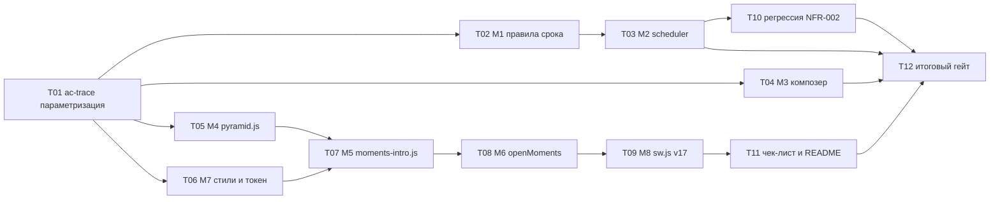

# Tasks: tweak-entry-and-moments

**Date**: 2026-10-06
**Planner**: task-planner
**Status**: Accepted (Gate A и Gate B сняты пользователем; черновик не согласовывался отдельно)
**Design**: `openspec/changes/tweak-entry-and-moments/design.md`
**HLD**: `openspec/changes/tweak-entry-and-moments/hld.md`
**Proposal**: `openspec/changes/tweak-entry-and-moments/proposal.md`

## Overview

12 задач, 20 story points (S=1, M=2, L=3). Сначала prefactoring: проверка трассировки AC делается параметризуемой (прежний change и новый используют пересекающиеся номера AC-001..AC-023). Затем три независимых вертикальных потока:

1. Правило срока: чистые функции `core.js` (M1), затем `scheduler.js` (M2).
2. Окно добавления: закрытие композера (M3).
3. Пирамида: чистый `pyramid.js` (M4), стили (M7), DOM-модуль `moments-intro.js` (M5), вставка в `openMoments` (M6).

Поставка (`sw.js` v17, M8), регрессия данных, документация и итоговый гейт идут последними. Проект на vanilla JS, поэтому роль `GO` ниже означает «прикладной код JS»; `QA` тесты и чек-листы; `Infra` инструменты проверки и `sw.js`.

**Total tasks**: 12
**Total effort**: 20 SP

> У каждой задачи есть `Verification`: одна команда, которая падает до реализации и проходит после. Тесты именуются идентификаторами AC этого change (C8): имя в `test('... AC-005 ...')`.

### Общие правила (из constraints_for_developer и orchestrator_notes)

- C1/C2: условие «date === today» живёт только в `core.js` и `scheduler.js`; `set()` время не сбрасывает; `M.scheduleTask` не менять.
- C3: `pyramid.js` без импортов `dom.js`/`store.js`/`model.js`, без `Math.random` и `Date`.
- C4: `matchMedia` читается внутри `introAllowed()` на каждый запуск.
- C5: очередь Moments считается один раз в `openMoments`.
- C6: пропуск по `click` (не `pointerdown`) и `keydown` capture с `preventDefault`/`stopPropagation`, `e.repeat` игнорируется.
- C7: номер шара через `textContent`; заголовки задач на оверлей не выводятся.
- C10: `model.js`, `store.js`, `sync.mjs`, `agent.js`, `app.js` не меняются.
- Q1 дизайна (пропуск по click) принят как есть.
- Работа только в этом worktree, без атрибуции Claude/AI в коммитах и файлах, `.workflow-state.yaml` не трогать.

## Task Graph

Порядок tracer-bullet: T01, T02, T03, T04, T05, T06, T07, T08, T09, T10, T11, T12.

## Progress

## 1. Prefactoring

- [x] 1.1 (T01) Параметризовать `scripts/ac-trace-check.mjs` по change

## 2. Правило «время только для сегодня»

- [x] 2.1 (T02) Чистые функции `needsTimeStep`, `timeAfterDayPick` в `js/core.js` и `test/scheduling-rules.test.mjs`
- [x] 2.2 (T03) `schedulePicker`: шаг времени только для сегодняшнего дня, `onDone` для остальных

## 3. Окно добавления

- [x] 3.1 (T04) Композер закрывается после добавления, тост «Задача добавлена / Открыть»

## 4. Анимация «бильярдная пирамида»

- [x] 4.1 (T05) Чистый `js/pyramid.js` (раскладка, цвет, тайминг, `buildIntro`) и `test/pyramid.test.mjs`
- [x] 4.2 (T06) Стили `.intro`, `.ball`, `.ball-num` и токен `--ball-none` во всех блоках тем
- [x] 4.3 (T07) `js/moments-intro.js`: `introAllowed`, `playIntro`, пропуск и уборка
- [x] 4.4 (T08) `openMoments`: ветки пусто / reduce / анимация и флаг `busy`
- [x] 4.5 (T09) `sw.js`: `taskflow-v17`, два новых модуля в `SHELL`, обновление `ui-static.test.mjs`

## 5. Проверки и документация

- [x] 5.1 (T10) Регрессионный тест совместимости данных (NFR-002, AC-022)
- [x] 5.2 (T11) `test/MANUAL-CHECKLIST.md`, `README.md`, `README.ru.md`
- [x] 5.3 (T12) Итоговый гейт: `node --test`, `ac-trace-check` для этого change, чистота запретных файлов

## Tasks

### T01: Параметризовать проверку трассировки AC по change

- **Progress**: 1.1
- **Role**: Infra
- **Effort**: M
- **Blocked by**: нет
- **Covers**: нет (prefactoring/infra, см. unmapped; поддерживает NFR-004 и AC-023 через проверяемость трассировки)
- **What to build**: `scripts/ac-trace-check.mjs` сейчас жёстко держит `AC_COUNT = 29` прошлого change. Сделать проверку параметризуемой: список AC берётся из proposal нужного change (таблица `| AC-NNN |` в `openspec/changes/<name>/proposal.md`), а при отсутствии параметров поведение прежнее (AC-001..AC-029). Так как номера AC этого и прошлого change пересекаются, добавить сужение источников покрытия, чтобы закрытые тесты и пункты чек-листа старого change не засчитывались новому: список файлов тестов (`--files`) и раздел чек-листа по заголовку (`--section`). Экспорты `trace` и `check` остаются совместимыми, CLI: `node scripts/ac-trace-check.mjs [--proposal <path>] [--files a,b] [--section <заголовок>]`.
- **Acceptance criteria**:
  - Без аргументов `check()` и CLI дают тот же результат, что до правки (29 AC, существующие тесты `ac-trace.test.mjs` проходят без изменений).
  - С `--proposal` проверяется ровно набор AC из этого файла (для этого change AC-001..AC-023).
  - С `--files` и `--section` покрытие считается только из указанных источников; AC прошлого change в других файлах не маскируют отсутствие покрытия.
- **Verification**: `node --test test/ac-trace.test.mjs` (добавить в этот файл тесты на новые параметры; они падают, пока параметров нет, прежние три теста остаются зелёными).

### T02: Чистые функции правила срока (M1)

- **Progress**: 2.1
- **Role**: GO
- **Effort**: S
- **Blocked by**: T01
- **Covers**: FR-003, FR-005, FR-006, NFR-004
- **What to build**: в `js/core.js` экспортировать `needsTimeStep(date, today = todayStr())` и `timeAfterDayPick(nextDate, prevTime, today = todayStr())` по сигнатурам design M1. `today` вычисляется при каждом вызове. Создать `test/scheduling-rules.test.mjs`.
- **Acceptance criteria**:
  - `needsTimeStep`: сегодня true; завтра, вчера, `null` false; подмена `today` работает; граница полуночи (дата сегодняшнего дня после смены `today`).
  - `timeAfterDayPick`: сегодня с временем сохраняет, сегодня без времени даёт `null`, завтра с временем даёт `null`, `null`-дата даёт `null`.
  - Тесты названы с `AC-005`, `AC-006`, `AC-011`, `AC-012`, `AC-013` там, где проверяют соответствующее поведение.
- **Verification**: `node --test test/scheduling-rules.test.mjs` (падает до реализации: нет экспортов).

### T03: `schedulePicker` по новому правилу (M2)

- **Progress**: 2.2
- **Role**: GO
- **Effort**: M
- **Blocked by**: T02
- **Covers**: FR-003, FR-004, FR-005, FR-006
- **What to build**: в `js/scheduler.js` `setDate` использует `timeAfterDayPick` и `needsTimeStep`; при несегодняшнем дне сбрасывает `timeAnswered` и вызывает `emit('date', true)` (onDone сразу); `render` показывает шаг «Во сколько» только при `needsTimeStep(date)`. `set()` время не сбрасывает; `isComplete`, `pendingStep`, `nudge` и публичный интерфейс не меняются. Хосты (окно новой задачи, карточка, разбор входящего, Moments) не правятся.
- **Acceptance criteria**:
  - Быстрые даты, ячейки календаря (прошедшая и будущая даты) и «Без даты» ведут себя как несегодняшний день: шаг времени не раскрывается, `onDone` вызывается сразу (AC-006..AC-011).
  - Сегодняшняя ячейка календаря равносильна кнопке «Сегодня» (AC-011).
  - Смена дня на несегодняшний сбрасывает время; смена только приоритета и `set()` из быстрого ввода время сохраняют (AC-012, AC-013).
  - В окне новой задачи после «Завтра» «Добавить» доступна сразу (AC-007).
- **Verification**: `node --test test/ui-static.test.mjs test/scheduling-rules.test.mjs` (добавить в `ui-static.test.mjs` тесты с именами `AC-005 ... AC-013`: `scheduler.js` вызывает `needsTimeStep` в `render` и `setDate`, использует `timeAfterDayPick`, `set()` не содержит сброса; падают до правки).

### T04: Композер закрывается после добавления (M3)

- **Progress**: 3.1
- **Role**: GO
- **Effort**: S
- **Blocked by**: T01
- **Covers**: FR-001, FR-002
- **What to build**: в `openComposer` / `submit` (`js/ui.js`) после `M.createTask` вызвать `ui.close()` и показать `toast('Задача добавлена', { actionLabel: 'Открыть', action })`; удалить блок сброса формы (`input.value = ''`, `picker.set(...)`, `syncFoot()`, `input.focus()`); переписать комментарий над `openComposer`; поправить подсказку в настройках до «…когда выбрано «Сегодня».». Неготовая форма окно не закрывает; Esc, крестик, клик мимо, `+` и `n` как раньше.
- **Acceptance criteria**:
  - Кнопка «Добавить» и Enter при готовой форме создают задачу и закрывают окно (AC-001).
  - Enter на неготовой форме ничего не создаёт и окно остаётся (AC-002).
  - После закрытия показан тост с действием «Открыть» (AC-003).
  - Закрытие и открытие пустого окна работают как раньше (AC-004).
- **Verification**: `node --test test/ui-static.test.mjs` (новые тесты `AC-001 AC-003 AC-004`: `submit` вызывает `ui.close()` и `toast` с `Открыть`, блок сброса отсутствует, подсказка настроек обновлена; падают до правки).

### T05: Чистый `pyramid.js` (M4)

- **Progress**: 4.1
- **Role**: GO
- **Effort**: L
- **Blocked by**: T01
- **Covers**: FR-007, FR-008, FR-012, NFR-001, NFR-004, NFR-005
- **What to build**: создать `js/pyramid.js` без импортов приложения (C3): `MAX_BALLS`, `INTRO_TOTAL_MS`, `ROLL_MS`, `MIN_HOLD_MS`, `NEUTRAL_VAR`, `rackRows`, `ballDiameter`, `slotCenters`, `ballColorVar`, `startPoint`, `ballTiming`, `buildIntro` по design M4 (раскладка Рис. 9, траектория из 4 ключевых точек, тайминг до 1250 мс, `total = 1500`). Элемент `pulse` включается; если окажется лишним, он удаляется целиком без последствий для требований. Создать `test/pyramid.test.mjs`.
- **Acceptance criteria**:
  - `rackRows`: 0, 1, 3, 7, 15, 20; `slotCenters`: число, симметрия, апекс сверху.
  - `ballColorVar`: 1..4 в `--p1..--p4`; `null`, `undefined`, 9 в `--ball-none` (AC-019).
  - `buildIntro`: 20 задач дают 15 шаров с номерами 1..15 по порядку очереди, 3 задачи дают ряды 1-2 (AC-015); результат детерминирован; `delay + duration ≤ 1250` у каждого шара; `total` в `[1200, 1800]` (AC-021); финальная точка пути равна слоту, `rot % 360 === 0`; пустая очередь даёт `balls: []`.
- **Verification**: `node --test test/pyramid.test.mjs` (падает до реализации: нет модуля); дополнительно в самом тесте: проверка, что исходник не содержит `Math.random`, `Date` и импортов `dom.js`/`store.js`/`model.js`.

### T06: Стили и токен нейтрального шара (M7)

- **Progress**: 4.2
- **Role**: GO
- **Effort**: S
- **Blocked by**: T01
- **Covers**: FR-012, NFR-005
- **What to build**: в `styles.css` добавить `--ball-none` рядом с `--p1..--p4` в каждом из блоков тем (светлая, тёмная, принудительные `[data-theme]`) и правила `.intro` (z-index 70), `.intro-rack`, `.ball`, `.ball-num` по design M7. Белый круг и тёмная цифра не зависят от темы.
- **Acceptance criteria**:
  - `--ball-none` определён во всех блоках, где определены `--p1..--p4` (AC-019).
  - `.intro` выше шторок (50) и ниже тоста (90).
  - Правило `prefers-reduced-motion` не используется для оверлея.
- **Verification**: `node --test test/ui-static.test.mjs` (новый тест `AC-019`: число вхождений `--ball-none` равно числу блоков с `--p1`; есть `.intro`, `.ball`, `.ball-num`; падает до правки).

### T07: `moments-intro.js` (M5)

- **Progress**: 4.3
- **Role**: GO
- **Effort**: L
- **Blocked by**: T05, T06
- **Covers**: FR-007, FR-009, FR-010, FR-013
- **What to build**: создать `js/moments-intro.js` с `introAllowed()` и `playIntro(queue)` по design M5: единственный оверлей `.intro[aria-hidden="true"]` в `#modal-root`, шары через `textContent`, WAAPI `el.animate` из `ball.path`, `rack.animate(pulse)`, главные часы `setTimeout(finish('done'), total)`, пропуск `click` по оверлею и `keydown` capture (C6), идемпотентный `finish`, повторный вызов возвращает тот же промис, промис никогда не отклоняется (`'skipped'` при ошибке). `M.*` не импортируется, фокус не забирается.
- **Acceptance criteria**:
  - `introAllowed()` читает `matchMedia('(prefers-reduced-motion: reduce)')` внутри функции и проверяет `Element.prototype.animate` (AC-017).
  - Любая клавиша (включая Esc) и клик по оверлею завершают анимацию, `e.repeat` игнорируется (AC-016).
  - `finish` снимает слушатели, таймер, анимации и оверлей; оверлей не более одного (AC-020).
  - Заголовки задач на оверлей не выводятся.
- **Verification**: `node --test test/ui-static.test.mjs` (новые тесты `AC-016 AC-017 AC-020`: чтение `matchMedia` не на уровне модуля, `click` а не `pointerdown`, `capture`, `preventDefault`, `stopPropagation`, `textContent`, нет импорта `model.js`/`store.js`; падают до реализации). Поведение анимации проверяется в чек-листе (T11).

### T08: Вставка в `openMoments` (M6)

- **Progress**: 4.4
- **Role**: GO
- **Effort**: M
- **Blocked by**: T07
- **Covers**: FR-007, FR-010, FR-011, FR-013
- **What to build**: в `js/moments.js` ввести флаг `busy`; `openMoments()` считает очередь один раз, пустую очередь отправляет в `openEmpty()` без анимации, при `!introAllowed()` сразу `openQueue(queue)`, иначе `playIntro(queue).finally(...)` снимает `busy` и открывает шторку ровно один раз. Прежнее тело разнести на `openEmpty` и `openQueue`; поведение шторки, `onClose: ctx.refresh` и `app.js` не меняются.
- **Acceptance criteria**:
  - Непустая очередь: сначала оверлей, затем шторка с первой карточкой (AC-014).
  - Очередь из 20 задач даёт 15 шаров и 20 карточек: одна и та же очередь передаётся в анимацию и в шторку (AC-015).
  - Reduce motion или отсутствие WAAPI: шторка сразу (AC-017); пустая очередь: «Планировать нечего», без анимации (AC-018).
  - Повторный `openMoments()` во время анимации игнорируется (AC-020).
- **Verification**: `node --test test/ui-static.test.mjs` (новые тесты `AC-014 AC-018 AC-020`: `moments.js` содержит `busy`, `introAllowed`, `playIntro`, `.finally`, ветку `openEmpty` до анимации, один вызов `momentsCandidates` в `openMoments`; падают до правки).

### T09: Поставка: `sw.js` v17 и модули в `SHELL` (M8)

- **Progress**: 4.5
- **Role**: Infra
- **Effort**: S
- **Blocked by**: T08
- **Covers**: NFR-003
- **What to build**: `sw.js`: `CACHE = 'taskflow-v17'`, в `SHELL` добавить `'./js/pyramid.js'` и `'./js/moments-intro.js'`. В `test/ui-static.test.mjs` обновить прежнюю проверку `taskflow-v16` на `taskflow-v17` и добавить проверку наличия обоих модулей в `SHELL`.
- **Acceptance criteria**:
  - `CACHE` равен `taskflow-v17`; оба новых модуля перечислены в `SHELL` и файлы существуют (AC-023).
  - Старая проверка v16 заменена, а не продублирована.
- **Verification**: `node --test test/ui-static.test.mjs` (тест `AC-023` падает на v16 и проходит после правки).

### T10: Регрессия совместимости данных (NFR-002)

- **Progress**: 5.1
- **Role**: QA
- **Effort**: S
- **Blocked by**: T03
- **Covers**: NFR-002
- **What to build**: тест без правок `model.js`, `store.js`, `sync.mjs`, `agent.js`, `app.js` (C10): старая задача с `due` на несегодняшнюю дату и временем («через 3 дня, 09:00») после нормализации и слияния остаётся без изменений; перенос делегированной задачи на будущую дату через `M.scheduleTask` снимает делегирование как прежде и сохраняет время. Использовать существующие экспорты и временные данные, не трогая реальный `data/taskflow.json`.
- **Acceptance criteria**:
  - Задача со временем на несегодняшний день не теряет `due` и время (AC-022).
  - Перенос делегированной задачи на завтра снимает делегирование (AC-022).
  - `git diff --stat` по файлам из C10 пуст (проверяется в T12).
- **Verification**: `node --test test/nfr-compat.test.mjs` (новый файл, тесты называются с `AC-022`).

### T11: Ручной чек-лист и README

- **Progress**: 5.2
- **Role**: QA
- **Effort**: M
- **Blocked by**: T09
- **Covers**: NFR-004
- **What to build**: в `test/MANUAL-CHECKLIST.md` новый раздел с заголовком этого change и пунктами `- [ ]` на жесты и анимацию: AC-001, AC-003, AC-005..AC-010 на четырёх хостах, AC-014..AC-021 (длительность 1,2..1,8 с на iPhone в PWA, reduced motion в ОС, светлая и тёмная темы, зажатая клавиша `m`, повторное `m` во время анимации), AC-022, AC-023 (обновление кэша PWA). `README.md` и `README.ru.md`: абзацы про окно добавления и шаг «во сколько», список модулей дополнить `js/pyramid.js` и `js/moments-intro.js`.
- **Acceptance criteria**:
  - Каждый AC, не покрытый автотестом, назван в пункте раздела чек-листа этого change (C11).
  - В обоих README описаны закрытие окна после добавления, шаг времени только для «Сегодня» и два новых модуля.
- **Verification**: `node scripts/ac-trace-check.mjs --proposal openspec/changes/tweak-entry-and-moments/proposal.md --section tweak-entry-and-moments` не сообщает AC без следа (до правки падает: раздела нет); `grep -c "pyramid.js" README.md README.ru.md` показывает не ноль в обоих файлах.

### T12: Итоговый гейт

- **Progress**: 5.3
- **Role**: QA
- **Effort**: S
- **Blocked by**: T03, T04, T10, T11
- **Covers**: NFR-002, NFR-003, NFR-004
- **What to build**: прогнать полный набор и сверить инварианты change; код не менять, найденные расхождения возвращать в соответствующую задачу.
- **Acceptance criteria**:
  - `node --test` проходит целиком (базовый уровень 248 pass плюс новые тесты, 0 fail) (AC-023).
  - `scripts/ac-trace-check.mjs` с параметрами этого change: все 23 AC сопоставлены тестам (имена с AC-NNN) или пунктам раздела чек-листа.
  - `git diff --stat main -- js/model.js js/store.js js/sync.js sync.mjs js/agent.js js/app.js` пуст (C10, NFR-002).
  - Прежний вызов `node scripts/ac-trace-check.mjs` без аргументов по-прежнему зелёный.
- **Verification**: `node --test && node scripts/ac-trace-check.mjs && node scripts/ac-trace-check.mjs --proposal openspec/changes/tweak-entry-and-moments/proposal.md --section tweak-entry-and-moments && test -z "$(git diff --name-only main -- js/model.js js/store.js js/sync.js sync.mjs js/agent.js js/app.js)"` (падает, пока хотя бы одна из частей не выполнена).

## Requirements Coverage

| FR/NFR | Задачи | AC |
|---|---|---|
| FR-001 | T04 | AC-001, AC-002, AC-004 |
| FR-002 | T04 | AC-003 |
| FR-003 | T02, T03 | AC-005, AC-006 |
| FR-004 | T03 | AC-006..AC-010 |
| FR-005 | T02, T03 | AC-008..AC-011 |
| FR-006 | T02, T03 | AC-012, AC-013 |
| FR-007 | T05, T07, T08 | AC-014 |
| FR-008 | T05 | AC-015 |
| FR-009 | T07 | AC-016 |
| FR-010 | T07, T08 | AC-017 |
| FR-011 | T08 | AC-018 |
| FR-012 | T05, T06 | AC-019 |
| FR-013 | T07, T08 | AC-020 |
| NFR-001 | T05 | AC-021 |
| NFR-002 | T10, T12 | AC-022 |
| NFR-003 | T09, T12 | AC-023 |
| NFR-004 | T01, T02, T05, T11, T12 | AC-023 |
| NFR-005 | T05, T06 | AC-019 |

**Coverage**: 18 из 18 FR/NFR (100%), непокрытых нет. AC-001..AC-023 назначены задачам (AC-016, AC-017, AC-020 и часть AC-001/003/014 дополнительно закрываются ручным чек-листом T11).

**Задачи без привязки к FR/NFR (обоснование)**:

| Задача | Обоснование |
|---|---|
| T01 | Prefactoring/infra: orchestrator_notes (C10 оркестратора) и C8 дизайна. Проверка трассировки захардкожена на AC прошлого change и маскирует пересечение номеров; без параметризации NFR-004 и AC-023 не проверяемы |
| T10 | Регрессионный щит под NFR-002 без изменения кода |
| T12 | Итоговый гейт, собственных требований не вводит |

Элемент `pulse` (косметика внутри FR-007) включён в T05 и может быть удалён без последствий.

## References

- Requirements Source: `openspec/changes/tweak-entry-and-moments/requirements-source.md`
- Proposal: `openspec/changes/tweak-entry-and-moments/proposal.md`
- Design: `openspec/changes/tweak-entry-and-moments/design.md`
- HLD: `openspec/changes/tweak-entry-and-moments/hld.md`
